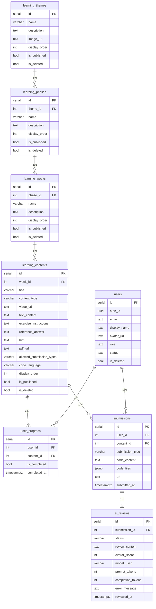

# データベース設計書

本書は、Web技術学習支援サービスのデータベース設計について記載する。

---

## 1. 概要

### 1.1 データベース基盤
- **DBMS**: PostgreSQL（Supabase マネージドサービス）
- **認証**: Supabase Auth（`auth.uid()` による認証ユーザー識別）
- **アクセス制御**: Row Level Security（RLS）
- **タイムゾーン**: TIMESTAMPTZ（タイムゾーン付きタイムスタンプ）

### 1.2 設計方針
- 論理削除方式（`is_deleted` フラグ）によるデータ保全
- 公開制御（`is_published` フラグ）によるコンテンツ管理
- `display_order` によるユーザー任意の表示順制御
- `updated_at` の自動更新トリガーによるデータ整合性の確保
- 外部キー制約 + `ON DELETE CASCADE` によるデータ一貫性の保証

---

## 2. ER図



---

## 3. テーブル定義

### 3.1 learning_themes（学習テーマ）

学習カリキュラムの最上位カテゴリ。複数の学習フェーズをまとめるテーマ（例：GAS学習、Webアプリ開発）。

| カラム | 型 | NULL | デフォルト | 制約 | 説明 |
|:--|:--|:--:|:--|:--|:--|
| id | SERIAL | NO | auto increment | PK | テーマID |
| name | VARCHAR(255) | NO | - | NOT NULL | テーマ名 |
| description | TEXT | YES | NULL | - | 説明文 |
| image_url | TEXT | YES | NULL | - | サムネイル画像URL |
| display_order | INTEGER | YES | 0 | - | 表示順（昇順） |
| is_published | BOOLEAN | YES | false | - | 公開フラグ |
| is_deleted | BOOLEAN | YES | false | - | 論理削除フラグ |
| created_at | TIMESTAMPTZ | YES | NOW() | - | 作成日時 |
| updated_at | TIMESTAMPTZ | YES | NOW() | トリガーで自動更新 | 更新日時 |

**サンプルデータ例**:
- GAS学習（Google Apps Scriptを使った自動化と開発の基礎）

---

### 3.2 learning_phases（学習フェーズ）

テーマ配下の学習フェーズ。Phase単位で学習内容をグループ化する。

| カラム | 型 | NULL | デフォルト | 制約 | 説明 |
|:--|:--|:--:|:--|:--|:--|
| id | SERIAL | NO | auto increment | PK | フェーズID |
| theme_id | INTEGER | NO | - | FK → learning_themes(id) ON DELETE CASCADE | 所属テーマ |
| name | VARCHAR(255) | NO | - | NOT NULL | フェーズ名 |
| description | TEXT | YES | NULL | - | 説明文 |
| display_order | INTEGER | YES | 0 | - | 表示順（昇順） |
| is_published | BOOLEAN | YES | false | - | 公開フラグ |
| is_deleted | BOOLEAN | YES | false | - | 論理削除フラグ |
| created_at | TIMESTAMPTZ | YES | NOW() | - | 作成日時 |
| updated_at | TIMESTAMPTZ | YES | NOW() | トリガーで自動更新 | 更新日時 |

**サンプルデータ例**:
- Phase 1 - GAS基礎
- Phase 2 - Web API基礎
- Phase 3 - フロントエンド基礎

---

### 3.3 learning_weeks（学習週）

フェーズ内の週単位グループ。Weekごとに学習コンテンツをまとめる。

| カラム | 型 | NULL | デフォルト | 制約 | 説明 |
|:--|:--|:--:|:--|:--|:--|
| id | SERIAL | NO | auto increment | PK | 週ID |
| phase_id | INTEGER | NO | - | FK → learning_phases(id) ON DELETE CASCADE | 所属フェーズ |
| name | VARCHAR(255) | NO | - | NOT NULL | 週名 |
| description | TEXT | YES | NULL | - | 説明文 |
| display_order | INTEGER | YES | 0 | - | 表示順（昇順） |
| is_published | BOOLEAN | YES | false | - | 公開フラグ |
| is_deleted | BOOLEAN | YES | false | - | 論理削除フラグ |
| created_at | TIMESTAMPTZ | YES | NOW() | - | 作成日時 |
| updated_at | TIMESTAMPTZ | YES | NOW() | トリガーで自動更新 | 更新日時 |

**サンプルデータ例**:
- Week 1 - はじめの一歩（Phase 1所属）
- Week 2 - スプレッドシート操作（Phase 1所属）

---

### 3.4 learning_contents（学習コンテンツ）

個別の学習教材。動画・テキスト・スライド・演習の4タイプをサポートする。

| カラム | 型 | NULL | デフォルト | 制約 | 説明 |
|:--|:--|:--:|:--|:--|:--|
| id | SERIAL | NO | auto increment | PK | コンテンツID |
| week_id | INTEGER | NO | - | FK → learning_weeks(id) ON DELETE CASCADE | 所属週 |
| title | VARCHAR(255) | NO | - | NOT NULL | タイトル |
| content_type | VARCHAR(20) | NO | - | CHECK ('video', 'text', 'exercise', 'slide') | コンテンツ種別 |
| video_url | TEXT | YES | NULL | - | YouTube URL（video時） |
| text_content | TEXT | YES | NULL | - | Markdownテキスト（text時） |
| exercise_instructions | TEXT | YES | NULL | - | 演習指示文（exercise時） |
| reference_answer | TEXT | YES | NULL | - | 模範回答（exercise時・AIレビュー採点基準・非公開） |
| hint | TEXT | YES | NULL | - | ヒント（exercise時・受講生に公開） |
| pdf_url | TEXT | YES | NULL | - | PDFファイルURL（slide時） |
| allowed_submission_types | VARCHAR(20) | NO | 'code' | CHECK ('code', 'url', 'both') | 許可する提出方法（exercise時） |
| code_language | VARCHAR(20) | NO | 'javascript' | CHECK ('javascript', 'typescript', 'html', 'css') | コードエディタの言語（exercise時） |
| display_order | INTEGER | YES | 0 | - | 表示順（昇順） |
| is_published | BOOLEAN | YES | false | - | 公開フラグ |
| is_deleted | BOOLEAN | YES | false | - | 論理削除フラグ |
| created_at | TIMESTAMPTZ | YES | NOW() | - | 作成日時 |
| updated_at | TIMESTAMPTZ | YES | NOW() | トリガーで自動更新 | 更新日時 |

**content_type別の利用カラム**:

| content_type | video_url | text_content | exercise_instructions | reference_answer | hint | pdf_url | allowed_submission_types | code_language |
|:--|:--:|:--:|:--:|:--:|:--:|:--:|:--:|:--:|
| video | 使用 | - | - | - | - | - | - | - |
| text | - | 使用 | - | - | - | - | - | - |
| exercise | - | - | 使用 | 使用 | 使用 | - | 使用 | 使用 |
| slide | - | - | - | - | - | 使用 | - | - |

**allowed_submission_types の値**:

| 値 | 動作 |
|:--|:--|
| `'code'` | コードのみ（提出方法の選択UI非表示） |
| `'url'` | URLのみ（提出方法の選択UI非表示） |
| `'both'` | コード・URL両方から選択可 |

**code_language の値**:

| 値 | 言語 |
|:--|:--|
| `'javascript'` | JavaScript / GAS（デフォルト） |
| `'typescript'` | TypeScript |
| `'html'` | HTML |
| `'css'` | CSS |

---

### 3.5 user_progress（学習進捗）

受講生のコンテンツ完了状態を管理する。

| カラム | 型 | NULL | デフォルト | 制約 | 説明 |
|:--|:--|:--:|:--|:--|:--|
| id | SERIAL | NO | auto increment | PK | 進捗ID |
| user_id | INTEGER | NO | - | FK → users(id) ON DELETE CASCADE | ユーザーID |
| content_id | INTEGER | NO | - | FK → learning_contents(id) ON DELETE CASCADE | コンテンツID |
| is_completed | BOOLEAN | YES | false | - | 完了フラグ |
| completed_at | TIMESTAMPTZ | YES | NULL | - | 完了日時 |
| created_at | TIMESTAMPTZ | YES | NOW() | - | 作成日時 |

**制約**:
- `UNIQUE(user_id, content_id)` — 1ユーザー・1コンテンツにつき1レコード
- upsert操作（`ON CONFLICT`）で完了/未完了をトグル

---

### 3.6 submissions（課題提出）

演習課題に対する受講生の提出データを管理する。

| カラム | 型 | NULL | デフォルト | 制約 | 説明 |
|:--|:--|:--:|:--|:--|:--|
| id | SERIAL | NO | auto increment | PK | 提出ID |
| user_id | INTEGER | NO | - | FK → users(id) ON DELETE CASCADE | ユーザーID |
| content_id | INTEGER | NO | - | FK → learning_contents(id) ON DELETE CASCADE | コンテンツID |
| submission_type | VARCHAR(20) | NO | - | CHECK ('code', 'url') | 提出種別 |
| code_content | TEXT | YES | NULL | - | コード内容（code・単一ファイル時） |
| code_files | JSONB | YES | NULL | - | コード内容（code・複数ファイル時）。`[{filename, language, content}]` |
| url | TEXT | YES | NULL | - | URL（url時） |
| submitted_at | TIMESTAMPTZ | YES | NOW() | - | 提出日時 |
| created_at | TIMESTAMPTZ | YES | NOW() | - | 作成日時 |

**submission_type別の利用カラム**:

| submission_type | code_content | code_files | url |
|:--|:--:|:--:|:--:|
| code（単一ファイル） | 使用 | - | - |
| code（複数ファイル） | - | 使用 | - |
| url | - | - | 使用 |

**補足**:
- 同一コンテンツに対する複数回提出が可能（ユニーク制約なし）。
- コード提出は単一/複数ファイルに対応。単一ファイルは `code_content`、複数ファイル（例: `コード.gs` + `index.html`）は `code_files` に保存し、もう一方は `NULL`。既存の `code_content` のみの提出はそのまま有効（後方互換）。

---

### 3.7 ai_reviews（AIレビュー）

演習課題の提出に対するGemini APIによる自動レビュー結果を管理する。

| カラム | 型 | NULL | デフォルト | 制約 | 説明 |
|:--|:--|:--:|:--|:--|:--|
| id | SERIAL | NO | auto increment | PK | レビューID |
| submission_id | INTEGER | NO | - | FK → submissions(id) ON DELETE CASCADE, UNIQUE | 紐づく提出ID |
| status | VARCHAR(20) | NO | 'pending' | CHECK ('pending', 'processing', 'completed', 'failed') | レビューステータス |
| review_content | TEXT | YES | NULL | - | レビュー本文 |
| overall_score | INTEGER | YES | NULL | CHECK (0 ≤ value ≤ 100) | 総合スコア（0〜100） |
| model_used | VARCHAR(100) | YES | NULL | - | 使用したGeminiモデル名 |
| prompt_tokens | INTEGER | YES | NULL | - | プロンプトトークン数 |
| completion_tokens | INTEGER | YES | NULL | - | 生成トークン数 |
| error_message | TEXT | YES | NULL | - | エラー詳細（failed時） |
| reviewed_at | TIMESTAMPTZ | YES | NULL | - | レビュー完了日時 |
| created_at | TIMESTAMPTZ | NO | NOW() | - | 作成日時 |
| updated_at | TIMESTAMPTZ | NO | NOW() | トリガーで自動更新 | 更新日時 |

**ステータス遷移**: `pending` → `processing` → `completed` / `failed`

**制約**:
- `submission_id` に UNIQUE 制約（1提出につき1レビュー）
- レビュー再実行時は既存レコードを upsert で更新

**アクセス制御**:
- 受講生: 自分の提出に紐づくレビューのみ閲覧可能（RLS）
- admin / maintainer: 全レビューの閲覧・操作可能

---

### 3.8 users（ユーザー）

本サービスの独自Supabaseプロジェクトで管理する。初回Googleログイン時にOAuthコールバックで自動作成される（`status=pending`, `role=member`）。管理者が承認後、`status=active` に変更することでサービスへのアクセスが可能になる。

| カラム | 型 | NULL | デフォルト | 説明 |
|:--|:--|:--:|:--|:--|
| id | SERIAL | NO | auto increment | ユーザーID |
| auth_id | UUID | NO | - | Supabase Auth UUID（UNIQUE） |
| email | VARCHAR(255) | NO | - | メールアドレス |
| display_name | VARCHAR(255) | NO | - | 表示名 |
| avatar_url | TEXT | YES | NULL | アバター画像URL |
| role | VARCHAR(20) | NO | 'member' | `admin` / `maintainer` / `member`（CHECK制約） |
| status | VARCHAR(20) | NO | 'pending' | `pending` / `active` / `rejected`（CHECK制約） |
| bio | TEXT | YES | NULL | 自己紹介 |
| is_deleted | BOOLEAN | YES | false | 論理削除フラグ |
| created_at | TIMESTAMPTZ | YES | NOW() | 作成日時 |
| updated_at | TIMESTAMPTZ | YES | NOW() | 更新日時（トリガーで自動更新） |

---

## 4. インデックス

| インデックス名 | テーブル | 対象カラム | 用途 |
|:--|:--|:--|:--|
| idx_learning_phases_theme_id | learning_phases | theme_id | テーマ内のフェーズ検索 |
| idx_learning_weeks_phase_id | learning_weeks | phase_id | フェーズ内の週検索 |
| idx_learning_contents_week_id | learning_contents | week_id | 週内のコンテンツ検索 |
| idx_user_progress_user_id | user_progress | user_id | ユーザー別の進捗検索 |
| idx_user_progress_content_id | user_progress | content_id | コンテンツ別の進捗検索 |
| idx_submissions_user_id | submissions | user_id | ユーザー別の提出検索 |
| idx_submissions_content_id | submissions | content_id | コンテンツ別の提出検索 |
| idx_ai_reviews_status | ai_reviews | status | ステータス別のレビュー検索 |
| idx_users_auth_role | users | auth_id, role, is_deleted | RLSヘルパー関数でのロール・本人判定の高速化 |

---

## 5. トリガー

### 5.1 updated_at 自動更新トリガー

`BEFORE UPDATE` トリガーにより、レコード更新時に `updated_at` を自動更新する。

**トリガー関数**:
```sql
CREATE OR REPLACE FUNCTION update_updated_at_column()
RETURNS TRIGGER AS $$
BEGIN
  NEW.updated_at = NOW();
  RETURN NEW;
END;
$$ language 'plpgsql';
```

**適用テーブル**:

| トリガー名 | テーブル |
|:--|:--|
| update_learning_themes_updated_at | learning_themes |
| update_learning_phases_updated_at | learning_phases |
| update_learning_weeks_updated_at | learning_weeks |
| update_learning_contents_updated_at | learning_contents |
| update_ai_reviews_updated_at | ai_reviews |
| update_users_updated_at | users |

### 5.2 RLSヘルパー関数

RLSポリシーのロール判定・本人判定に使用する `SECURITY DEFINER` 関数。ポリシーが `users` テーブルを直接参照すると再帰（無限ループ）が発生するため、RLSをバイパスするこれらの関数経由で判定する。

| 関数 | 返り値 | 説明 |
|:--|:--|:--|
| `get_user_role()` | TEXT | 認証ユーザー（`auth.uid()`）の `role` を返す（`is_deleted = false` が対象） |
| `get_user_id()` | INTEGER | 認証ユーザーの `users.id` を返す（`is_deleted = false` が対象） |

いずれも `STABLE SECURITY DEFINER`・`SET search_path = public` で定義されている。

EXECUTE 権限は `authenticated` / `service_role` にのみ付与しており、`anon`（未認証）からの REST RPC 経由の実行は許可しない（`PUBLIC` へのデフォルト付与も取り消し済み）。

---

## 6. Row Level Security（RLS）

全テーブルに対してRLSが有効化されている。ポリシーは `authenticated` ロール（Supabase Authで認証済みユーザー）に対して適用される。

パフォーマンスのため、以下の方針でポリシーを定義している（Supabase Performance Advisor の `multiple_permissive_policies` / `auth_rls_initplan` 警告対応）。

- 同一テーブル・同一操作に対する許可ポリシーは `OR` 条件で1つに統合する
- ポリシー内の関数呼び出しは `(select get_user_role())` のように `(select ...)` で包み、行ごとの再評価を防いでクエリ実行時に1回だけ評価（InitPlan化）させる

### 6.1 学習コンテンツ系テーブル

`learning_themes`、`learning_phases`、`learning_weeks`、`learning_contents` に共通のポリシーパターン。

| ポリシー | 操作 | 対象 | 条件 |
|:--|:--|:--|:--|
| {Table} are viewable by users or content managers | SELECT | 認証済み全ユーザー（公開分）/ admin・maintainer（全件） | `(is_published = true AND is_deleted = false) OR (select get_user_role()) IN ('admin', 'maintainer')` |
| Content managers can insert {table} | INSERT | admin・maintainer | `(select get_user_role()) IN ('admin', 'maintainer')` |
| Content managers can update {table} | UPDATE | admin・maintainer | `(select get_user_role()) IN ('admin', 'maintainer')` |
| Content managers can delete {table} | DELETE | admin・maintainer | `(select get_user_role()) IN ('admin', 'maintainer')` |

admin と maintainer はいずれもコンテンツ系テーブルの全件参照・作成・更新・削除が可能（コンテンツ管理は両ロール共通）。

**ロール判定ロジック**:

ロールチェックは SECURITY DEFINER 関数 `get_user_role()` を用いる（「5.2 RLSヘルパー関数」参照）。

```sql
(select get_user_role()) IN ('admin', 'maintainer')   -- 例: コンテンツ管理者向けポリシー
```

### 6.2 user_progress

| ポリシー | 操作 | 対象 | 条件 |
|:--|:--|:--|:--|
| Users can view own progress, managers can view all | SELECT | 本人 / admin・maintainer（全件） | `user_id = (select get_user_id()) OR (select get_user_role()) IN ('admin', 'maintainer')` |
| Users can insert own progress | INSERT | 本人 | `user_id` が自身のユーザーIDと一致 |
| Users can update own progress | UPDATE | 本人 | `user_id` が自身のユーザーIDと一致 |

maintainer は受講生進捗一覧（`/manage/students`）で全受講生の進捗を参照するため、admin と同様に全件の SELECT を許可する。

**本人判定ロジック**:

本人チェックは SECURITY DEFINER 関数 `get_user_id()`（認証ユーザーの `users.id` を返す）を用いる。

```sql
user_id = (select get_user_id())
```

### 6.3 submissions

| ポリシー | 操作 | 対象 | 条件 |
|:--|:--|:--|:--|
| Users can view own submissions, managers can view all | SELECT | 本人 / admin・maintainer（全件） | `user_id = (select get_user_id()) OR (select get_user_role()) IN ('admin', 'maintainer')` |
| Users can insert own submissions | INSERT | 本人 | `user_id` が自身のユーザーIDと一致 |

### 6.4 ai_reviews

| ポリシー | 操作 | 対象 | 条件 |
|:--|:--|:--|:--|
| Users can view own ai reviews, managers can view all | SELECT | 本人 / admin・maintainer（全件） | `submission_id IN (SELECT id FROM submissions WHERE user_id = (select get_user_id())) OR (select get_user_role()) IN ('admin', 'maintainer')` |

`ai_reviews` には INSERT / UPDATE のRLSポリシーは定義していない。レビューの作成・更新は AIレビューAPI（`/api/ai-review`）がサーバー側で Service Role キーを用いて行い、RLSをバイパスする。

### 6.5 users

| ポリシー | 操作 | 対象 | 条件 |
|:--|:--|:--|:--|
| Users can view own record, managers can view all | SELECT | 本人 / admin・maintainer（全件） | `(auth_id = (select auth.uid()) AND is_deleted = false) OR (select get_user_role()) IN ('admin', 'maintainer')` |
| Authenticated users can insert own record | INSERT | 本人 | `auth_id = (select auth.uid())` |
| Admins can update users | UPDATE | admin | `(select get_user_role()) = 'admin'` |

初回ログイン時のレコード作成（INSERT）は本人の `auth_id` に限定される。ユーザーの承認・却下・ロール変更（UPDATE）は admin のみ可能。maintainer は受講生進捗（`/manage/students`）の閲覧で `users` を参照するため SELECT のみ許可し、UPDATE は付与しない（ユーザー管理は不可）。

---

## 7. マイグレーション管理

マイグレーションファイルは `supabase/migrations/` ディレクトリで管理する。スキーマ（`01_schema`）・RLS（`02_rls`）・シードデータ（`03_seed`、コーススラッグ別のサブディレクトリ）の3区分で構成する。

| ファイル | 内容 |
|:--|:--|
| `01_schema/001_create_tables.sql` | 全テーブル・ヘルパー関数・トリガー・インデックスの作成 |
| `01_schema/002_add_submission_code_files.sql` | submissions に複数ファイル提出用 `code_files`（JSONB）カラムを追加 |
| `02_rls/001_rls_policies.sql` | 全テーブルのRLS有効化とポリシー定義（`get_user_role()` / `get_user_id()` でロール判定） |
| `02_rls/002_consolidate_rls_policies.sql` | ロール別許可ポリシーのOR統合・initplan最適化・ヘルパー関数の anon EXECUTE 取り消し |
| `03_seed/gas/001_course_structure.sql` | GAS講座のテーマ・フェーズ・週・コンテンツ構造のシード |
| `03_seed/gas/002_exercises.sql` | GAS講座の演習コンテンツ（課題・模範回答）のシード |
| `03_seed/gas/003_hints.sql` | GAS講座の全演習課題へのヒントデータ投入 |
| `03_seed/gas-advanced/001_exercises.sql` | GAS講座（応用編）の演習コンテンツ（課題・ヒント・模範回答）のシード |

---

## 8. 設計上の補足事項

### 8.1 論理削除
- 全コンテンツ系テーブルは `is_deleted` フラグによる論理削除を採用
- 物理削除は行わず、データの追跡性を維持する
- RLSポリシーおよびアプリ側のクエリで `is_deleted = false` をフィルタ条件に含める

### 8.2 公開制御
- `is_published` フラグにより、コンテンツの公開/非公開を制御
- 一般ユーザー（受講生）には公開済みコンテンツのみ表示される
- 管理者は公開/非公開を問わず全コンテンツを閲覧可能

### 8.3 カスケード削除
- 外部キーに `ON DELETE CASCADE` を設定
- 親テーブルのレコード削除時、子テーブルの関連レコードも自動削除される
- 実運用では論理削除を使用するため、通常はカスケード物理削除は発生しない

### 8.4 進捗管理のupsertパターン
- `user_progress` は `(user_id, content_id)` のユニーク制約を利用
- `ON CONFLICT` 句による upsert で完了/未完了のトグルを実現
- 初回完了時は INSERT、再操作時は UPDATE として処理される

---

## 改訂履歴

| 日付 | 内容 |
|:--|:--|
| 2026年2月 | 初版作成（実装に基づく） |
| 2026年3月 | learning_contentsに `allowed_submission_types` カラム追加。マイグレーション一覧を最新化 |
| 2026年3月 | learning_contentsに `code_language` カラム追加（コードエディタの言語設定） |
| 2026年3月 | learning_contentsに `hint` カラム追加（演習コンテンツへのヒント表示機能） |
| 2026年4月 | `learning_themes` テーブル追加・learning_phasesに `theme_id` FK追加。`ai_reviews` テーブル追加。ER図・インデックス・トリガー・RLS・セクション番号を全面更新 |
| 2026年6月 | マイグレーション一覧を実際のディレクトリ構成（`01_schema` / `02_rls` / `03_seed`）に修正。RLSにmaintainerポリシーを追記し、`ai_reviews` のINSERT/UPDATEポリシー記載を削除（Service Role経由のためRLS対象外） |
| 2026年6月 | 実DB（Supabase）と照合し差分を修正：RLSヘルパー関数 `get_user_role()` / `get_user_id()` を追記し判定ロジックを実装準拠に修正、`users` テーブルのRLS（6.5）・`update_users_updated_at` トリガー・`idx_users_auth_role` インデックスを追記、`users` の文字列カラム型を VARCHAR に修正 |
