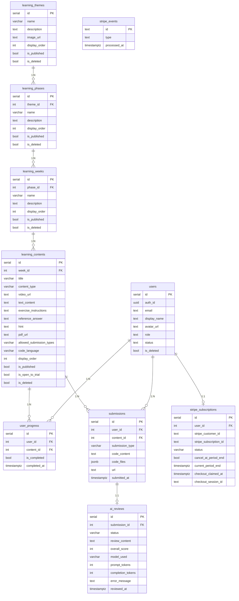

# データベース設計書

本書は、Web技術学習支援サービスのデータベース設計について記載する。

---

## 1. 概要

### 1.1 データベース基盤
- **DBMS**: PostgreSQL（Supabase マネージドサービス）
- **認証**: Supabase Auth（`auth.uid()` による認証ユーザー識別）
- **アクセス制御**: Row Level Security（RLS）
- **タイムゾーン**: TIMESTAMPTZ（タイムゾーン付きタイムスタンプ）

### 1.2 設計方針
- 論理削除方式（`is_deleted` フラグ）によるデータ保全
- 公開制御（`is_published` フラグ）によるコンテンツ管理
- `display_order` によるユーザー任意の表示順制御
- `updated_at` の自動更新トリガーによるデータ整合性の確保
- 外部キー制約 + `ON DELETE CASCADE` によるデータ一貫性の保証

---

## 2. ER図



---

## 3. テーブル定義

### 3.1 learning_themes（学習テーマ）

学習カリキュラムの最上位カテゴリ。複数の学習フェーズをまとめるテーマ（例：GAS学習、Webアプリ開発）。

| カラム | 型 | NULL | デフォルト | 制約 | 説明 |
|:--|:--|:--:|:--|:--|:--|
| id | SERIAL | NO | auto increment | PK | テーマID |
| name | VARCHAR(255) | NO | - | NOT NULL | テーマ名 |
| description | TEXT | YES | NULL | - | 説明文 |
| image_url | TEXT | YES | NULL | - | サムネイル画像URL（Storage配信分は `/storage/v1/object/public/thumbnails/theme-{id}/thumbnail.{ext}?v={timestamp}` の相対パス。未設定時はプレースホルダー表示） |
| display_order | INTEGER | YES | 0 | - | 表示順（昇順） |
| is_published | BOOLEAN | YES | false | - | 公開フラグ |
| is_deleted | BOOLEAN | YES | false | - | 論理削除フラグ |
| created_at | TIMESTAMPTZ | YES | NOW() | - | 作成日時 |
| updated_at | TIMESTAMPTZ | YES | NOW() | トリガーで自動更新 | 更新日時 |

**サンプルデータ例**:
- GAS学習（Google Apps Scriptを使った自動化と開発の基礎）

---

### 3.2 learning_phases（学習フェーズ）

テーマ配下の学習フェーズ。Phase単位で学習内容をグループ化する。

| カラム | 型 | NULL | デフォルト | 制約 | 説明 |
|:--|:--|:--:|:--|:--|:--|
| id | SERIAL | NO | auto increment | PK | フェーズID |
| theme_id | INTEGER | NO | - | FK → learning_themes(id) ON DELETE CASCADE | 所属テーマ |
| name | VARCHAR(255) | NO | - | NOT NULL | フェーズ名 |
| description | TEXT | YES | NULL | - | 説明文 |
| display_order | INTEGER | YES | 0 | - | 表示順（昇順） |
| is_published | BOOLEAN | YES | false | - | 公開フラグ |
| is_deleted | BOOLEAN | YES | false | - | 論理削除フラグ |
| created_at | TIMESTAMPTZ | YES | NOW() | - | 作成日時 |
| updated_at | TIMESTAMPTZ | YES | NOW() | トリガーで自動更新 | 更新日時 |

**サンプルデータ例**:
- Phase 1 - GAS基礎
- Phase 2 - Web API基礎
- Phase 3 - フロントエンド基礎

---

### 3.3 learning_weeks（学習週）

フェーズ内の週単位グループ。Weekごとに学習コンテンツをまとめる。

| カラム | 型 | NULL | デフォルト | 制約 | 説明 |
|:--|:--|:--:|:--|:--|:--|
| id | SERIAL | NO | auto increment | PK | 週ID |
| phase_id | INTEGER | NO | - | FK → learning_phases(id) ON DELETE CASCADE | 所属フェーズ |
| name | VARCHAR(255) | NO | - | NOT NULL | 週名 |
| description | TEXT | YES | NULL | - | 説明文 |
| display_order | INTEGER | YES | 0 | - | 表示順（昇順） |
| is_published | BOOLEAN | YES | false | - | 公開フラグ |
| is_deleted | BOOLEAN | YES | false | - | 論理削除フラグ |
| created_at | TIMESTAMPTZ | YES | NOW() | - | 作成日時 |
| updated_at | TIMESTAMPTZ | YES | NOW() | トリガーで自動更新 | 更新日時 |

**サンプルデータ例**:
- Week 1 - はじめの一歩（Phase 1所属）
- Week 2 - スプレッドシート操作（Phase 1所属）

---

### 3.4 learning_contents（学習コンテンツ）

個別の学習教材。動画・テキスト・スライド・演習の4タイプをサポートする。

| カラム | 型 | NULL | デフォルト | 制約 | 説明 |
|:--|:--|:--:|:--|:--|:--|
| id | SERIAL | NO | auto increment | PK | コンテンツID |
| week_id | INTEGER | NO | - | FK → learning_weeks(id) ON DELETE CASCADE | 所属週 |
| title | VARCHAR(255) | NO | - | NOT NULL | タイトル |
| content_type | VARCHAR(20) | NO | - | CHECK ('video', 'text', 'exercise', 'slide') | コンテンツ種別 |
| video_url | TEXT | YES | NULL | - | YouTube URL（video時） |
| text_content | TEXT | YES | NULL | - | Markdownテキスト（text時） |
| exercise_instructions | TEXT | YES | NULL | - | 演習指示文（exercise時） |
| reference_answer | TEXT | YES | NULL | - | 模範回答（exercise時・AIレビュー採点基準・非公開） |
| hint | TEXT | YES | NULL | - | ヒント（exercise時・受講生に公開） |
| pdf_url | TEXT | YES | NULL | - | PDFファイルURL（slide時） |
| allowed_submission_types | VARCHAR(20) | NO | 'code' | CHECK ('code', 'url', 'both') | 許可する提出方法（exercise時） |
| code_language | VARCHAR(20) | NO | 'javascript' | CHECK ('javascript', 'typescript', 'html', 'css') | コードエディタの言語（exercise時） |
| display_order | INTEGER | YES | 0 | - | 表示順（昇順） |
| is_published | BOOLEAN | YES | false | - | 公開フラグ |
| is_open_to_trial | BOOLEAN | NO | false | NOT NULL | お試し公開フラグ。true の場合、お試しユーザー（`status = 'pending'`）にも公開する |
| is_deleted | BOOLEAN | YES | false | - | 論理削除フラグ |
| created_at | TIMESTAMPTZ | YES | NOW() | - | 作成日時 |
| updated_at | TIMESTAMPTZ | YES | NOW() | トリガーで自動更新 | 更新日時 |

`is_open_to_trial` はお試しユーザー向けの公開範囲のみを制御する。お試しユーザーに実際に見えるのは `is_published = true AND is_open_to_trial = true AND is_deleted = false` の行に限られ、`is_published` による通常の公開制御が優先される（詳細は「6.1 学習コンテンツ系テーブル」参照）。

**content_type別の利用カラム**:

| content_type | video_url | text_content | exercise_instructions | reference_answer | hint | pdf_url | allowed_submission_types | code_language |
|:--|:--:|:--:|:--:|:--:|:--:|:--:|:--:|:--:|
| video | 使用 | - | - | - | - | - | - | - |
| text | - | 使用 | - | - | - | - | - | - |
| exercise | - | - | 使用 | 使用 | 使用 | - | 使用 | 使用 |
| slide | - | - | - | - | - | 使用 | - | - |

**allowed_submission_types の値**:

| 値 | 動作 |
|:--|:--|
| `'code'` | コードのみ（提出方法の選択UI非表示） |
| `'url'` | URLのみ（提出方法の選択UI非表示） |
| `'both'` | コード・URL両方から選択可 |

**code_language の値**:

| 値 | 言語 |
|:--|:--|
| `'javascript'` | JavaScript / GAS（デフォルト） |
| `'typescript'` | TypeScript |
| `'html'` | HTML |
| `'css'` | CSS |

---

### 3.5 user_progress（学習進捗）

受講生のコンテンツ完了状態を管理する。

| カラム | 型 | NULL | デフォルト | 制約 | 説明 |
|:--|:--|:--:|:--|:--|:--|
| id | SERIAL | NO | auto increment | PK | 進捗ID |
| user_id | INTEGER | NO | - | FK → users(id) ON DELETE CASCADE | ユーザーID |
| content_id | INTEGER | NO | - | FK → learning_contents(id) ON DELETE CASCADE | コンテンツID |
| is_completed | BOOLEAN | YES | false | - | 完了フラグ |
| completed_at | TIMESTAMPTZ | YES | NULL | - | 完了日時 |
| created_at | TIMESTAMPTZ | YES | NOW() | - | 作成日時 |

**制約**:
- `UNIQUE(user_id, content_id)` — 1ユーザー・1コンテンツにつき1レコード
- upsert操作（`ON CONFLICT`）で完了/未完了をトグル

---

### 3.6 submissions（課題提出）

演習課題に対する受講生の提出データを管理する。

| カラム | 型 | NULL | デフォルト | 制約 | 説明 |
|:--|:--|:--:|:--|:--|:--|
| id | SERIAL | NO | auto increment | PK | 提出ID |
| user_id | INTEGER | NO | - | FK → users(id) ON DELETE CASCADE | ユーザーID |
| content_id | INTEGER | NO | - | FK → learning_contents(id) ON DELETE CASCADE | コンテンツID |
| submission_type | VARCHAR(20) | NO | - | CHECK ('code', 'url') | 提出種別 |
| code_content | TEXT | YES | NULL | - | コード内容（code・単一ファイル時） |
| code_files | JSONB | YES | NULL | - | コード内容（code・複数ファイル時）。`[{filename, language, content}]` |
| url | TEXT | YES | NULL | - | URL（url時） |
| submitted_at | TIMESTAMPTZ | YES | NOW() | - | 提出日時 |
| created_at | TIMESTAMPTZ | YES | NOW() | - | 作成日時 |

**submission_type別の利用カラム**:

| submission_type | code_content | code_files | url |
|:--|:--:|:--:|:--:|
| code（単一ファイル） | 使用 | - | - |
| code（複数ファイル） | - | 使用 | - |
| url | - | - | 使用 |

**補足**:
- 同一コンテンツに対する複数回提出が可能（ユニーク制約なし）。
- コード提出は単一/複数ファイルに対応。単一ファイルは `code_content`、複数ファイル（例: `コード.gs` + `index.html`）は `code_files` に保存し、もう一方は `NULL`。既存の `code_content` のみの提出はそのまま有効（後方互換）。

---

### 3.7 ai_reviews（AIレビュー）

演習課題の提出に対するGemini APIによる自動レビュー結果を管理する。

| カラム | 型 | NULL | デフォルト | 制約 | 説明 |
|:--|:--|:--:|:--|:--|:--|
| id | SERIAL | NO | auto increment | PK | レビューID |
| submission_id | INTEGER | NO | - | FK → submissions(id) ON DELETE CASCADE, UNIQUE | 紐づく提出ID |
| status | VARCHAR(20) | NO | 'pending' | CHECK ('pending', 'processing', 'completed', 'failed') | レビューステータス |
| review_content | TEXT | YES | NULL | - | レビュー本文 |
| overall_score | INTEGER | YES | NULL | CHECK (0 ≤ value ≤ 100) | 総合スコア（0〜100） |
| model_used | VARCHAR(100) | YES | NULL | - | 使用したGeminiモデル名 |
| prompt_tokens | INTEGER | YES | NULL | - | プロンプトトークン数 |
| completion_tokens | INTEGER | YES | NULL | - | 生成トークン数 |
| error_message | TEXT | YES | NULL | - | エラー詳細（failed時） |
| reviewed_at | TIMESTAMPTZ | YES | NULL | - | レビュー完了日時 |
| created_at | TIMESTAMPTZ | NO | NOW() | - | 作成日時 |
| updated_at | TIMESTAMPTZ | NO | NOW() | トリガーで自動更新 | 更新日時 |

**ステータス遷移**: `pending` → `processing` → `completed` / `failed`

**制約**:
- `submission_id` に UNIQUE 制約（1提出につき1レビュー）
- レビュー再実行時は既存レコードを upsert で更新

**アクセス制御**:
- 受講生: 自分の提出に紐づくレビューのみ閲覧可能（RLS）
- admin / maintainer: 全レビューの閲覧・操作可能

---

### 3.8 users（ユーザー）

本サービスの独自Supabaseプロジェクトで管理する。初回Googleログイン時にOAuthコールバックで自動作成される（`status=pending`, `role=member`, `membership_type=NULL`）。`status=pending` は「お試し（trial）ユーザー」としてログインしてサービスを利用でき、お試し公開コンテンツ（`is_open_to_trial=true`）の閲覧・課題提出が可能。管理者が承認後、`status=active` に変更することで全コンテンツへのアクセスが可能になる。承認時には会員種別（`membership_type`）も同時に設定する。

| カラム | 型 | NULL | デフォルト | 説明 |
|:--|:--|:--:|:--|:--|
| id | SERIAL | NO | auto increment | ユーザーID |
| auth_id | UUID | NO | - | Supabase Auth UUID（UNIQUE） |
| email | VARCHAR(255) | NO | - | メールアドレス |
| display_name | VARCHAR(255) | NO | - | 表示名 |
| avatar_url | TEXT | YES | NULL | アバター画像URL |
| role | VARCHAR(20) | NO | 'member' | `admin` / `maintainer` / `member`（CHECK制約） |
| status | VARCHAR(20) | NO | 'pending' | `pending` / `active` / `rejected`（CHECK制約） |
| membership_type | VARCHAR(20) | YES | NULL | 会員種別。`community`（コミュニティ会員）/ `general`（一般有料会員）（CHECK制約）。承認前・却下ユーザーは NULL |
| bio | TEXT | YES | NULL | 自己紹介 |
| is_deleted | BOOLEAN | YES | false | 論理削除フラグ |
| created_at | TIMESTAMPTZ | YES | NOW() | 作成日時 |
| updated_at | TIMESTAMPTZ | YES | NOW() | 更新日時（トリガーで自動更新） |

> CHECK制約は値の妥当性のみを検証する。「`status = 'active'` なら `membership_type` は NOT NULL」という不変条件はDBでは保証しておらず、承認・却下処理（`approveUser()` / `rejectUser()`）を通るアプリ層でのみ担保している。

---

### 3.9 stripe_subscriptions（Stripeサブスクリプション）

ユーザーごとのStripe課金状態のミラー（1ユーザー1行）。アプリの認可判定は従来どおり `users.status` / `users.membership_type` が唯一の真実であり、このテーブルは課金状態の参照・管理画面表示用に徹する。加えて、`user_id` のUNIQUE制約をCheckout作成の排他制御（処理権のclaim）にも用いる（後述）。書き込みはWebhook（`/api/stripe/webhook`）・successページ（`/upgrade/success`）・Checkout作成API（`/api/stripe/checkout`、claim/releaseのみ）から service_role 経由でのみ行われ、通常クライアントからの書き込みポリシーは存在しない（6.6参照）。

| カラム | 型 | NULL | デフォルト | 説明 |
|:--|:--|:--:|:--|:--|
| id | SERIAL | NO | auto increment | ID |
| user_id | INTEGER | NO | - | `users.id`（UNIQUE, ON DELETE CASCADE）。1ユーザー1行 |
| stripe_customer_id | TEXT | YES | NULL | Stripe Customer ID（`cus_...`、UNIQUE）。ユーザーごとに一意で、確保後は必ず再利用する。claim直後〜Customer作成前のみ NULL |
| stripe_subscription_id | TEXT | YES | NULL | Stripe Subscription ID（`sub_...`、UNIQUE） |
| status | VARCHAR(30) | NO | - | Stripeの `subscription.status` をそのままミラー（例: `active`, `past_due`, `canceled`, `unpaid`）。CHECK制約は設けず、Stripe側の値追加にそのまま追従する。例外として、Checkout作成の処理権を確保している間だけ番兵値 `checkout_pending`（Stripe側には存在しない値）が入る |
| cancel_at_period_end | BOOLEAN | NO | false | 期間終了時に解約予定かどうか |
| current_period_end | TIMESTAMPTZ | YES | NULL | 現在の請求期間の終了日時 |
| checkout_claimed_at | TIMESTAMPTZ | YES | NULL | Checkout作成の処理権を確保した日時。NULLは処理権なし（未確保・解放済み・契約記録済み） |
| checkout_session_id | TEXT | YES | NULL | 処理権が確保しているCheckout Session（`cs_...`）。次のリクエストがStripeで有効性を確認するために保持する |
| created_at | TIMESTAMPTZ | NO | now() | 作成日時 |
| updated_at | TIMESTAMPTZ | NO | now() | 更新日時（トリガーで自動更新） |

> **行が解約後も残り続ける点に注意**: `DELETE` は行わず常に `user_id` を key に `upsert` するため、一度でも契約したユーザーの行は解約後（`status` が `canceled` / `unpaid` / `incomplete_expired` / `paused` などの終端状態）も残り続ける。Checkout手続きを中断したユーザーの行（`checkout_pending`）も同様に残る。「現在契約中かどうか」を判定する箇所（`/upgrade` の契約中表示・管理画面のバッジ表示など）は、行の有無だけでなく `status` が契約を表す値であることも確認する必要がある（アプリ側では `NON_CURRENT_SUBSCRIPTION_STATUSES` 定数＝終端状態＋`checkout_pending` を除外して判定）。
>
> **Checkout作成の排他（claim/release）**: `POST /api/stripe/checkout` は、Checkout Sessionを作る**前に** `status = 'checkout_pending'` の行をINSERTして処理権を確保する（`claimCheckoutSlot()`）。`user_id` のUNIQUE制約により、同一ユーザーの並行リクエストは片方だけがclaimに成功する（`stripe_events` のclaimと同じパターン）。既に行がある場合は「契約が記録されておらず（`NON_CURRENT_SUBSCRIPTION_STATUSES`）、かつ奪ってよいclaimの」行だけを条件付きUPDATEで奪う（条件評価と書き込みが1文で完結するためレースにならない）。claim時に契約の痕跡（`stripe_subscription_id`・`cancel_at_period_end`・`current_period_end`）は消さない。`paused` / `unpaid` はStripe側で復帰しうるため、`stripe_subscription_id` を消すと復帰時のWebhookを `syncSubscriptionStatus()` が照合できず取りこぼす。
>
> Checkoutを作れなかった場合は `checkout_claimed_at` をNULLに戻して解放し（`releaseCheckoutSlot()`。確保済みCustomerを失わないよう行自体は削除しない）、決済完了時は昇格処理のミラー更新が実ステータスと `checkout_claimed_at = NULL` を書き込むことで解除される。
>
> **有効なclaimが残っている場合の判断**: `checkout_session_id` のセッション状態をStripeへ問い合わせ、`open`（まだ決済できる）ならそのURLを再利用し（2つ目のセッションを作らず、手続きを中断したユーザーも即座にやり直せる）、`expired` なら参照した claim をそのまま奪い、`complete`（決済済みで反映待ち）なら奪わない。セッションを特定できない場合（記録前に中断・Stripeが応答しない）のみ、`CHECKOUT_CLAIM_TTL_MS`（`app/services/api/stripe-server.ts`）経過で再claim可能とする救済に委ねる。TTLはセッション有効期限（32分）＋猶予（10分）としてコードで導出し、「TTL経過時点で当該セッションは必ず失効している」という不等号を構造的に保証する。
>
> **Stripe Customerはユーザーごとに一意**: `stripe_customer_id` は最初のCheckout作成時に確保して保存し、以後は必ず再利用する（`ensureCheckoutCustomer()`）。Checkoutごとに新しいCustomerが作られると、ミラーに載らないCustomerの契約が生まれ、`/api/stripe/portal`（ミラーの `stripe_customer_id` しか見ない）から解約できなくなるため。
>
> **`users` への昇格反映は「現に有効」なときのみ**: `stripe_subscriptions` のミラー自体はStripeから取得したステータスをそのまま保存するが、`users.status`/`membership_type` を昇格させるのは `status` が `ACTIVATABLE_SUBSCRIPTION_STATUSES`（`active` / `trialing`）のときのみ（`app/services/api/stripe-server.ts`）。Checkout Sessionは決済後もStripe側に不変オブジェクトとして残るため、`payment_status` だけで判定すると解約後・未入金時にも昇格してしまう経路を防ぐための制御。

### 3.10 stripe_events（Webhookイベント記録）

Stripe Webhookイベントの処理権（claim）記録。`event.id`（`evt_...`）をPKにすることで、TTL（後述）以内の再送・重複配信を安全にスキップできる。

| カラム | 型 | NULL | デフォルト | 説明 |
|:--|:--|:--:|:--|:--|
| id | TEXT | NO | - | Stripe event.id（`evt_...`、PK） |
| type | TEXT | NO | - | イベント種別（例: `checkout.session.completed`） |
| processed_at | TIMESTAMPTZ | NO | now() | claim（処理権確保）した日時 |

> **claim/releaseによる原子的な冪等性**: `event.id` への素のINSERT（upsertではない）を「claim」として使う（`claimEvent()`）。同一event.idの並行配信はDBの一意制約により片方だけがclaimに成功するため、真に排他的。ハンドラが失敗した場合のみ行を削除して処理権を解放する（`releaseEventClaim()`）。先に成功扱いで記録し、ハンドラが後から失敗するような設計だと、Stripeの自動リトライ時に「処理済み」と誤判定され二度とハンドラに到達できなくなるため、claim（実行前）とrelease（失敗時のみ）を明確に分離している。`/api/stripe/webhook` はclaimに成功した場合のみハンドラを実行する。
>
> **TTLによる救済（既知の限界への対処）**: サーバーレス関数のタイムアウト・強制終了等でclaim後にrelease処理へ到達できなかった場合、claim行が残り続け以後の再送が永久にスキップされてしまう。これを防ぐため、一意制約違反（既にclaim済み）の場合は既存claimの`processed_at`が`EVENT_CLAIM_TTL_MINUTES`（10分、`app/services/api/stripe-webhook-server.ts`）を超えて放置されていないかを確認し、放置されていれば`processed_at`を更新して再claimする。ハンドラは冪等に設計されているため、まれに完了済みイベントを再claim・再実行しても実害は小さい（Slack通知の重複程度）。
>
> **releaseの3者競合対策**: `releaseEventClaim()` は `id` に加えて `claimEvent()` が返した `processed_at` の一致もDELETE条件に含める。TTL経過後に別プロセスが再claimした直後、旧claim保持者が遅れて解放処理に到達すると、`id` のみの無条件DELETEでは新しいclaimまで消してしまい3重処理の窓が開くため。

---

## 4. インデックス

| インデックス名 | テーブル | 対象カラム | 用途 |
|:--|:--|:--|:--|
| idx_learning_phases_theme_id | learning_phases | theme_id | テーマ内のフェーズ検索 |
| idx_learning_weeks_phase_id | learning_weeks | phase_id | フェーズ内の週検索 |
| idx_learning_contents_week_id | learning_contents | week_id | 週内のコンテンツ検索 |
| idx_user_progress_user_id | user_progress | user_id | ユーザー別の進捗検索 |
| idx_user_progress_content_id | user_progress | content_id | コンテンツ別の進捗検索 |
| idx_submissions_user_id | submissions | user_id | ユーザー別の提出検索 |
| idx_submissions_content_id | submissions | content_id | コンテンツ別の提出検索 |
| idx_ai_reviews_status | ai_reviews | status | ステータス別のレビュー検索 |
| idx_users_auth_role | users | auth_id, role, is_deleted | RLSヘルパー関数でのロール・本人判定の高速化 |

---

## 5. トリガー

### 5.1 updated_at 自動更新トリガー

`BEFORE UPDATE` トリガーにより、レコード更新時に `updated_at` を自動更新する。

**トリガー関数**:
```sql
CREATE OR REPLACE FUNCTION update_updated_at_column()
RETURNS TRIGGER AS $$
BEGIN
  NEW.updated_at = NOW();
  RETURN NEW;
END;
$$ language 'plpgsql';
```

**適用テーブル**:

| トリガー名 | テーブル |
|:--|:--|
| update_learning_themes_updated_at | learning_themes |
| update_learning_phases_updated_at | learning_phases |
| update_learning_weeks_updated_at | learning_weeks |
| update_learning_contents_updated_at | learning_contents |
| update_ai_reviews_updated_at | ai_reviews |
| update_users_updated_at | users |

### 5.2 RLSヘルパー関数

RLSポリシーのロール判定・本人判定・ステータス判定に使用する `SECURITY DEFINER` 関数。ポリシーが `users` テーブルを直接参照すると再帰（無限ループ）が発生するため、RLSをバイパスするこれらの関数経由で判定する。

| 関数 | 返り値 | 説明 |
|:--|:--|:--|
| `get_user_role()` | TEXT | 認証ユーザー（`auth.uid()`）の `role` を返す（`is_deleted = false` が対象） |
| `get_user_id()` | INTEGER | 認証ユーザーの `users.id` を返す（`is_deleted = false` が対象） |
| `get_user_status()` | TEXT | 認証ユーザーの `status`（`pending` / `active` / `rejected`）を返す（`is_deleted = false` が対象）。お試しユーザーのコンテンツ制限に使用する |

いずれも `STABLE SECURITY DEFINER`・`SET search_path = public` で定義されている。

EXECUTE 権限は `authenticated` / `service_role` にのみ付与しており、`anon`（未認証）からの REST RPC 経由の実行は許可しない（`PUBLIC` へのデフォルト付与も取り消し済み）。新たにヘルパー関数を追加する際も、同じパターン（`STABLE SECURITY DEFINER` + `SET search_path = public` + `PUBLIC, anon` からの REVOKE + `authenticated, service_role` への GRANT）を踏襲する。

---

## 6. Row Level Security（RLS）

全テーブルに対してRLSが有効化されている。ポリシーは `authenticated` ロール（Supabase Authで認証済みユーザー）に対して適用される。

パフォーマンスのため、以下の方針でポリシーを定義している（Supabase Performance Advisor の `multiple_permissive_policies` / `auth_rls_initplan` 警告対応）。

- 同一テーブル・同一操作に対する許可ポリシーは `OR` 条件で1つに統合する
- ポリシー内の関数呼び出しは `(select get_user_role())` のように `(select ...)` で包み、行ごとの再評価を防いでクエリ実行時に1回だけ評価（InitPlan化）させる

### 6.1 学習コンテンツ系テーブル

`learning_themes`、`learning_phases`、`learning_weeks`、`learning_contents` に共通のポリシーパターン。ただし SELECT のみ、`learning_contents` はお試しユーザー向けの制限が加わるため別パターンとなる（後述）。

| ポリシー | 操作 | 対象 | 条件 |
|:--|:--|:--|:--|
| {Table} are viewable by users or content managers | SELECT | 認証済み全ユーザー（公開分）/ admin・maintainer（全件） | `(is_published = true AND is_deleted = false) OR (select get_user_role()) IN ('admin', 'maintainer')` |
| Content managers can insert {table} | INSERT | admin・maintainer | `(select get_user_role()) IN ('admin', 'maintainer')` |
| Content managers can update {table} | UPDATE | admin・maintainer | `(select get_user_role()) IN ('admin', 'maintainer')` |
| Content managers can delete {table} | DELETE | admin・maintainer | `(select get_user_role()) IN ('admin', 'maintainer')` |

`{Table}` / `{table}` にはテーブル名（themes / phases / weeks / contents）が入る。実際のポリシー名に合わせ、文頭に置かれる `{Table}` のみ先頭大文字（例: `Themes are viewable by users or content managers` / `Content managers can insert themes`）。

admin と maintainer はいずれもコンテンツ系テーブルの全件参照・作成・更新・削除が可能（コンテンツ管理は両ロール共通）。

**ロール判定ロジック**:

ロールチェックは SECURITY DEFINER 関数 `get_user_role()` を用いる（「5.2 RLSヘルパー関数」参照）。

```sql
(select get_user_role()) IN ('admin', 'maintainer')   -- 例: コンテンツ管理者向けポリシー
```

**learning_contents の SELECT（お試しユーザー制限）**:

`learning_contents` の SELECT のみ、お試しユーザー（`status = 'pending'`）はお試し公開分に限定する。

| ポリシー | 操作 | 対象 | 条件 |
|:--|:--|:--|:--|
| Contents are viewable by users or content managers | SELECT | active（公開分）/ お試しユーザー（お試し公開分のみ）/ admin・maintainer（全件） | `(is_published = true AND is_deleted = false AND ((select get_user_status()) = 'active' OR ((select get_user_status()) = 'pending' AND is_open_to_trial = true))) OR (select get_user_role()) IN ('admin', 'maintainer')` |

親階層（`learning_themes` / `learning_phases` / `learning_weeks`）はステータスによる絞り込みを行わず、従来どおり公開分を認証済み全ユーザーが参照できる。お試しユーザーにもコースツリーの骨格（テーマ・フェーズ・週）を見せてロック表示するための設計であり、これによりステータス判定の対象は `learning_contents` の1テーブルに閉じる。

この制限により、お試し非公開コンテンツはタイトルを含めて通常クライアント（`authenticated`）から取得できなくなる。ツリー表示のロック項目と、詳細ページ直リンク時のロック画面表示に必要な最小限の情報は、アプリ層が service_role クライアント + カラム許可リスト（本文カラムを含めない）で取得する（詳細は[機能設計書](./specification.md)の2.6を参照）。

service_role は RLS を素通りするため、この経路のクエリでは `is_published = true AND is_deleted = false` をアプリ側で必ず指定し、通常の公開制御を再現する。条件を省くと未公開・論理削除済みコンテンツのタイトルが露出し、`active` ユーザーにすら見えないものがお試しユーザーに見える逆転が生じる。

### 6.2 user_progress

| ポリシー | 操作 | 対象 | 条件 |
|:--|:--|:--|:--|
| Users can view own progress, managers can view all | SELECT | 本人 / admin・maintainer（全件） | `user_id = (select get_user_id()) OR (select get_user_role()) IN ('admin', 'maintainer')` |
| Users can insert own progress | INSERT | 本人（かつ可視コンテンツのみ） | `user_id` が自身のユーザーIDと一致 **かつ** 対象 `content_id` が自身に可視であること（EXISTS 条件） |
| Users can update own progress | UPDATE | 本人（かつ可視コンテンツのみ） | 同上 |

maintainer は受講生進捗一覧（`/manage/students`）で全受講生の進捗を参照するため、admin と同様に全件の SELECT を許可する。

**可視コンテンツ限定の EXISTS 条件**:

お試しユーザーがお試し非公開コンテンツの進捗を書き込めないよう、INSERT / UPDATE に対象コンテンツが自身に可視であることの EXISTS 条件を課す。

```sql
EXISTS (SELECT 1 FROM learning_contents WHERE id = content_id)
```

`learning_contents` の SELECT ポリシー（6.1）が適用されるため、この EXISTS はお試しユーザーではお試し公開分のみ真になる。

**`active` ユーザーへの影響**: この条件はステータスを問わず適用されるため、`active` ユーザーも不可視コンテンツ（未公開・存在しないID）への書き込みができなくなる。従来は未公開コンテンツへの書き込みが素通りし、存在しないIDはFK違反でエラーになっていたが、いずれもRLSで拒否される。通常のUI経路では不可視コンテンツに到達しないため、正常系への影響はない。

**INSERT だけでなく UPDATE にも課す理由**: 進捗API（`/api/progress`）は upsert（`onConflict: user_id,content_id`）で、既存行がある場合は UPDATE 経路を通る。INSERT のみに条件を課すと2回目以降の更新がすり抜けるため、UPDATE にも同じ条件が必要。これにより、お試し公開フラグを後から `false` に戻したコンテンツの進捗も書き換えられなくなる。

**本人判定ロジック**:

本人チェックは SECURITY DEFINER 関数 `get_user_id()`（認証ユーザーの `users.id` を返す）を用いる。

```sql
user_id = (select get_user_id())
```

### 6.3 submissions

| ポリシー | 操作 | 対象 | 条件 |
|:--|:--|:--|:--|
| Users can view own submissions, managers can view all | SELECT | 本人 / admin・maintainer（全件） | `user_id = (select get_user_id()) OR (select get_user_role()) IN ('admin', 'maintainer')` |
| Users can insert own submissions | INSERT | 本人（かつ可視コンテンツのみ） | `user_id` が自身のユーザーIDと一致 **かつ** 対象 `content_id` が自身に可視であること（EXISTS 条件、6.2 と同じパターン） |

提出物は作成後に受講生が更新・削除することはないため、UPDATE / DELETE のポリシーは定義していない。したがって EXISTS 条件は INSERT のみでよい（進捗のように upsert で UPDATE 経路を通ることがない）。

### 6.4 ai_reviews

| ポリシー | 操作 | 対象 | 条件 |
|:--|:--|:--|:--|
| Users can view own ai reviews, managers can view all | SELECT | 本人 / admin・maintainer（全件） | `submission_id IN (SELECT id FROM submissions WHERE user_id = (select get_user_id())) OR (select get_user_role()) IN ('admin', 'maintainer')` |

`ai_reviews` には INSERT / UPDATE のRLSポリシーは定義していない。レビューの作成・更新は AIレビューAPI（`/api/ai-review`）がサーバー側で Service Role キーを用いて行い、RLSをバイパスする。

### 6.5 users

| ポリシー | 操作 | 対象 | 条件 |
|:--|:--|:--|:--|
| Users can view own record, managers can view all | SELECT | 本人 / admin・maintainer（全件） | `(auth_id = (select auth.uid()) AND is_deleted = false) OR (select get_user_role()) IN ('admin', 'maintainer')` |
| Authenticated users can insert own record | INSERT | 本人 | `auth_id = (select auth.uid())` |
| Admins can update users | UPDATE | admin | `(select get_user_role()) = 'admin'` |

初回ログイン時のレコード作成（INSERT）は本人の `auth_id` に限定される。ユーザーの承認・却下・ロール変更（UPDATE）は admin のみ可能。maintainer は受講生進捗（`/manage/students`）の閲覧で `users` を参照するため SELECT のみ許可し、UPDATE は付与しない（ユーザー管理は不可）。

### 6.6 stripe_subscriptions

| ポリシー | 操作 | 対象 | 条件 |
|:--|:--|:--|:--|
| Users can view own subscription, admins can view all | SELECT | 本人 / admin（全件） | `user_id = (select get_user_id()) OR (select get_user_role()) = 'admin'` |

INSERT / UPDATE / DELETE のポリシーは定義していない。昇格・降格を伴う書き込みはアプリの認可判定と密結合しているため、Webhook（`/api/stripe/webhook`）・successページ（`/upgrade/success`）・Checkout作成API（`/api/stripe/checkout` の処理権claim/release）から service_role 経由でのみ行う。

### 6.7 stripe_events

RLSは有効化しているが、ポリシーは一切定義していない（service_role専用。`authenticated` ロールでは SELECT を含め一切のアクセスができない）。

### 6.8 storage.objects（thumbnails バケット）

テーマのサムネイルを保存する `thumbnails` は公開バケット（`public = true`）のため参照は制限しない。書き込み系の操作のみコンテンツ管理者に限定する。

| ポリシー | 操作 | 対象 | 条件 |
|:--|:--|:--|:--|
| Content managers can upload thumbnails | INSERT | admin / maintainer | `bucket_id = 'thumbnails' AND (select get_user_role()) IN ('admin', 'maintainer')` |
| Content managers can update thumbnails | UPDATE | admin / maintainer | 同上 |
| Content managers can delete thumbnails | DELETE | admin / maintainer | 同上 |

アップロード・削除APIは `createAdminSupabaseClient()` を使うため、`SUPABASE_SERVICE_ROLE_KEY` が設定されていればRLSをバイパスする。ただし同関数は未設定時に通常クライアントへフォールバックするため、その場合はこれらのポリシーが実際の書き込み可否を決める。スライドPDFの `slides` バケットにはポリシーを定義していない。

---

## 7. マイグレーション管理

マイグレーションファイルは `supabase/migrations/` ディレクトリで管理する。スキーマ（`01_schema`）・RLS（`02_rls`）・シードデータ（`03_seed`、コーススラッグ別のサブディレクトリ）の3区分で構成する。

| ファイル | 内容 |
|:--|:--|
| `01_schema/001_create_tables.sql` | 全テーブル・ヘルパー関数・トリガー・インデックスの作成 |
| `01_schema/002_add_submission_code_files.sql` | submissions に複数ファイル提出用 `code_files`（JSONB）カラムを追加 |
| `01_schema/003_add_is_open_to_trial.sql` | learning_contents にお試し公開フラグ `is_open_to_trial` を追加 |
| `01_schema/004_add_membership_type.sql` | users に会員種別 `membership_type` を追加し、既存の `active` ユーザーを `community` にバックフィル |
| `01_schema/005_add_stripe_tables.sql` | `stripe_subscriptions` / `stripe_events` テーブルを追加 |
| `01_schema/006_add_thumbnails_bucket.sql` | テーマサムネイル用の `thumbnails` 公開バケットを作成 |
| `01_schema/007_add_checkout_claim.sql` | `stripe_subscriptions` に `checkout_claimed_at` / `checkout_session_id` を追加し、`stripe_customer_id` をNULL許容へ変更（Checkout作成の排他制御用） |
| `02_rls/001_rls_policies.sql` | 全テーブルのRLS有効化とポリシー定義（`get_user_role()` / `get_user_id()` でロール判定） |
| `02_rls/002_consolidate_rls_policies.sql` | ロール別許可ポリシーのOR統合・initplan最適化・ヘルパー関数の anon EXECUTE 取り消し |
| `02_rls/003_trial_user_policies.sql` | `get_user_status()` の追加と、お試しユーザー制限を含むポリシーへの差し替え（learning_contents の SELECT、user_progress / submissions の書き込み） |
| `02_rls/004_stripe_tables_policies.sql` | `stripe_subscriptions` / `stripe_events` のRLS有効化とポリシー定義（`stripe_subscriptions` はSELECTのみ本人/admin） |
| `02_rls/005_thumbnails_storage_policies.sql` | `thumbnails` バケットへの INSERT / UPDATE / DELETE を admin・maintainer に限定 |
| `03_seed/gas/001_course_structure.sql` | GAS講座のテーマ・フェーズ・週・コンテンツ構造のシード |
| `03_seed/gas/002_exercises.sql` | GAS講座の演習コンテンツ（課題・模範回答）のシード |
| `03_seed/gas/003_hints.sql` | GAS講座の全演習課題へのヒントデータ投入 |
| `03_seed/gas-advanced/001_exercises.sql` | GAS講座（応用編）の演習コンテンツ（課題・ヒント・模範回答）のシード |

---

## 8. 設計上の補足事項

### 8.1 論理削除
- 全コンテンツ系テーブルは `is_deleted` フラグによる論理削除を採用
- 物理削除は行わず、データの追跡性を維持する
- RLSポリシーおよびアプリ側のクエリで `is_deleted = false` をフィルタ条件に含める

### 8.2 公開制御
- `is_published` フラグにより、コンテンツの公開/非公開を制御
- 一般ユーザー（受講生）には公開済みコンテンツのみ表示される
- 管理者は公開/非公開を問わず全コンテンツを閲覧可能
- `learning_contents` はさらに `is_open_to_trial` フラグを持ち、お試しユーザー（`status = 'pending'`）に見えるのは `is_published = true AND is_open_to_trial = true` の行のみ。2つのフラグは AND で効き、`is_open_to_trial = true` でも `is_published = false` なら誰にも公開されない

### 8.3 カスケード削除
- 外部キーに `ON DELETE CASCADE` を設定
- 親テーブルのレコード削除時、子テーブルの関連レコードも自動削除される
- 実運用では論理削除を使用するため、通常はカスケード物理削除は発生しない

### 8.4 進捗管理のupsertパターン
- `user_progress` は `(user_id, content_id)` のユニーク制約を利用
- `ON CONFLICT` 句による upsert で完了/未完了のトグルを実現
- 初回完了時は INSERT、再操作時は UPDATE として処理される
- **RLSポリシー設計上の注意**: 上記のとおり2回目以降の操作は UPDATE 経路を通るため、書き込み制限を追加する際は INSERT だけでなく UPDATE ポリシーにも同じ条件を課す必要がある（6.2 参照）

---

## 改訂履歴

| 日付 | 内容 |
|:--|:--|
| 2026年2月 | 初版作成（実装に基づく） |
| 2026年3月 | learning_contentsに `allowed_submission_types` カラム追加。マイグレーション一覧を最新化 |
| 2026年3月 | learning_contentsに `code_language` カラム追加（コードエディタの言語設定） |
| 2026年3月 | learning_contentsに `hint` カラム追加（演習コンテンツへのヒント表示機能） |
| 2026年4月 | `learning_themes` テーブル追加・learning_phasesに `theme_id` FK追加。`ai_reviews` テーブル追加。ER図・インデックス・トリガー・RLS・セクション番号を全面更新 |
| 2026年6月 | マイグレーション一覧を実際のディレクトリ構成（`01_schema` / `02_rls` / `03_seed`）に修正。RLSにmaintainerポリシーを追記し、`ai_reviews` のINSERT/UPDATEポリシー記載を削除（Service Role経由のためRLS対象外） |
| 2026年6月 | 実DB（Supabase）と照合し差分を修正：RLSヘルパー関数 `get_user_role()` / `get_user_id()` を追記し判定ロジックを実装準拠に修正、`users` テーブルのRLS（6.5）・`update_users_updated_at` トリガー・`idx_users_auth_role` インデックスを追記、`users` の文字列カラム型を VARCHAR に修正 |
| 2026年7月 | お試し（trial）ユーザー機能に対応：`learning_contents` に `is_open_to_trial` カラム追加、RLSヘルパー関数 `get_user_status()` 追加、`learning_contents` のSELECTをお試しユーザー制限付きの別パターンに分離、`user_progress` / `submissions` の書き込みに可視コンテンツ限定のEXISTS条件を追記、マイグレーション一覧・公開制御・upsertパターンの注意点を更新 |
| 2026年8月 | 会員種別の導入に対応：`users` に `membership_type`（`community` / `general`、承認前・却下は NULL）カラム追加、マイグレーション一覧に `01_schema/004_add_membership_type.sql` を追記 |
| 2026年8月 | Stripe月額サブスク決済の導入に対応：`stripe_subscriptions`（課金状態のミラー）・`stripe_events`（Webhook冪等性）テーブルを追加。ER図・テーブル定義（3.9/3.10）・RLS（6.6/6.7）・マイグレーション一覧を更新 |
| 2026年8月 | PRレビュー指摘を反映：`stripe_events` の冪等性設計を「確認→ハンドラ成功後に記録」から、INSERT自体を処理権のclaimとして使う原子的な排他制御（claim/release）に変更。3.10節を更新 |
| 2026年8月 | GitHub Copilotレビュー指摘を反映：claimにTTLによる再claim救済を追加（サーバーレス関数の異常終了でclaimが永久に残る問題への対処）し3.10節を更新 |
| 2026年8月 | 別セッションからの追加レビュー指摘を反映：`TERMINAL_SUBSCRIPTION_STATUSES`に`paused`を追加（トライアル終了後の未払いによる一時停止を終端状態として扱う） |
| 2026年8月 | 上記に対する独立レビューの指摘を反映：`releaseEventClaim()`の3者競合対策（`processed_at`一致条件）を3.10節に追記 |
| 2026年8月 | テーマサムネイルのStorage管理に対応：`thumbnails` 公開バケットとStorageポリシーを追加。`learning_themes.image_url` の保存形式（3.1）・RLS（6.8）・マイグレーション一覧を更新 |
| 2026年9月 | 並行Checkoutによる二重契約の対策（#103）に対応：`stripe_subscriptions` に `checkout_claimed_at` / `checkout_session_id` を追加し `stripe_customer_id` をNULL許容へ変更。claim/releaseによるCheckout作成の排他、既存セッションの状態に応じた再利用・奪取・待機、Stripe Customerの一意化を3.9節・6.6節・マイグレーション一覧に追記 |
