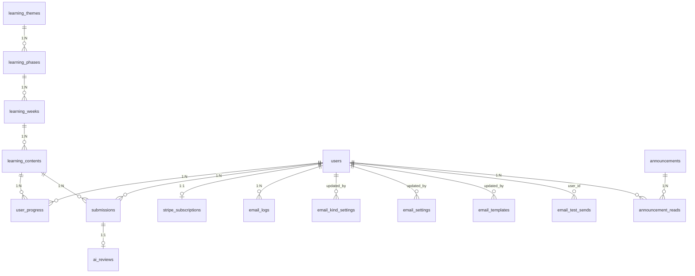

# データベース設計書

本書は、Web技術学習支援サービスのデータベース設計について記載する。

> 本書は現在の仕様のみを記載する。変更履歴は git / PR 履歴で管理し、改訂履歴節は設けない（#185）。調査ログ・一時的な運用手順は本書に残さない。
>
> **カラム・型・DEFAULT・CHECK/FK 制約・インデックス・RLS ポリシーの定義そのものは `supabase/migrations/` と `app/types/lib/database.types.ts` が正**であり、本書には転記しない。本書は、そこから読み取れない意図・不変条件・設計判断だけを記載する。

---

## 1. 概要

### 1.1 データベース基盤
- **DBMS**: PostgreSQL（Supabase マネージドサービス）
- **認証**: Supabase Auth（`auth.uid()` による認証ユーザー識別）
- **アクセス制御**: Row Level Security（RLS）
- **日時**: すべて TIMESTAMPTZ

### 1.2 設計方針
論理削除・公開制御・カスケード削除・進捗 upsert の方針は「8. 設計上の補足事項」を参照。

---

## 2. ER図

```mermaid
erDiagram
    learning_themes ||--o{ learning_phases : "1:N"
    learning_phases ||--o{ learning_weeks : "1:N"
    learning_weeks ||--o{ learning_contents : "1:N"
    learning_contents ||--o{ user_progress : "1:N"
    learning_contents ||--o{ submissions : "1:N"
    users ||--o{ user_progress : "1:N"
    users ||--o{ submissions : "1:N"
    submissions ||--o| ai_reviews : "1:1"
    users ||--o| stripe_subscriptions : "1:1"
    users ||--o{ email_logs : "1:N"
    users ||--o{ email_kind_settings : "updated_by"
    users ||--o{ email_settings : "updated_by"
    users ||--o{ email_templates : "updated_by"
    users ||--o{ email_test_sends : "user_id"
    announcements ||--o{ announcement_reads : "1:N"
    users ||--o{ announcement_reads : "1:N"
```

`stripe_events` / `cron_locks` は他テーブルと関連を持たない独立テーブル。`email_kind_settings` / `email_settings` / `email_templates` は更新者（`updated_by`）でのみ `users` を参照する。

---

## 3. テーブル定義

### 3.1 learning_themes（学習テーマ）

学習カリキュラムの最上位カテゴリ。複数の学習フェーズをまとめる（例：GAS学習）。

`learning_themes` / `learning_phases` / `learning_weeks` / `learning_contents` は共通して `display_order`（昇順の表示順）・`is_published`（公開フラグ、既定 false）・`is_deleted`（論理削除フラグ）を持つ。

- `image_url`: サムネイル画像。Storage 配信分は環境非依存の相対パス `/storage/v1/object/public/thumbnails/theme-{id}/thumbnail.{ext}?v={timestamp}` を保存する。未設定時はプレースホルダー表示

### 3.2 learning_phases（学習フェーズ）

テーマ配下のグループ（例：Phase 1 - GAS基礎）。`theme_id` が親（`ON DELETE CASCADE`）。

### 3.3 learning_weeks（学習週）

フェーズ内の週単位グループ（例：Week 1 - はじめの一歩）。`phase_id` が親（`ON DELETE CASCADE`）。

### 3.4 learning_contents（学習コンテンツ）

個別の学習教材。動画・テキスト・スライド・演習の4種別（`content_type`）をサポートする。`week_id` が親（`ON DELETE CASCADE`）。

**種別ごとの利用カラム**（未使用カラムは NULL）:

| content_type | 使用するカラム |
|:--|:--|
| video | `video_url`（YouTube URL）、`description`（任意） |
| text | `text_content`（Markdown） |
| exercise | `exercise_instructions`、`reference_answer`（AIレビューの採点基準・**受講生には非公開**）、`hint`（受講生に公開）、`allowed_submission_types`、`code_language` |
| slide | `pdf_url`、`description`（任意） |

- `description`: 概要（Markdown・任意入力）。未入力（NULL）の場合、詳細ページの概要欄カードを表示しない
- `pdf_url`: `slides` バケット内の**オブジェクトキーのみ**（例: `gas/slide-01.pdf`）。URL を保存せず、配信時にサーバー側で署名付きURLを発行する（6.8参照）
- `allowed_submission_types`（`code` / `url` / `both`）: 演習で許可する提出方法。`code` / `url` は提出方法の選択UIを出さず、`both` のみ選択可（既定 `code`）
- `code_language`: コードエディタの言語（既定 `javascript`）。許可値は CHECK 制約が正
- `is_open_to_trial`: お試し公開フラグ。`is_open_to_trial` はお試しユーザー向けの公開範囲のみを制御し、お試しユーザーに実際に見えるのは `is_published = true AND is_open_to_trial = true AND is_deleted = false` の行に限られる（`is_published` が優先。「6.1 学習コンテンツ系テーブル」参照）

### 3.5 user_progress（学習進捗）

受講生のコンテンツ完了状態。`UNIQUE(user_id, content_id)`（1ユーザー・1コンテンツにつき1レコード）で、進捗API は upsert（`ON CONFLICT`）で完了/未完了をトグルする（8.4参照）。

### 3.6 submissions（課題提出）

演習課題に対する提出データ。

- 同一コンテンツへの複数回提出が可能（ユニーク制約なし）
- コード提出は、単一ファイルなら `code_content`（TEXT）、複数ファイル（例: `コード.gs` + `index.html`）なら `code_files`（JSONB。`[{filename, language, content}]`）に保存し、**もう一方は NULL**。URL 提出は `url` のみ。`code_content` のみの既存提出もそのまま有効（後方互換）

### 3.7 ai_reviews（AIレビュー）

提出に対する Gemini API の自動レビュー結果。`submission_id` は UNIQUE（1提出につき1レビュー。再実行時は既存レコードを upsert で更新）。

- ステータス遷移: `pending` → `processing` → `completed` / `failed`
- 受講生は自分の提出に紐づくレビューのみ閲覧でき、admin / maintainer は全件閲覧できる（6.4参照）

### 3.8 users（ユーザー）

本サービス独自の Supabase プロジェクトで管理する。初回 Google ログイン時に OAuth コールバックで自動作成される（`status=trial`, `role=member`, `membership_type=NULL`, `terms_accepted_at=登録時刻`）。管理者が承認すると `status=active` になり、承認時に会員種別（`membership_type`）も同時に設定する。

- `role`: `admin` / `maintainer` / `member`。`status`: `trial` / `active` / `rejected`（いずれも CHECK 制約）。既定は `member` / `trial`
- `membership_type`: `community`（コミュニティ会員）/ `general`（一般有料会員）。承認前・却下ユーザーは NULL
- `terms_accepted_at`: 利用規約・プライバシーポリシーへの同意日時。新規登録時のみ記録し、既存ユーザーは NULL のまま利用継続できる（再同意は求めない）
- `onboarding_completed_at`: 初回利用ガイド（ウェルカムダイアログ）の完了日時。閉じたときに記録し、既存ユーザーは NULL のまま
- `email_opt_out_at`: 案内メール（定期メール）の配信停止日時。NULL は配信対象。配信停止リンク（`/api/email/unsubscribe`）で記録し、停止・再開は管理者もユーザー管理画面（`PATCH /api/admin/users` の `opt_out_email` / `resume_email`）から行える。トランザクションメールには影響しない（[機能設計書](./specification.md)10.8節）
- `auth_id`: Supabase Auth UUID（UNIQUE）

> CHECK制約は値の妥当性のみを検証する。「`status = 'active'` なら `membership_type` は NOT NULL」という不変条件はDBでは保証しておらず、承認・却下処理（`approveUser()` / `rejectUser()`）を通るアプリ層でのみ担保している。

### 3.9 stripe_subscriptions（Stripeサブスクリプション）

ユーザーごとのStripe課金状態のミラー（1ユーザー1行、`user_id` は UNIQUE）。アプリの認可判定は従来どおり `users.status` / `users.membership_type` が唯一の真実であり、このテーブルは課金状態の参照・管理画面表示用に徹する。加えて、`user_id` のUNIQUE制約をCheckout作成の排他制御（処理権のclaim）にも用いる（後述）。書き込みはWebhook（`/api/stripe/webhook`）・successページ（`/upgrade/success`）・Checkout作成API（`/api/stripe/checkout`、claim/releaseのみ）から service_role 経由でのみ行われ、通常クライアントからの書き込みポリシーは存在しない（6.6参照）。

- `stripe_customer_id`（UNIQUE）: ユーザーごとに一意で、確保後は必ず再利用する。claim直後〜Customer作成前のみ NULL
- `stripe_subscription_id`（UNIQUE）
- `cancel_at_period_end` / `cancel_at`: Stripe の `subscription.cancel_at_period_end` / `cancel_at`（解約予定日時）をそのままミラーする（下記「解約予約の判定は2列で行う」）
- `status`: Stripeの `subscription.status` をそのままミラーする。CHECK制約は設けず、Stripe側の値追加にそのまま追従する。例外として、Checkout作成の処理権を確保している間だけ番兵値 `checkout_pending`（Stripe側には存在しない値）が入る
- `checkout_claimed_at`: Checkout作成の処理権を確保した日時。NULLは処理権なし（未確保・解放済み・契約記録済み）
- `checkout_session_id`: 処理権が確保しているCheckout Session（`cs_...`）。次のリクエストがStripeで有効性を確認するために保持する
- `became_active_at` / `became_terminal_at`: 週次ファネル用。`status` が初めて `active` になった時刻と、そのあと初めて終端になった時刻。未課金の終端では `became_terminal_at` を埋めない。トリガーが初回だけ埋め、後続の更新と再契約では動かさない（`created_at` は処理権の INSERT、`updated_at` は毎回動くため使わない）

> **解約予約の判定は2列で行う**: flexible billing mode（Stripe API 2025-09-30.clover 以降の新規サブスクの既定）では、Customer Portal での解約は `cancel_at` に終了日時が入り、`cancel_at_period_end` は false のままになる。このため「解約予約中」は `cancel_at_period_end = true` または `cancel_at IS NOT NULL`、利用期限は `cancel_at`（無ければ `current_period_end`）で判定する。判定は `isCancellationScheduled()` / `cancellationEndsAt()`（`app/lib/subscription-period.ts`）に集約し、`/upgrade` の表示と解約予約メールで共有する。両列ともStripeの値をそのままミラーし、アプリ側で合成した値は書かない。
>
> **行が解約後も残り続ける点に注意**: `DELETE` は行わず常に `user_id` を key に `upsert` するため、一度でも契約したユーザーの行は解約後（`status` が `canceled` / `unpaid` / `incomplete_expired` / `paused` などの終端状態）も残り続ける。Checkout手続きを中断したユーザーの行（`checkout_pending`）も同様に残る。「現在契約中かどうか」を判定する箇所（`/upgrade` の契約中表示・管理画面のバッジ表示など）は、行の有無だけでなく `status` が契約を表す値であることも確認する必要がある（アプリ側では `NON_CURRENT_SUBSCRIPTION_STATUSES` 定数＝終端状態＋`checkout_pending` を除外して判定）。
>
> **Checkout作成の排他（claim/release）**: `POST /api/stripe/checkout` は、Checkout Sessionを作る**前に** `status = 'checkout_pending'` の行をINSERTして処理権を確保する（`claimCheckoutSlot()`）。`user_id` のUNIQUE制約により、同一ユーザーの並行リクエストは片方だけがclaimに成功する（`stripe_events` のclaimと同じパターン）。既に行がある場合は「契約が記録されておらず（`NON_CURRENT_SUBSCRIPTION_STATUSES`）、かつ奪ってよいclaimの」行だけを条件付きUPDATEで奪う（条件評価と書き込みが1文で完結するためレースにならない）。claim時に契約の痕跡（`stripe_subscription_id`・`cancel_at_period_end`・`current_period_end`）は消さない。`paused` / `unpaid` はStripe側で復帰しうるため、`stripe_subscription_id` を消すと復帰時のWebhookを `syncSubscriptionStatus()` が照合できず取りこぼす。
>
> Checkoutを作れなかった場合は `checkout_claimed_at` をNULLに戻して解放し（`releaseCheckoutSlot()`。確保済みCustomerを失わないよう行自体は削除しない）、決済完了時は昇格処理のミラー更新が実ステータスと `checkout_claimed_at = NULL` を書き込むことで解除される。
>
> **有効なclaimが残っている場合の判断**: `checkout_session_id` のセッション状態をStripeへ問い合わせ、`open`（まだ決済できる）ならそのURLを再利用し、`expired` なら参照した claim をそのまま奪い（claimの確保時刻をCASの条件にする）、`complete`（決済済みで反映待ち）なら奪わず、呼び出し元がそのセッションを反映してから claim をやり直す（挙動の詳細は[機能設計書](./specification.md)2.11節）。`checkout_session_id` が記録されていない場合は、Customerに紐づく「claim確保以降に作られたセッション」を照会して同じ判定を行う（作成時刻の下限をclaim確保時刻に置き、過去の契約で完了したセッションを拾わない。`complete` と `open` が並存する場合は `complete` を優先し、`open` を失効させてから反映する）。Stripeへ照会できない場合のみ、`CHECKOUT_CLAIM_TTL_MS`（`app/services/api/stripe-server.ts`）経過で再claim可能とする救済に委ねる。TTLはセッション有効期限（32分）＋猶予（10分）としてコードで導出し、「TTL経過時点で当該セッションは必ず失効している」という不等号を構造的に保証する。
>
> **処理権を解放してよい条件**: Checkout作成に失敗した場合でも、解放してよいのは「Stripe側に有効なセッションが残っていないと確定できる」ときだけ（Stripeが4xxで拒否した場合、またはセッションを失効させられた場合）。通信タイムアウト・5xxのように作成済みか判別できない場合は解放せず、次回claim時の照会かTTLに委ねる。セッションidを記録できなかった場合は、作成したセッションを失効させてから失敗させる（記録できないと、そのセッションと処理権を紐付けられず、リプレイで処理権が解除されたときに二重契約の窓が開くため）。
>
> **ミラー更新のCAS**: 「既存行の確認 → ミラー更新」は複数ステートメントに分かれるため、`activateUserFromCheckoutSession()` の書き込みは、確認した時点の `checkout_claimed_at` / `stripe_subscription_id` が変わっていないことを条件にした条件付きUPDATE（行が無い場合はINSERT）で行う。0行更新なら読み直して判断からやり直す。これが無いと、古い成功ページURLの処理が、確認後に発生した新しい処理権を後から消してしまう。
>
> **Stripe Customerはユーザーごとに一意**: `stripe_customer_id` は最初のCheckout作成時に確保して保存し、以後は必ず再利用する（`ensureCheckoutCustomer()`）。Checkoutごとに新しいCustomerが作られると、ミラーに載らないCustomerの契約が生まれ、`/api/stripe/portal`（ミラーの `stripe_customer_id` しか見ない）から解約できなくなるため。
>
> **`users` への昇格反映は「現に有効」なときのみ**: `stripe_subscriptions` のミラー自体はStripeから取得したステータスをそのまま保存するが、`users.status`/`membership_type` を昇格させるのは `status` が `ACTIVATABLE_SUBSCRIPTION_STATUSES`（`active` / `trialing`）のときのみ（`app/services/api/stripe-server.ts`）。Checkout Sessionは決済後もStripe側に不変オブジェクトとして残るため、`payment_status` だけで判定すると解約後・未入金時にも昇格してしまう経路を防ぐための制御（[機能設計書](./specification.md)2.11節）。

### 3.10 stripe_events（Webhookイベント記録）

Stripe Webhookイベントの処理権（claim）記録。`event.id`（`evt_...`）をPKにすることで、TTL以内の再送・重複配信を安全にスキップできる。`type` はイベント種別、`processed_at` はclaim（処理権確保）した日時。

> **claim/releaseによる原子的な冪等性**: `event.id` への素のINSERT（upsertではない）を「claim」として使う（`claimEvent()`）。同一event.idの並行配信はDBの一意制約により片方だけがclaimに成功するため、真に排他的。ハンドラが失敗した場合のみ行を削除して処理権を解放する（`releaseEventClaim()`）。先に成功扱いで記録し、ハンドラが後から失敗するような設計だと、Stripeの自動リトライ時に「処理済み」と誤判定され二度とハンドラに到達できなくなるため、claim（実行前）とrelease（失敗時のみ）を明確に分離している。`/api/stripe/webhook` はclaimに成功した場合のみハンドラを実行する。共用Stripeアカウントの他用途の決済のイベントはclaimより前に対象外としてスキップするため、行を作らない（[機能設計書](./specification.md)2.11節）。
>
> **TTLによる救済**: サーバーレス関数のタイムアウト・強制終了等でclaim後にrelease処理へ到達できなかった場合、claim行が残り続け以後の再送が永久にスキップされてしまう。これを防ぐため、一意制約違反（既にclaim済み）の場合は既存claimの`processed_at`が`EVENT_CLAIM_TTL_MINUTES`（`app/services/api/stripe-webhook-server.ts`）を超えて放置されていないかを確認し、放置されていれば`processed_at`を更新して再claimする。ハンドラは冪等に設計されているため、まれに完了済みイベントを再claim・再実行しても実害は小さい（Slack通知の重複程度）。
>
> **Webhook以外の用途（通知の重複抑止）**: Checkout自動復旧不可通知（[機能設計書](./specification.md)2.11節）の重複抑止にも、同じclaimを流用する。キーは `checkout_recovery_notice:<users.id>:<Checkout Session id,...>`、`type` は `app.checkout_recovery_notice` で、Stripeの `event.id`（`evt_...`）とは衝突しない。TTLは60分（`claimEvent()` の `ttlMinutes` で指定）で、releaseはしない（60分経過後に再claimできた場合のみ再通知する）。
>
> **releaseの3者競合対策**: `releaseEventClaim()` は `id` に加えて `claimEvent()` が返した `processed_at` の一致もDELETE条件に含める。TTL経過後に別プロセスが再claimした直後、旧claim保持者が遅れて解放処理に到達すると、`id` のみの無条件DELETEでは新しいclaimまで消してしまい3重処理の窓が開くため。

### 3.11 email_logs（メール送信ログ）

受講生向けメール（トランザクションメール・定期メール。[機能設計書](./specification.md)10章）の送信記録。送信前のINSERTを処理権（claim）として使い、同一事象の二重送信を防ぐ。`UNIQUE (user_id, kind, reference_key)`。

- `kind`: メール種別。値はアプリの `EMAIL_KIND` で管理し、種別の追加に追従できるよう CHECK 制約は設けない（種別とトリガーは[機能設計書](./specification.md)10.4・10.7・11.4節）。週次進捗の繰り越し予約 `weekly_digest_reserved` は送信しない記録用の行で、`sent_at` / `error` は NULL のまま
- `reference_key`: 同一事象の識別子（種別ごとの値は機能設計書10.4・10.7節）
- `sent_at`（送信成功日時）/ `provider_message_id`（Resend のメッセージid）/ `error`（失敗時の内容。APIキー等の秘匿情報は含めない）

> **claimによる二重送信防止**: 送信前に `(user_id, kind, reference_key)` をINSERTし、一意制約違反（23505）なら送信しない（`stripe_events` のclaimと同じパターン。`deliverUserEmail()`）。Webhook と `/upgrade/success` の両経路・Webhookの再送・同時配信でも、INSERTに成功した1つだけが送信する。送信失敗時は行を削除せず `error` を記録する（再送はしない。例外として、お知らせの一斉送信は Resend が受け付けなかったことが確実な失敗の行を公開から3日以内に限り翌日以降に削除して送り直す。機能設計書11.4節）。claim後に処理が中断した行は `sent_at` / `error` が共に NULL のまま残り、以後その事象のメールは送られない（重複よりも欠落を許容する）。

### 3.12 cron_locks（Cron バッチの実行ロック）

定期メールの日次バッチ（[機能設計書](./specification.md)10.7節）の並行実行を防ぐロック（`name` が PK、`locked_at`）。`name` への INSERT を処理権（claim）とし、主キー違反なら別の実行が進行中として何もしない（`claimCheckoutSlot()` と同じパターン。`claimCronLock()`）。終了時に自分が取った行（`locked_at` が一致する行）を削除して解放する（`releaseCronLock()`）。関数のハードタイムアウト等で残った行は、アプリ側の TTL（`EMAIL_DIGEST_LOCK_TTL_MS`）を過ぎたら削除して取り直す。

### 3.13 announcements（お知らせ）

運営（admin / maintainer）から受講生へのお知らせ（[機能設計書](./specification.md)11章）。

- `published_at`: NULL なら下書き
- `target_statuses`（`active` / `trial` の1つ以上。CHECK）/ `target_membership_types`（`community` / `general` の1つ以上。CHECK。NULL は全種別。指定するとお試しユーザー（会員種別 NULL）には見えない）
- `send_email`: メールでも一斉送信するか。Cron の日次バッチが送り、対象者全員に送り終えた日に `email_sent_at` を記録する（対象を変更すると NULL に戻す）
- `created_by`: 作成者（`users.id`、`ON DELETE SET NULL`）。`is_deleted` で論理削除

### 3.14 announcement_reads（お知らせの既読）

本人が詳細を開いたときに記録する既読（1人1お知らせ1行、`PRIMARY KEY (announcement_id, user_id)`）。既読は取り消さない。

### 3.15 email_kind_settings（メール種別ごとの設定）

メール種別（`EMAIL_KIND`）ごとの有効・無効と送信タイミング（[機能設計書](./specification.md)10.10節）。1種別1行で、マイグレーションが初期値を投入する。繰り越し予約 `weekly_digest_reserved` は送信種別ではないため行を持たない。

- `kind`（PK）: `EMAIL_KIND` と同じ値。CHECK 制約は設けない（`email_logs.kind` と同じく、種別の追加に追従できるようにするため。行の欠落は案内系の送信側でフェイルクローズ扱いになる）
- `enabled`: 有効・無効（既定 true）
- `send_days`: 「登録から N 日目」の配列。`inactivity_reminder` / `trial_nurture` のみ使用（それ以外は NULL）。CHECK は要素数1〜10。値の範囲（1〜60）・重複・昇順は API の zod で保証する
- `send_weekday`: 週次進捗の送信曜日（0 = 日曜〜6 = 土曜。CHECK）。`weekly_digest` のみ使用
- `updated_at` / `updated_by`（`users.id`、`ON DELETE SET NULL`）

初期値: 全種別が有効、`inactivity_reminder` は 7・14 日目、`trial_nurture` は 2・5・7・14 日目、`weekly_digest` は月曜（1）。#253 時点の定数と一致する（テストで確認している）。

### 3.16 email_settings（メール通知の共通設定）

案内系メールの1日の上限（`digest_daily_limit`）を持つ、1行だけのテーブル（`id = 1` の CHECK 制約）。`digest_daily_limit` は CHECK で1〜95（Resend 無料枠の日次100通未満）。初期値は 80。`updated_at` / `updated_by` は `email_kind_settings` と同じ。

メールの差出人名・件名の先頭・見出し・フッターに使うサービス名も、この行に持つ（#286。[機能設計書](./specification.md)10.11節）。

- `service_name`: TEXT NOT NULL、既定 `'Sinlab Study'`（コードの `EMAIL_SERVICE_NAME` と同じ。テストで一致を確認している）。長さ・改行の検証は API の zod（1〜50文字、改行不可）
- `service_subtitle`: TEXT、既定 `'AIと学ぶ実践Web技術講座'`（`EMAIL_SERVICE_SUBTITLE`）。NULL は「補足なし」。API の zod は0〜100文字・改行不可
- `service_updated_at` / `service_updated_by`（`users.id`、`ON DELETE SET NULL`）: サービス名・補足の最終更新。NULL は未編集。`updated_at` / `updated_by` は1日の上限の最終更新なので共用しない

### 3.17 email_templates（メール文面の上書き）

テンプレートキーごとの件名・本文（Markdown）の上書き。**行が無いキーはコードの既定値で送る**（既定値はアプリ側の `EMAIL_TEMPLATE_DEFINITIONS`）。「既定に戻す」は行の削除。

- `template_key`（PK）: `EMAIL_TEMPLATE_KEYS` と同じ値（`signup` / `trial_nurture.day2` など）。CHECK 制約は設けない（キーの追加に追従できるようにするため。許可キーとプレースホルダーの検証はアプリ側の zod と送信側の `validateEmailTemplateText()`）
- `subject` / `body`: TEXT NOT NULL。本文は Markdown で `{{placeholder}}` を書ける。長さの上限は API の zod（件名100・本文5,000）
- `updated_at` / `updated_by`（`users.id`、`ON DELETE SET NULL`）。変更履歴（版管理）は持たない

### 3.18 email_test_sends（テスト送信の記録）

管理画面のテスト送信（[機能設計書](./specification.md)10.11節）の1日の回数を数えるための記録（`id` / `user_id`（`ON DELETE SET NULL`）/ `created_at`）。`email_logs` とは別にし、案内系メールの1日の上限の集計に影響させない。本文・宛先は保存しない。枠の確保は関数 `claim_email_test_send(p_user_id, p_day_start, p_limit)` が `pg_advisory_xact_lock` の中で「数える → 上限未満なら INSERT」を行う（上限なら NULL。`authenticated` / `anon` には実行権限を与えず、service_role のみ）。

---

## 4. インデックス

定義は `supabase/migrations/` が正（`20260911010345_add_query_pattern_indexes.sql` ほか）。設計上の意図のみ記す。

- 階層テーブルは親IDと `display_order` の複合インデックス（`ORDER BY display_order` の一覧取得向け）
- `submissions` は `(submitted_at DESC, id DESC)` 系（提出一覧の offset ページネーション向け。ユーザー別は先頭に `user_id`）
- `user_progress` の部分インデックス（`is_completed = true`）は、RPC `get_students_progress_summary` の完了集計向け
- `learning_contents.pdf_url` の部分インデックス `idx_learning_contents_pdf_url`（`pdf_url IS NOT NULL`）は、slides の Storage SELECT ポリシーの `EXISTS`（`pdf_url = storage.objects.name`）向け（6.8参照）
- `announcements` は公開済み・未削除に絞った `published_at DESC` の部分インデックス（受講生向け一覧と、一斉送信の送信待ち抽出向け）、`announcement_reads` は `user_id`（未読件数の算出向け）
- UNIQUE 制約が暗黙に作るインデックス（`user_progress(user_id, content_id)`・`ai_reviews(submission_id)`・`users(auth_id)` 等）と重複する covering インデックスは追加しない。`users(auth_id)` は RLS ヘルパー（5.2）の検索を賄う

---

## 5. トリガー

### 5.1 updated_at 自動更新トリガー

`updated_at` を持つテーブルに `BEFORE UPDATE` トリガー（関数 `update_updated_at_column()`）を設定し、更新時に自動で `updated_at` を更新する。定義は `20260412010000_create_tables.sql`。

### 5.2 RLSヘルパー関数

RLSポリシーのロール判定・本人判定・ステータス判定に使用する `SECURITY DEFINER` 関数。ポリシーが `users` テーブルを直接参照すると再帰（無限ループ）が発生するため、RLSをバイパスするこれらの関数経由で判定する。

| 関数 | 返り値 | 説明 |
|:--|:--|:--|
| `get_user_role()` | TEXT | 認証ユーザー（`auth.uid()`）の `role` を返す（`is_deleted = false` かつ `status <> 'rejected'` が対象）。却下（`rejected`）ユーザーは NULL となり、admin/maintainer 向けポリシーのロールバイパスに一切乗らない。却下前に付与されていたロールを保持したまま Auth セッションが有効な間に認可を突破する事故を防ぐ（#104）。`trial` は対象外にしない（アプリ層は元々 rejected のみを弾く設計であり、`active` 限定にすると trial の admin/maintainer でアプリ層とRLSの認可判定が食い違うため） |
| `get_user_id()` | INTEGER | 認証ユーザーの `users.id` を返す（`is_deleted = false` が対象） |
| `get_user_status()` | TEXT | 認証ユーザーの `status` を返す（`is_deleted = false` が対象）。お試しユーザーのコンテンツ制限に使用する |
| `get_user_membership_type()` | TEXT | 認証ユーザーの `membership_type` を返す（`is_deleted = false` が対象。お試し・却下は NULL）。お知らせの対象会員種別の判定に使用する（#254） |

いずれも `STABLE SECURITY DEFINER`・`SET search_path = public` で定義し、EXECUTE 権限は `authenticated` / `service_role` にのみ付与する（`PUBLIC` へのデフォルト付与を取り消し、`anon`（未認証）からの REST RPC 経由の実行は許可しない）。新たにヘルパー関数を追加する際も同じパターン（`PUBLIC, anon` からの REVOKE + `authenticated, service_role` への GRANT）を踏襲する。ヘルパーの GRANT/REVOKE や関数本体は認可ロジックの変更時以外いじらない。

**この `SECURITY DEFINER` の規約は、ポリシー内から呼ぶRLSヘルパーに限る。** アプリから直接叩くRPC（例: `get_students_progress_summary()`。6.2節参照）は逆に `SECURITY DEFINER` にしてはならない。`SECURITY DEFINER` にするとRLSを迂回するため、`authenticated` にGRANTしたままだと任意のmemberが他ユーザーの行まで取得できてしまう。呼び出し元の権限のままRLSに従わせる `SECURITY INVOKER`（デフォルト）を維持すること。

---

## 6. Row Level Security（RLS）

全テーブルに対してRLSが有効化されている。ポリシーは `authenticated` ロール（Supabase Authで認証済みユーザー）に対して適用される。ポリシーの正確な条件式は `supabase/migrations/` の `*_rls_policies.sql` 以降が正で、本節は各ポリシーの意図を記す。

パフォーマンスのため、以下の方針でポリシーを定義している（Supabase Performance Advisor の `multiple_permissive_policies` / `auth_rls_initplan` 警告対応）。

- 同一テーブル・同一操作に対する許可ポリシーは `OR` 条件で1つに統合する
- ポリシー内の関数呼び出しは `(select get_user_role())` のように `(select ...)` で包み、行ごとの再評価を防いでクエリ実行時に1回だけ評価（InitPlan化）させる
- 同一ヘルパーを1ポリシー内で複数回書くと、Postgres は別の InitPlan になり各1回評価される（共有されない）。分岐が必要なときは `CASE (select get_user_status()) ...` のように1本に折り畳む
- 外側の行と結びつく条件が書けるときは `EXISTS (SELECT 1 ...)` を用いる（相関 `EXISTS` にすると点検索で PK プローブも選べる）。ヘルパー呼び出しは引き続き `(select ...)` で包む（`ai_reviews` SELECT）

以降、ロール判定は `(select get_user_role()) IN ('admin', 'maintainer')`（5.2参照）、本人判定は `user_id = (select get_user_id())` を用いる。

### 6.1 学習コンテンツ系テーブル

`learning_themes`、`learning_phases`、`learning_weeks`、`learning_contents` に共通のポリシーパターン。ただし SELECT のみ、`learning_contents` はお試しユーザー向けの制限が加わるため別パターンとなる（後述）。

| 操作 | 対象 | 条件 |
|:--|:--|:--|
| SELECT | 認証済み全ユーザー（公開分）/ admin・maintainer（全件） | `(is_published = true AND is_deleted = false)` または admin・maintainer |
| INSERT / UPDATE / DELETE | admin・maintainer | ロールが admin・maintainer |

コンテンツ管理は admin・maintainer 共通で、全件の参照・作成・更新・削除が可能。

**learning_contents の SELECT（お試しユーザー制限）**:

公開済み・未削除行のうち、`get_user_status()` が `active` なら全行、`trial` なら `is_open_to_trial = true` の行のみ、`rejected` / その他は不可（`CASE (select get_user_status()) WHEN 'active' THEN true WHEN 'trial' THEN is_open_to_trial ELSE false END`）。admin / maintainer は `get_user_role()` の OR 枝で未公開行も含め全件可視。却下時のロールバイパス抑止は `get_user_role()` の契約に従う（5.2参照）。

親階層（`learning_themes` / `learning_phases` / `learning_weeks`）はステータスによる絞り込みを行わず、公開分を認証済み全ユーザーが参照できる。お試しユーザーにもコースツリーの骨格（テーマ・フェーズ・週）を見せてロック表示するための設計であり、これによりステータス判定の対象は `learning_contents` の1テーブルに閉じる。

この制限により、お試し非公開コンテンツはタイトルを含めて通常クライアント（`authenticated`）から取得できなくなる。ツリー表示のロック項目と、詳細ページ直リンク時のロック画面表示に必要な最小限の情報は、アプリ層が service_role クライアント + カラム許可リスト（本文カラムを含めない）で取得する（詳細は[機能設計書](./specification.md)の2.6を参照）。service_role は RLS を素通りするため、この経路のクエリでは `is_published = true AND is_deleted = false` をアプリ側で必ず指定し、通常の公開制御を再現する。条件を省くと未公開・論理削除済みコンテンツのタイトルが露出し、`active` ユーザーにすら見えないものがお試しユーザーに見える逆転が生じる。

**兄弟要素の display_order 一括更新**: 管理画面の挿入位置指定は、RPC `bulk_update_sibling_display_order(p_table, p_updates)` で変化した兄弟行の `display_order` を1回の `UPDATE … FROM` で更新する。upsert ではなく純粋な UPDATE のため INSERT 経路に乗らず、`updated_at` の BEFORE UPDATE トリガーも通常どおり発火する。`SECURITY INVOKER` で呼び出し元の UPDATE ポリシーに従う（許可テーブルは `learning_themes` / `learning_phases` / `learning_weeks` / `learning_contents` のみ）。

### 6.2 user_progress

| 操作 | 対象 | 条件 |
|:--|:--|:--|
| SELECT | 本人 / admin・maintainer（全件） | 本人または admin・maintainer。コンテンツの公開状態では絞らない |
| INSERT / UPDATE | 本人（かつ可視コンテンツのみ） | `user_id` が自身のユーザーIDと一致 **かつ** 対象 `content_id` が自身に可視であること（EXISTS 条件） |

`ever_completed` は一度完了したら true のまま残す（完了解除は `is_completed` と `completed_at` だけを戻す）。`first_content_completed` の初回判定は、解除や再完了で件数が 0 に戻らないようにこの列を数える。SELECT は公開状態で隠れないので、非公開になったコンテンツの完了も本人の件数に残る。コンテンツ行の物理削除は `ON DELETE CASCADE` で進捗行ごと消える。

maintainer は受講生進捗一覧（`/manage/students`）で全受講生の進捗を参照するため、admin と同様に全件の SELECT を許可する。

**受講生進捗一覧の集計**: `/manage/students` はユーザーごとの完了数・最終活動日時を、RPC `get_students_progress_summary()`（`GROUP BY user_id`）から取得する。この関数は `SECURITY DEFINER` を使わないプレーンな SQL 関数（デフォルトの `SECURITY INVOKER`）で、呼び出し元の権限のまま上記SELECTポリシーに従う。そのため member が直接呼び出しても本人の1行しか返らず、admin/maintainer が呼び出したときだけ全件が返る（RPC側でのロールチェックは不要）。

**可視コンテンツ限定の EXISTS 条件**:

お試しユーザーがお試し非公開コンテンツの進捗を書き込めないよう、INSERT / UPDATE に `EXISTS (SELECT 1 FROM learning_contents WHERE id = content_id)` を課す。`learning_contents` の SELECT ポリシー（6.1）が適用されるため、この EXISTS はお試しユーザーではお試し公開分のみ真になる。**親階層（week / phase / theme）の公開・削除は見ない**ため、コンテンツ行が公開済みでも親が未公開・論理削除の場合に EXISTS だけでは防げない。進捗APIはアプリ層の `isContentVisible()` で親階層まで判定すること（Storage 側のみ方針Aで親階層を閉じ、こちらはアプリ層に残す。6.8参照）。

- **`active` ユーザーへの影響**: この条件はステータスを問わず適用されるため、`active` ユーザーも不可視コンテンツ（未公開・存在しないID）への書き込みができない（正常なUI経路では不可視コンテンツに到達しないため、正常系への影響はない）
- **INSERT だけでなく UPDATE にも課す理由**: 進捗API（`/api/progress`）は upsert（`onConflict: user_id,content_id`）で、既存行がある場合は UPDATE 経路を通る。INSERT のみに条件を課すと2回目以降の更新がすり抜けるため、UPDATE にも同じ条件が必要。これにより、お試し公開フラグを後から `false` に戻したコンテンツの進捗も書き換えられなくなる

### 6.3 submissions

| 操作 | 対象 | 条件 |
|:--|:--|:--|
| SELECT | 本人 / admin・maintainer（全件） | 本人または admin・maintainer |
| INSERT | 本人（かつ可視コンテンツのみ） | `user_id` が自身のユーザーIDと一致 **かつ** 対象 `content_id` が自身に可視であること（EXISTS 条件、6.2 と同じパターン） |

提出物は作成後に受講生が更新・削除することはないため、UPDATE / DELETE のポリシーは定義していない。したがって EXISTS 条件は INSERT のみでよい（進捗のように upsert で UPDATE 経路を通ることがない）。EXISTS は親階層を見ないため、提出APIもアプリ層の `isContentVisible()` で親階層まで判定すること（6.2 と同じ注意）。

### 6.4 ai_reviews

SELECT のみ: 自分の提出（`submissions.user_id` が自身）に紐づくレビュー、または admin・maintainer（全件）。INSERT / UPDATE のRLSポリシーは定義していない。レビューの作成・更新は AIレビューAPI（`/api/ai-review`）がサーバー側で Service Role キーを用いて行い、RLSをバイパスする。

### 6.5 users

| 操作 | 対象 |
|:--|:--|
| SELECT | 本人（未削除のみ）/ admin・maintainer（全件） |
| INSERT | 本人（`auth_id = auth.uid()`） |
| UPDATE | admin のみ |

初回ログイン時のレコード作成（INSERT）は本人の `auth_id` に限定される。ユーザーの承認・却下・ロール変更（UPDATE）は admin のみ可能。maintainer は受講生進捗（`/manage/students`）の閲覧で `users` を参照するため SELECT のみ許可し、UPDATE は付与しない（ユーザー管理は不可）。

本人による `onboarding_completed_at` の更新は、API Route（`POST /api/onboarding/complete`）が service_role 経由で行い、RLS では許可しない（`role` / `status` の自己書き換えを防ぐため）。`email_opt_out_at` も同様に、配信停止ルート（`/api/email/unsubscribe`。署名付きリンクでログイン不要）が service_role 経由で記録する。

### 6.6 stripe_subscriptions

SELECT のみ: 本人 / admin（全件。maintainer は不可）。INSERT / UPDATE / DELETE のポリシーは定義していない。昇格・降格を伴う書き込みはアプリの認可判定と密結合しているため、Webhook（`/api/stripe/webhook`）・successページ（`/upgrade/success`）・Checkout作成API（`/api/stripe/checkout` の処理権claim/release）から service_role 経由でのみ行う。

### 6.7 stripe_events

RLSは有効化しているが、ポリシーは一切定義していない（service_role専用。`authenticated` ロールでは SELECT を含め一切のアクセスができない）。

### 6.8 storage.objects（thumbnails / slides バケット）

テーマのサムネイルを保存する `thumbnails` は公開バケット（`public = true`）のため参照は制限しない。スライドPDFを保存する `slides` は**非公開バケット**（`public = false`）で、参照はコンテンツの可視性に連動させる。書き込み系（INSERT / UPDATE / DELETE）は両バケットともコンテンツ管理者（admin / maintainer）に限定し、操作ごとに1本のポリシーへ統合している（`multiple_permissive_policies` 対策）。

`slides` の SELECT ポリシーは、admin / maintainer はロールで無条件に許可（未公開プレビューのため。[機能設計書](./specification.md)2.12節）、それ以外は「`learning_contents.pdf_url = storage.objects.name` の行が存在し、その週・フェーズ・テーマを含む4階層すべてが `is_published = true AND is_deleted = false`」の場合のみ許可する（`learning_contents → learning_weeks → learning_phases → learning_themes` を JOIN）。

- `EXISTS` サブクエリには呼び出しユーザーの RLS が適用されるため、`learning_contents` の SELECT ポリシー（`is_published` / `is_deleted` / `status` / `is_open_to_trial`）がコンテンツ行の可視範囲として効く。加えて week / phase / theme への JOIN で、**member / お試しユーザー**に対してはアプリ層の `isContentVisible()` と同じ4階層条件にする（#216 方針A: Storage 側のみ拡張し、`learning_contents` の SELECT RLS 自体は親階層を見ないまま。方針Bを採らない理由は、お試しユーザー向けの階層骨格表示と `user_progress` / `submissions` の書き込み RLS まで波及するため）。`isContentVisible()` 自体はロール非依存のフェイルクローズなので、admin / maintainer が未公開階層・orphan を見る場合はポリシーと `isContentVisible()` の真理値は一致しない
- member / お試しでは、可視コンテンツが存在する場合だけ署名付きURLの発行（`createSignedUrl()`）やダウンロードが許可され、お試しユーザーがロック済みスライドのキーを推測しても取得できない。この等値比較のため、`pdf_url` にはオブジェクトキー以外（公開URL等）を保存してはならない
- `anon` 向けのポリシーは無く、未認証のデモ画面はサーバー側で service_role によりお試し公開スライドのみ署名する（[機能設計書](./specification.md)3.2）
- `learning_contents` の SELECT ポリシーは引き続きコンテンツ行自身の `is_published` / `is_deleted` しか見ない。進捗・提出・AIレビューAPIの可視性はアプリ層の `isContentVisible()` が親階層まで補う（6.2 / 6.3 の EXISTS もコンテンツ行の可視性に委譲するだけなので、親階層判定を省いてはならない）
- アップロード・削除APIは `createAdminSupabaseClient()` を使うため、`SUPABASE_SERVICE_ROLE_KEY` が必須である（未設定時は throw。通常クライアントへの暗黙フォールバックはしない）。キー設定時は RLS をバイパスし、Storage の RLS ポリシーは、呼び出し側が通常クライアントを明示的に選んだ経路に対する防御層として機能する

### 6.9 email_logs / 6.10 cron_locks

いずれもRLSは有効化しているが、ポリシーは一切定義していない（service_role専用。`stripe_events` と同じ）。受講生・管理画面からは参照せず、`authenticated` ロールでは SELECT を含め一切のアクセスができない。`cron_locks` は Cron ルートからのみ読み書きする。

### 6.13 email_kind_settings / email_settings

| 操作 | 対象 | 条件 |
|:--|:--|:--|
| SELECT | admin | `(select get_user_role()) = 'admin'` |
| UPDATE | admin | 同上（USING / WITH CHECK とも） |

同一操作のポリシーは1本にまとめ、`get_user_role()` は `(select ...)` で包む。INSERT / DELETE のポリシーは定義しない（行はマイグレーションで投入し、消さない）。maintainer には開放しない。Cron（`runEmailDigest()`）とメール送信（`deliverToUser()`）は service_role で読む（RLS をバイパスする）。

### 6.11 announcements

| 操作 | 対象 | 条件 |
|:--|:--|:--|
| SELECT | 対象の受講生 / admin・maintainer（全件） | 公開済み（`published_at IS NOT NULL`）・未削除で、`get_user_status()` が `target_statuses` に含まれ、`target_membership_types` が NULL または `get_user_membership_type()` が含まれる。または admin・maintainer |
| INSERT / UPDATE / DELETE | admin・maintainer | ロールが admin・maintainer |

却下ユーザーは `get_user_status()` が `rejected`（対象ステータスに含められない）で、`get_user_role()` が NULL のため、どのお知らせも見えない。admin / maintainer は管理画面のため全件を読めるので、受講生向け画面はアプリ層でも同じ条件で絞る（[機能設計書](./specification.md)11.2節の二層防御）。メールの一斉送信の抽出は Cron の service_role で行う。

### 6.12 announcement_reads

SELECT は本人のみ。INSERT は本人かつ、`announcements` の SELECT ポリシーが適用される `EXISTS` により自分に見える（公開済み・未削除の）お知らせに限る。UPDATE / DELETE のポリシーは定義していない（既読は取り消さない）。

### 6.14 email_templates / email_test_sends

`email_templates` は SELECT / INSERT / UPDATE / DELETE とも admin のみ（条件は `(select get_user_role()) = 'admin'`。INSERT は WITH CHECK、UPDATE は USING / WITH CHECK）。同一操作のポリシーは1本にまとめる。maintainer には開放しない。メール送信（`deliverToUser()`・`runEmailDigest()`）は service_role で読む（RLS をバイパスする）。`email_test_sends` は RLS を有効にしポリシーを定義しない（service_role 専用。`email_logs` と同じ）。

### 6.15 get_weekly_funnel

`/manage` の週次ファネル（[機能設計書](./specification.md)6.3節・12章）。`get_weekly_funnel(weeks integer DEFAULT 8)` は `SECURITY INVOKER` のプレーン SQL 関数（`SECURITY DEFINER` にしない）。`REVOKE EXECUTE FROM PUBLIC, anon` / `GRANT TO authenticated, service_role`。週境界は JST の月曜始まり（`timezone('Asia/Tokyo', timestamptz)` の後に `date_trunc('week')`）。`upgraded` は `became_active_at`（初めて `active` になった時刻。`created_at` は `checkout_pending` の処理権なので使わない。`past_due` は `active` の証拠ではないので埋めない）、`ended` は `became_active_at` がある行の `became_terminal_at`（有料化のあと初めて終端になった時刻。後続の `updated_at` では動かさない。未課金の終端は含めない）。どちらも再契約の UPDATE で消さない。列の定義は機能設計書 6.3節とマイグレーションのヘッダが同じ内容。`weeks` は 1〜104 に丸める。トリガー関数 `stamp_stripe_subscription_funnel_times()` は `BEFORE INSERT OR UPDATE` でこの2列の初回だけを埋め、`PUBLIC` / `anon` から EXECUTE できない。

アプリの呼び出しは `fetchWeeklyFunnel()` に限る。admin / maintainer（`checkContentPermissions()`）を確認したあと service_role で実行する。`stripe_subscriptions` の SELECT は本人か admin だけなので、maintainer のセッションのまま INVOKER で呼ぶと有料化・解約が過少になる。ポリシーは広げず、集計だけ service_role に寄せる。member が REST で直接呼んだ場合は RLS のとおり自分の行しか見えない。

---

## 7. マイグレーション管理

マイグレーションファイルは `supabase/migrations/` 直下にフラットに配置する（サブディレクトリは作らない）。Supabase CLI の `migration list` / `db push` は直下の `.sql` のみを走査し、サブディレクトリを再帰的にスキャンしないため（#149）。

ファイル名は `<14桁タイムスタンプ>_<説明>.sql` とし、タイムスタンプがCLIの管理するバージョン識別子（適用順）になる（`supabase migration new <説明>` の標準形式）。新規追加時は `date -u +%Y%m%d%H%M%S` 相当の現在時刻を使う。区分はディレクトリではなく説明文（RLSは `_policies`、シードは `seed_<コーススラッグ>_` 接頭辞）で表現する。個々のファイルの内容は各ファイルのヘッダコメントとファイル名を参照する（一覧を本書に転記しない）。

**既存ファイルに関する注意**:

- `20260521000000_seed_gas_advanced_course_structure.sql` と `20260613000000_seed_gas_practical_theme.sql` のタイムスタンプは、後続シードよりフレッシュ環境での適用順を前にするため意図的に選んだ過去日付で、実際の適用日時ではない。適用済みの後続バージョンより小さいため、素の `db push` は拒否され `--include-all` が必要になる
- `20260412010002_seed_gas_course_structure.sql` は `WHERE name = 'GAS学習'` の get-or-create のため、リネーム後の環境で再実行するとテーマ・フェーズが重複作成される。適用済みマイグレーションを再実行しない
- `20260614080707_seed_gas_practical_course_structure.sql` はリモートの `schema_migrations.statements` と意図的に内容が異なる（フレッシュ環境向けの修正済み内容）。`migration fetch` 等で上書きしない。既に旧内容で適用済みの環境への修正は `20260906090000_move_gas_practical_gemini_week.sql` が担う
- 適用済みファイルは書き換えず、修正は新規ファイルで行う（例: `pdf_url` の検証強化は `20260917011152`、空文字の正規化は `20260926000000` で追加）

### 7.1 マイグレーション追加後の運用

本番への適用は、リリース時に `supabase migration list --db-url <本番>` で未適用分（`Remote` が空の行）だけであることを確認したうえで `bunx supabase db push --db-url <本番>` で行う（詳細は Wiki の [本番環境リリース手順](https://github.com/Singuralitylabs/sinlab-study/wiki/本番環境リリース手順) Step 3）。SQL Editor で手動適用すると履歴に記録されず、次回の `db push` で再実行されるため行わないこと。

このリポジトリには `supabase/config.toml` がなく、Docker上のローカルSupabaseスタック（`supabase start` / `supabase db reset`）は未整備。そのため動作確認は `.env.local` がリンクしている開発用プロジェクトに対して行う。

1. `bunx supabase migration new <説明>` でファイルを作成し、内容を実装する。
2. `bunx supabase db push` で開発用プロジェクトに適用し、アプリを動かして動作確認する。
3. **`bun run db:types` はリンク先プロジェクトのリモートスキーマから型を生成するため、必ず上記の `db push` の後に実行する**（`db push` 前に実行しても新しいカラム等は反映されない）。生成物（`app/types/lib/database.types.ts`）もコミットする。
4. 対応する Issue / PR にマイグレーションファイルをひも付けてレビューを受ける。

カラム削除・リネーム・型変更、既存行の値を書き換えるデータ移行、Storageバケット・ポリシーの変更など既存データに影響する破壊的変更を含む場合は、本番反映前に Wiki の [本番環境リリース手順](https://github.com/Singuralitylabs/sinlab-study/wiki/本番環境リリース手順)（Step 1 に後方互換でないマイグレーションの確認、Step 3 にDBマイグレーション、末尾にロールバック方針を記載）に従うこと。

---

## 8. 設計上の補足事項

### 8.1 論理削除
- コンテンツ系テーブル・`users` は `is_deleted` フラグによる論理削除を採用し、物理削除は行わずデータの追跡性を維持する
- RLSポリシーおよびアプリ側のクエリで `is_deleted = false` をフィルタ条件に含める

### 8.2 公開制御
- `is_published` により公開/非公開を制御する。受講生には公開済みのみ表示され、管理者（admin / maintainer）は非公開を含め全件閲覧できる
- `learning_contents` はさらに `is_open_to_trial` を持ち、2つのフラグは AND で効く（`is_open_to_trial = true` でも `is_published = false` なら誰にも公開されない）

### 8.3 カスケード削除
- 外部キーは `ON DELETE CASCADE`。実運用では論理削除を使用するため、通常はカスケード物理削除は発生しない

### 8.4 進捗管理のupsertパターン
- `user_progress` は `(user_id, content_id)` の UNIQUE 制約と `ON CONFLICT` の upsert で完了/未完了をトグルする（初回は INSERT、再操作は UPDATE 経路）
- 2回目以降が UPDATE 経路を通るため、書き込み制限を追加する際は INSERT だけでなく UPDATE ポリシーにも同じ条件を課す必要がある（6.2参照）
