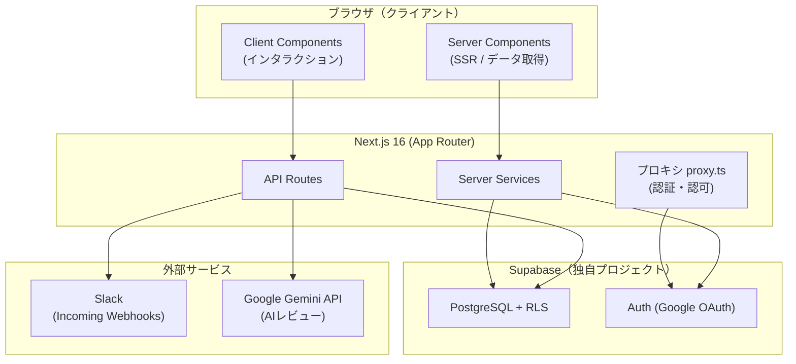
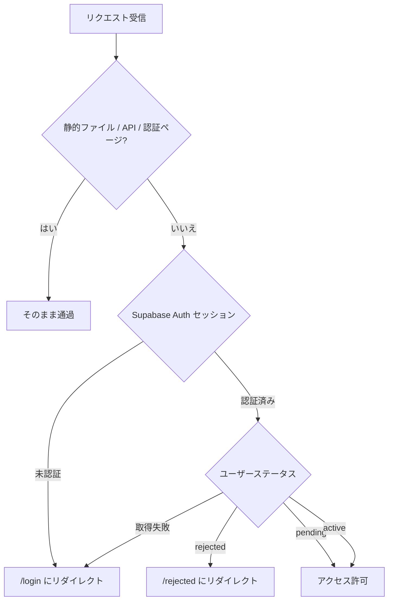
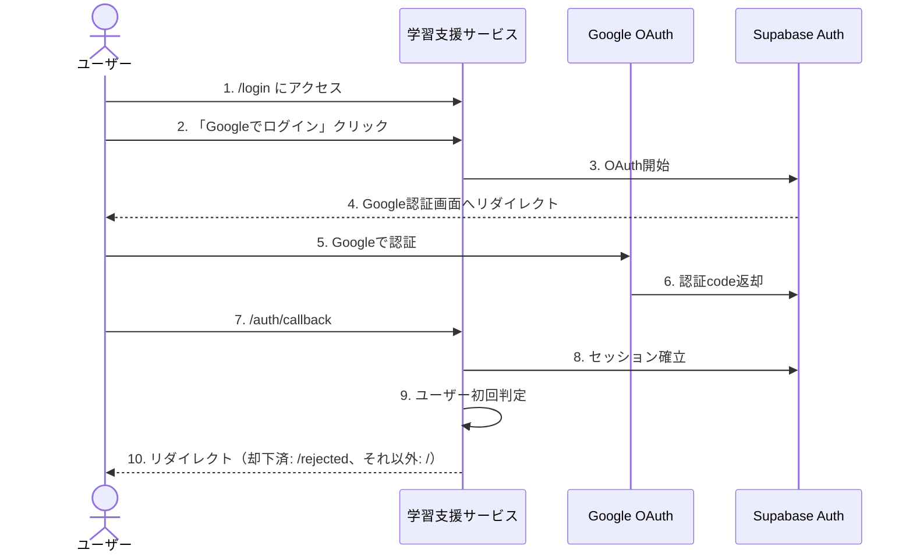
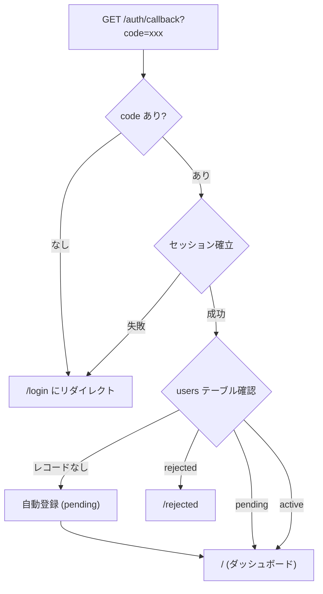
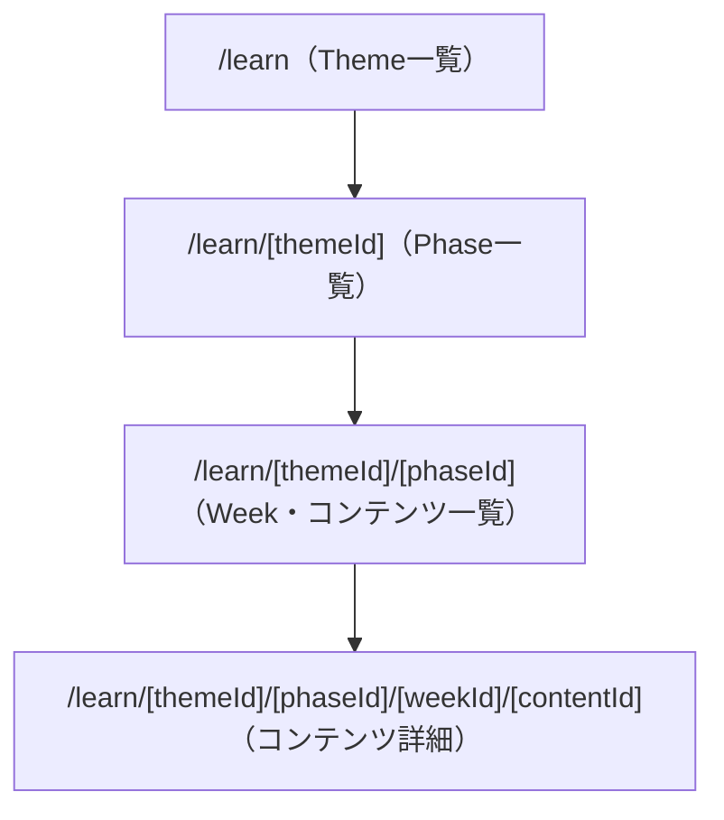
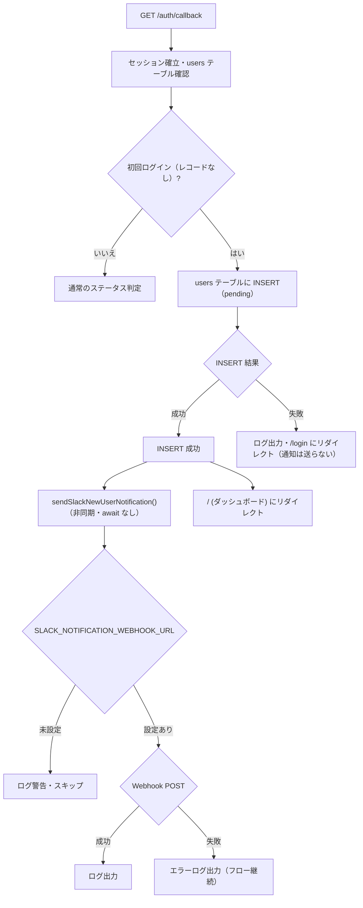
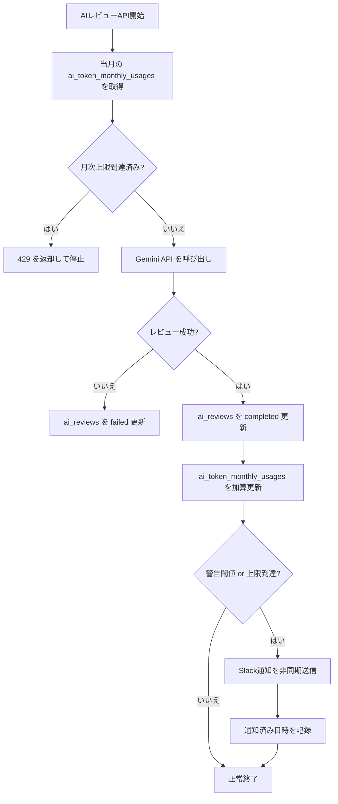

# 機能設計書

本書は、Web技術学習支援サービスの各機能の設計について記載する。

---

## 1. システムアーキテクチャ

### 1.1 全体構成



### 1.2 レイヤー構成

| レイヤー | 責務 |
|:--|:--|
| プロキシ（`proxy.ts`） | 認証・認可ゲート（静的ファイル・認証ページ以外の全リクエストをインターセプト） |
| Pages (Server Components) | ページレンダリング・Supabaseからのデータ取得 |
| Client Components | ユーザーインタラクション（フォーム、ボタン等） |
| API Routes | クライアントからのデータ更新（進捗記録、課題提出等） |
| Server Services | Supabase クエリ・ビジネスロジック |
| Auth Services | 認証・ロールベースの権限チェック |
| Notification Services | 外部通知サービスとの連携（Slack Incoming Webhooks） |

---

## 2. 認証・認可機能

### 2.1 プロキシ（proxy.ts）による認証フロー

> Next.js 16 では従来の Middleware が `proxy.ts` に改称された。本サービスの認証フローはこの `proxy.ts`（`proxy()` 関数）で実装している。



ステータス取得失敗（null）時は `/login` へ送るフェイルクローズとする。お試しユーザー（`pending`）はページアクセス自体は許可し、コンテンツ単位の制限はアプリ層とRLSで担保する（2.6参照）。

### 2.2 認証の多層構造

| レイヤー | 保護対象 | 方式 |
|:--|:--|:--|
| プロキシ（`proxy.ts`） | 全ページ | Supabase Auth セッション + ユーザーステータス確認（第一の砦。`active` / `pending` のみ許可するフェイルクローズ方式） |
| Server Components（`(authenticated)/layout.tsx`） | 認証必須ページ全体 | `getServerAuth()` の `userStatus` を許可リスト検証（`active` / `pending` 以外はリダイレクト。プロキシのスキップ経路・設定不備に備えた第二の砦） |
| Server Components（layout / page） | ロール別の表示・ナビゲーション | `getServerAuth()`（`React.cache()` でリクエスト単位にメモ化）によるロール取得・権限チェック |
| Server Components（コンテンツ表示） | お試しユーザーへのコンテンツ制限 | `userStatus` と `is_open_to_trial` によるロック判定（RLSと合わせた二層防御の第一層） |
| RLS | データベース | `auth.uid()` によるRow Level Security。お試しユーザーには `learning_contents` をお試し公開分のみに制限（二層防御の第二層） |
| API Routes | データ更新操作 | サーバー側での認証チェック + ステータスに基づく認可（`rejected` は403、お試しユーザーはお試し公開コンテンツのみ書き込み可） |

### 2.3 権限チェック

| 権限レベル | 対象ロール | 用途 |
|:--|:--|:--|
| 管理者権限 | `admin` のみ | 管理ダッシュボード、受講生管理、ユーザー管理 |
| コンテンツ管理権限 | `admin` または `maintainer` | コンテンツ CRUD 操作 |

### 2.4 Googleログインフロー



**OAuthコールバック処理**:


初回ログイン（自動登録）後もお試しユーザーとしてそのままダッシュボードへ遷移する。承認待ちであることはアプリ内バナーで通知する。

### 2.5 初回ログイン時のユーザー自動登録

OAuthコールバック処理中に初回ログインを検知し、`users` テーブルにレコードを自動作成する。

**自動登録データ**:

| カラム | 値 | 取得元 |
|:--|:--|:--|
| `auth_id` | Supabase Auth UUID | 認証ユーザー情報 |
| `email` | Googleアカウントのメール | 認証ユーザー情報 |
| `display_name` | Google表示名 | ユーザーメタデータ |
| `avatar_url` | Googleアバター画像 | ユーザーメタデータ |
| `role` | `member` | デフォルト値 |
| `status` | `pending` | デフォルト値 |

### 2.6 お試し（trial）ユーザーへのコンテンツ制限

承認前ユーザー（`status = 'pending'`）を「**お試し（trial）ユーザー**」と呼ぶ。お試し体験を通じた入会動機の醸成のため、承認前でも通常どおりログインでき、お試し公開指定されたコンテンツのみ閲覧・課題提出できる。

> DB上の status 値 `'pending'` 自体のリネームは別issueで対応予定のため、新設するフラグ名・UI文言にのみ trial 系の名称を用いる。

**閲覧範囲**: `is_published = true` かつ `is_open_to_trial = true` のコンテンツのみ閲覧・進捗登録・提出が可能。

**ロック表示**:

| 対象 | 挙動 |
|:--|:--|
| コースツリー（テーマ / フェーズ / 週 / コンテンツ一覧） | 全件表示する（何が学べるかを見せるため） |
| お試し非公開のコンテンツ | 鍵アイコンでロックし、中身（本文・動画・スライド）は表示しない |
| ロック済みコンテンツへの直リンク | ロック画面を表示する（404にはしない） |
| 承認待ちの通知 | アプリ内バナーで通知（`/pending` 承認待ち専用画面は設けない） |

**承認待ちバナーの表示場所**: `(authenticated)/layout.tsx` で `getServerAuth()` の `userStatus` が `pending` の場合にバナーを表示する。認証必須ページ全体で共通表示となり、ページごとの実装は不要。

**`/pending` の廃止方法**: 旧URLのブックマークからの流入に備え、`/pending` は404にせず `/` へリダイレクトする。実装は以下の2点をプロキシ（`proxy.ts`）で行い、リダイレクト判定を1箇所に集約する。

1. `shouldSkipMiddleware()` の対象から `/pending` を外す（対象に残したままだとプロキシが判定せず素通りさせ、ページ削除後は404になる）
2. ステータス判定を通過した `active` / `pending` ユーザーについて、パスが `/pending` の場合は `/` へリダイレクトする

これにより `rejected` は既存のステータス判定で `/rejected` へ、ステータス取得不能時は `/login` へ送られ、旧URLでも各ステータスの行き先が通常パスと一致する。承認待ち画面（`app/(auth)/pending/`）自体は削除する。

**二層防御**: アプリ層（Server Componentsでの `userStatus` と `is_open_to_trial` によるロック判定・API のお試し公開チェック）とRLS（`learning_contents` のSELECT制限）の二層で担保する。

**service_role クライアントの使用範囲**:

RLS強化により、お試し非公開コンテンツはタイトルを含めて通常クライアント（`authenticated`）から取得できなくなる。ロック表示に必要な最小限の情報を得るため、**受講生向けのコンテンツ配信経路において RLS をバイパスしてよいのは以下の2箇所に限る**。

| 用途 | 理由 |
|:--|:--|
| ツリー表示の一覧サマリー取得 | ロック済みコンテンツのタイトル・並び順を表示するため |
| コンテンツ詳細ページの存在チェック | 直リンク時に「存在しない（404）」と「ロックされている」を区別するため。通常クライアントでは両者とも0行になり判別できない |

> この制限は受講生向けのコンテンツ配信経路に限った話であり、管理者 / 講師向けの権限チェック済みクエリ（`admin-server.ts`・`/api/admin/users`・`/api/upload-pdf`・AIレビュー等）や、`user_id` フィルタで安全性を担保している既存の service_role 利用（`submissions-server.ts` 等）は従来どおりで、本設計の対象外。

**service_role クエリの必須条件**:

service_role は RLS を素通りするため、上記2箇所のクエリには以下を必ず課す。条件を省くと、`active` ユーザーにすら見えない未公開コンテンツのタイトルがお試しユーザーに露出する。

| 項目 | 内容 |
|:--|:--|
| WHERE 条件 | **`is_published = true AND is_deleted = false` で必ず絞る**（RLSが効かないため、通常の公開制御をアプリ側で再現する） |
| カラム許可リスト | `id, title, content_type, display_order, is_open_to_trial, week_id` のみ。`week_id` は週ごとのグルーピングおよびコンテンツ詳細ページの所属週判定に使用する。本文カラム（`text_content` / `video_url` / `pdf_url` / `exercise_instructions` / `reference_answer` / `hint`）は select しない |
| 0行だった場合 | 未公開・論理削除済み・存在しないコンテンツのいずれかであり、**404 として扱う**（ロック画面は表示しない） |

ロック済み（`is_open_to_trial = false`）と判定した場合はタイトルのみ表示するロック画面を返し、本文・動画・スライドは一切取得しない。

**RLS強化の対象範囲**: ステータスによる絞り込みを追加するのは `learning_contents` のみ。親階層（`learning_themes` / `learning_phases` / `learning_weeks`）は従来どおりステータス不問で公開分を閲覧可のため変更しない（データベース設計書の6.1参照）。

**進捗率の分母**: ダッシュボードの進捗率は、お試しユーザーではお試し公開コンテンツのみを分母とする（体験範囲内の進捗を示す）。集計は通常クライアントのネスト select で行うため、RLSによる絞り込みがそのまま分母に反映される。ツリーは全件表示・進捗率はお試し公開分の分母、という差異は意図的なもの。

**提出物の引き継ぎ**: 承認前の提出・進捗は `user_id` ベースで記録されるため、承認後（`pending` → `active`）もそのまま引き継がれる。管理者 / メンテナーのレビュー一覧にもお試しユーザーの提出が表示される。

**既知のエッジケース（お試し公開フラグの取り下げ）**: 提出済みコンテンツの `is_open_to_trial` を後から `false` に戻すと、提出履歴画面（提出物とコンテンツを通常クライアントでネスト取得している）でお試しユーザーにはコンテンツのタイトルが取得できず、表示が欠ける。提出レコード自体は残り、承認後は再び表示される。運用上まれなケースのため、タイトル欠落時のフォールバック表示（「非公開のコンテンツ」等）に留める。

**既知の制約（スライドPDF）**: スライドは公開バケット（`slides`、`public = true`）配信でオブジェクトキーが連番のため、ロック済みコンテンツのPDFもURL推測で取得できる。これは本機能以前からの既存の性質であり、署名付きURL化は別issueで対応する。

### 2.7 ユーザー管理（管理者向け）

**パス**: `/admin/users`

**アクセス権限**: `admin` ロールのみ

**機能**:
- 全ユーザー一覧の表示（ステータスでフィルタ可能）
- ユーザーの承認（`pending` → `active`）
- ユーザーの却下（`pending` → `rejected`）
- ステータス変更のリカバリ（`rejected` → `active`）
- ユーザーのロール変更（`member` / `maintainer` / `admin` を画面上のセレクトボックスで切り替え）

**ロール変更の制約**:
- 管理者（`admin`）のロールは変更不可（セルフロック防止）
- ロール変更は `active` ユーザーのみ対象
- ロール変更後はページを即時リロードして反映

**表示項目**: 表示名、メールアドレス、ロール（編集可能）、ステータス、登録日時、操作ボタン

### 2.8 ログアウト

サイドナビゲーションからSupabase Authのセッションを破棄し、`/login` にリダイレクトする。

### 2.9 OAuthセキュリティ

| 項目 | 対策 |
|:--|:--|
| PKCE | Supabase Auth が自動的にPKCEフローを使用 |
| CSRF保護 | OAuth stateパラメータによるCSRF防止（Supabase管理） |
| セッション管理 | HTTP-only cookieでセッショントークンを管理 |
| トークン更新 | リフレッシュトークンによる自動更新 |
| 却下済みユーザーのアクセス | プロキシ（`proxy.ts`） + `(authenticated)/layout.tsx` + RLSの多重チェック |
| 承認前ユーザーのアクセス範囲 | お試し公開コンテンツのみ。アプリ層のロック判定 + RLS（`learning_contents` のSELECT制限）の二層で担保（2.6参照） |
| ステータス改ざん | `users` テーブルの更新はRLSでadminロールのみに制限 |
| 自動登録の悪用 | Googleアカウントが必要。登録後は `pending`（お試し）となり、お試し公開コンテンツ以外の閲覧には管理者の承認が必須 |

### 2.10 Supabase Auth 設定

**Google OAuthプロバイダー設定**（Supabaseダッシュボード > Authentication > Providers）:
- Google Cloud ConsoleのOAuth 2.0クライアントID / クライアントシークレット
- リダイレクトURI: `https://<supabase-project-id>.supabase.co/auth/v1/callback`

**Google Cloud Console側の設定**:
- 承認済みリダイレクトURI: Supabaseが提供するコールバックURLを追加
- 承認済みJavaScript生成元: 本アプリのドメインを追加

**Supabase Auth URL設定**:

| 設定項目 | 値 |
|:--|:--|
| Site URL | 本アプリのURL（`http://localhost:3000` / 本番URL） |
| Redirect URLs | `http://localhost:3000/auth/callback`, `https://本番ドメイン/auth/callback` |

---

## 3. 学習コンテンツ配信機能

### 3.1 コンテンツ取得

サーバーサイドで Supabase から公開コンテンツを取得する。

**共通フィルタ条件**: `is_published = true AND is_deleted = false`
**共通ソート順**: `display_order` 昇順

取得可能なデータ:
- 公開テーマ一覧 / テーマ詳細
- テーマ内の公開フェーズ一覧 / フェーズ詳細（テーマ情報付き）
- フェーズ内の公開週一覧 / 週詳細（フェーズ・テーマ情報付き）
- 週内の公開コンテンツ一覧 / コンテンツ詳細（週・フェーズ・テーマ情報付き）

お試しユーザー（`status = 'pending'`）の場合、コンテンツ（`learning_contents`）はRLSにより `is_open_to_trial = true` の行のみが返る。ロック表示に必要なサマリー・存在チェックのみ service_role クライアントで別途取得する（2.6参照）。

### 3.2 コンテンツ種別ごとの表示

| 種別 | 表示方法 |
|:--|:--|
| 動画（video） | YouTube動画の埋め込み表示（URLからVideo IDを自動抽出、レスポンシブ対応） |
| テキスト（text） | Markdown形式で記述・表示（GFM対応）。DOMPurifyによるXSSサニタイズ |
| スライド（slide） | Supabase StorageのPDF URLを react-pdf でブラウザ内表示 |
| 演習（exercise） | Markdown形式の演習指示を表示。課題提出フォームと連携 |

### 3.3 画面遷移



各階層でパンくずリストを表示し、上位階層への導線を提供する。

---

## 4. 進捗管理機能

### 4.1 進捗記録 API

**エンドポイント**: `POST /api/progress`

**リクエストボディ**:
```json
{
  "contentId": 1,
  "userId": 1,
  "isCompleted": true
}
```

**処理フロー**:
1. リクエストボディのバリデーション（`contentId`, `userId` は必須）
2. `getServerAuth()` による認証チェック（ステータス取得を含む）
3. ユーザーID検証（認証ユーザーと一致するか）
4. ステータスに基づく認可: `rejected` は403
5. コンテンツ可視性チェック: **ステータスを問わず、対象 `contentId` が自分に可視でなければ403**（後述）
6. `user_progress` テーブルへの upsert
   - 完了時: `completed_at` に現在日時を設定
   - 未完了時: `completed_at` を null に設定

**可視性チェックの実装方法**: 通常クライアント（`authenticated`）で対象 `contentId` を SELECT し、0行なら403とする。`learning_contents` のRLSがステータスを織り込むため（データベース設計書の6.1参照）、アプリ層でステータス別の分岐を書く必要はない。この方式は「存在しない contentId」「未公開コンテンツ」も同時に弾ける。

**`active` ユーザーへの影響**: RLSに可視コンテンツ限定のEXISTS条件を追加した結果、`active` ユーザーも不可視コンテンツ（未公開・存在しないID）へは書き込めなくなる。従来は未公開コンテンツへの書き込みが素通りし、存在しないIDはFK違反で500になっていたが、いずれも403に統一される。

upsert は既存行がある場合 UPDATE 経路を通るため、RLS側も INSERT / UPDATE の双方に可視コンテンツ限定の条件を課す（データベース設計書の6.2参照）。

**レスポンス**:

| ステータス | 条件 |
|:--|:--|
| 200 | 正常（完了状態を返却） |
| 400 | バリデーションエラー |
| 401 | 未認証 |
| 403 | ユーザーID不一致 / `rejected` ユーザー / 対象コンテンツが自分に不可視（お試し非公開・未公開・存在しないID） |
| 500 | サーバーエラー |

### 4.2 進捗集計

ダッシュボードおよび一覧画面で表示する進捗率の計算:

```
進捗率 = (完了コンテンツ数 / 総コンテンツ数) × 100
```

**集計レベル**:
- **全体**: 全公開コンテンツ中の完了数
- **Phase単位**: Phase配下の全コンテンツ中の完了数
- **Week単位**: Week配下の全コンテンツ中の完了数

**お試しユーザーの分母**: 集計は通常クライアントのネスト select で行うため、お試しユーザーではRLSによる絞り込みがそのまま反映され、分母はお試し公開コンテンツのみとなる（体験範囲内の進捗を示す意図的な仕様。2.6参照）。

---

## 5. 課題提出機能

### 5.1 課題提出 API

**エンドポイント**: `POST /api/submissions`

**リクエストボディ**:
```json
{
  "contentId": 1,
  "userId": 1,
  "submissionType": "code",
  "codeContent": "function myFunction() { ... }",
  "url": null
}
```

**処理フロー**:
1. リクエストボディのバリデーション
   - `contentId`, `userId`, `submissionType` は必須
   - `code` タイプ: `codeContent` は必須
   - `url` タイプ: `url` は必須
2. `getServerAuth()` による認証チェック（ステータス取得を含む）
3. ユーザーID検証（認証ユーザーと一致するか）
4. ステータスに基づく認可: `rejected` は403
5. コンテンツ可視性チェック: ステータスを問わず、対象 `contentId` が自分に可視でなければ403（判定方法は4.1と同じ）
6. `submissions` テーブルへの INSERT

### 5.3 提出方法のコンテンツ別制御

演習コンテンツごとに許可する提出方法を `allowed_submission_types` で制御する。

| 値 | フォームの動作 |
|:--|:--|
| `'code'` | コード入力のみ表示（提出方法選択UI非表示） |
| `'url'` | URL入力のみ表示（提出方法選択UI非表示） |
| `'both'` | コード・URL両方から選択可 |

コンテンツ管理画面（`/manage/contents`）で演習コンテンツ作成・編集時に設定する。デフォルトは `'code'`。

### 5.4 コードエディタ

演習のコード提出フォームには、シンタックスハイライトと自動インデントを備えたコードエディタ（CodeMirror 6）を使用する。

**対応言語**（`code_language` カラムで演習ごとに設定）:

| 値 | 言語 | 用途例 |
|:--|:--|:--|
| `'javascript'` | JavaScript / GAS | GAS課題（デフォルト） |
| `'typescript'` | TypeScript | TypeScript課題 |
| `'html'` | HTML | フロントエンド課題 |
| `'css'` | CSS | スタイリング課題 |

**エディタ機能**:
- シンタックスハイライト
- 自動インデント・ブラケット補完
- ライト / ダークモード対応（OSテーマ連動）

**レスポンス**:

| ステータス | 条件 |
|:--|:--|
| 200 | 正常（提出データを返却） |
| 400 | バリデーションエラー |
| 401 | 未認証 |
| 403 | ユーザーID不一致 / `rejected` ユーザー / 対象コンテンツが自分に不可視（お試し非公開・未公開・存在しないID） |
| 500 | サーバーエラー |

### 5.5 ヒント表示

演習コンテンツに `hint` カラムが設定されている場合、課題提出フォームの上部にアコーディオン形式でヒントを表示する。

- ヒントはデフォルト折りたたみ（`<details>` タグ）で表示し、クリックで展開
- `hint` が `NULL` の場合はヒントUIを表示しない
- ヒント本文はMarkdown形式で記述可能（Markdownレンダリングは行わずプレーンテキストで表示）

ヒントはコンテンツ管理画面（`/manage/contents`）で演習コンテンツ作成・編集時に設定する。`reference_answer` などと同様に演習（`exercise`）専用の項目で、未入力の場合は `NULL` として保存される。

### 5.6 提出履歴

- **受講生**: 自分の提出履歴を提出日時の降順で取得（コンテンツ情報付き）
- **管理者**: 全受講生の提出一覧を提出日時の降順で取得（ユーザー・コンテンツ情報付き）

---

## 6. 管理機能

### 6.1 コンテンツ管理

Theme / Phase / Week / コンテンツそれぞれに対してCRUD操作が可能。削除は論理削除（`is_deleted = true`）。コンテンツ種別 `slide` では、PDF ファイルを Supabase Storage（`slides` バケット）にアップロードして `pdf_url` に保存する。

**アクセス権限**: `admin` または `maintainer` ロール

**管理ルート**: `/manage` 配下（`/manage/themes`、`/manage/phases`、`/manage/weeks`、`/manage/contents`）

**お試し公開の設定**: コンテンツ作成・編集フォーム（`/manage/contents`）にチェックボックス「お試しユーザーにも公開する」を設け、`is_open_to_trial` を設定する。デフォルトは未チェック（`false`）で、種別を問わず全コンテンツで設定可能（2.6参照）。

### 6.1.1 PDFアップロード API

**エンドポイント**: `POST /api/upload-pdf`

**アクセス権限**: `admin` または `maintainer` ロール

**リクエスト**: `multipart/form-data`（最大50MB）

| フィールド | 必須 | 説明 |
|:--|:--|:--|
| `file` | ○ | アップロードする PDF ファイル |
| `folder` | - | 保存先フォルダ（コーススラッグ。例: `gas-advanced`）。英小文字・数字・ハイフンのみ |
| `slideNumber` | - | スライド番号（1以上の整数）。`folder` 指定時のみ有効 |

**命名規約**: スライドは `slides` バケット内にオブジェクトキー `<コーススラッグ>/slide-NN.pdf` で保存する（NN は最低2桁のゼロ埋め。1〜99は `01`〜`99`、100以上は `100` のように桁が増える）。例: キー `gas/slide-01.pdf`・`gas-advanced/slide-03.pdf` → 公開URL `.../storage/v1/object/public/slides/gas/slide-01.pdf`。

**処理フロー**:
1. 認証チェック
2. ロール確認（admin / maintainer のみ許可）
3. 保存先オブジェクトキーの決定
   - `folder` 指定あり: `<folder>/slide-NN.pdf`
     - `slideNumber` 指定あり → その番号で保存（同名ファイルは上書き）
     - `slideNumber` 指定なし → 同フォルダ内の既存 `slide-NN.pdf` を走査し、最大値+1 で自動採番（走査失敗時は500）
   - `folder` 指定なし: 後方互換のため `<timestamp>_<sanitizedName>` でバケット直下に保存
4. Supabase Storage の `slides` バケットにアップロード
5. 公開 URL と保存パスを返却

**レスポンス**:

| ステータス | 条件 |
|:--|:--|
| 200 | 正常（`{ url: string, path: string }` を返却） |
| 400 | ファイルなし / サイズ超過 / PDF以外 / フォルダ名不正 / 番号不正 |
| 403 | 権限なし |
| 500 | アップロード失敗（自動採番中の重複含む） / サーバーエラー |

### 6.1.2 AIレビュー API

**エンドポイント**: `POST /api/ai-review`

**アクセス権限**: 認証済みユーザー（自分の提出のみ対象）

**リクエストボディ**:
```json
{ "submissionId": 1 }
```

**処理フロー**:
1. 認証チェック
2. 当月のトークン使用量集計を取得し、月次上限超過済みであればリクエストを停止
3. 提出データと関連コンテンツを取得
4. 本人の提出であることを確認
5. Gemini API にコード・演習指示・模範回答を送信してレビュー生成
6. `ai_reviews` テーブルに結果を upsert（`pending` → `processing` → `completed` / `failed`）
7. 成功時は `ai_token_monthly_usages` を更新し、必要に応じてSlack通知を送信

**トークン使用量管理方針**:
- 1リクエストごとの実績トークンは Gemini レスポンスから取得し `ai_reviews` に保存する
- 月次上限チェックとアラート重複防止には `ai_token_monthly_usages` を利用する
- MVPでは Gemini の事前見積もりAPIは導入せず、既存レスポンスで得られる実績トークンを用いて集計する
- そのため上限判定は「当月累計に基づく簡易ガード」とし、より厳密な事前制御が必要になった段階で別途拡張する

**レスポンス**:

| ステータス | 条件 |
|:--|:--|
| 200 | 正常（`{ review: AIReview }` を返却） |
| 400 | submissionId 未指定 |
| 403 | 他人の提出 |
| 404 | 提出データなし |
| 429 | 同一コンテンツのAIレビュー利用済み、または月次トークン上限到達 |
| 500 | サーバーエラー |
| 502 | Gemini API エラー |
| 503 | Gemini APIキー未設定 |

### 6.1.3 ユーザー管理 API

**エンドポイント**: `PATCH /api/admin/users`

**アクセス権限**: `admin` ロールのみ

**リクエストボディ（ステータス変更）**:
```json
{ "userId": 1, "action": "approve" }
{ "userId": 1, "action": "reject" }
```

**リクエストボディ（ロール変更）**:
```json
{ "userId": 1, "action": "change_role", "role": "maintainer" }
```

`role` に指定可能な値: `member` / `maintainer` / `admin`

**制約**:
- `admin` ロールのユーザーへのロール変更は不可（403）
- `userId` と `action` は必須（省略時は 400）

**レスポンス**:

| ステータス | 条件 |
|:--|:--|
| 200 | 正常（`{ success: true, action }` を返却） |
| 400 | バリデーションエラー |
| 403 | 管理者権限なし、または admin ユーザーへのロール変更 |
| 500 | DB 更新失敗 / サーバーエラー |

### 6.2 受講生管理

アクティブな受講生の一覧と進捗状況を表示する。

**表示項目**: 表示名、メール、進捗率（完了数/総数）、最終アクティビティ日時

**アクセス権限**: `admin` ロールのみ

### 6.3 管理ダッシュボード

**パス**: `/admin`

**表示統計**: フェーズ数、週数、コンテンツ数、受講生数、提出数、最近の提出5件、当月AIトークン使用量（使用量 / 上限 / 残量 / 通知状態）

**アクセス権限**: `admin` ロールのみ

---

## 7. 画面設計

### 7.1 認証系画面

| パス | 画面名 | 表示内容 |
|:--|:--|:--|
| `/login` | ログイン画面 | サービス名、「Googleでログイン」ボタン、サービス説明。中央寄せレイアウト、ダークモード対応 |
| `/rejected` | 却下画面 | 却下メッセージ、問い合わせ案内、ログアウトボタン |

承認待ち専用画面（`/pending`）は設けない。お試しユーザーはダッシュボードを含む通常画面にアクセスでき、承認待ちであることはアプリ内バナーで通知する（2.6参照）。`/pending` へのアクセスは `/` にリダイレクトする。

### 7.2 受講生向け画面

| パス | 画面名 | 表示内容 |
|:--|:--|:--|
| `/` | ダッシュボード | 全体進捗率、Phase別進捗バー、学習への導線リンク |
| `/learn` | Theme一覧 | 公開Themeのカード一覧（名前、説明、サムネイル） |
| `/learn/[themeId]` | Phase一覧 | パンくずリスト、Phaseカード一覧（名前、説明） |
| `/learn/[themeId]/[phaseId]` | Week・コンテンツ一覧 | パンくずリスト、Week一覧と各Week内のコンテンツリスト（タイトル、種別アイコン、完了チェック） |
| `/learn/[themeId]/[phaseId]/[weekId]/[contentId]` | コンテンツ詳細 | パンくずリスト、コンテンツ本体、完了ボタン、提出フォーム（演習のみ）、前後ナビゲーション |
| `/submissions` | 提出履歴 | 提出一覧（提出日時、コンテンツ名、提出タイプ、内容プレビュー） |

### 7.3 管理・講師向け画面（`/manage`）

admin と maintainer が共通でアクセス可能。`/admin` および `/instructor` へのアクセスは `/manage` にリダイレクトされる。

| パス | 画面名 | 表示内容 |
|:--|:--|:--|
| `/manage` | 管理ダッシュボード | 統計カード（テーマ・フェーズ・週・コンテンツ・受講生・提出数）、最近の提出リスト |
| `/manage/themes` | テーマ管理 | CRUD操作（一覧、新規作成、編集、論理削除）、サムネイル画像設定 |
| `/manage/phases` | フェーズ管理 | CRUD操作（一覧、新規作成、編集、論理削除） |
| `/manage/weeks` | 週管理 | CRUD操作（一覧、新規作成、編集、論理削除） |
| `/manage/contents` | コンテンツ管理 | CRUD操作（一覧、新規作成、編集、論理削除）、PDFアップロード |
| `/manage/students` | 受講生一覧 | テーブル形式（表示名、メール、進捗率、最終アクティビティ） |
| `/manage/submissions` | 提出管理 | テーブル形式（受講生名、コンテンツ名、提出タイプ、提出日時） |

### 7.4 管理者専用画面

| パス | 画面名 | 表示内容 |
|:--|:--|:--|
| `/admin/users` | ユーザー管理 | ユーザー一覧、承認・却下・ロール変更操作 |

### 7.5 共通UIコンポーネント

| コンポーネント | 責務 |
|:--|:--|
| サイドナビゲーション | アプリ全体のナビゲーション。デスクトップは固定サイドバー、モバイルはドロワー。管理者メニューの動的表示。ログアウト機能 |
| パンくずリスト | ページヘッダーと階層ナビゲーションの表示 |
| Markdownレンダラー | Markdownの安全なレンダリング（DOMPurifyでサニタイズ → GFM対応Markdown変換 → Typographyスタイリング） |
| YouTube埋め込み | YouTube URLからVideo IDを抽出して動画を埋め込み表示 |
| 完了ボタン | コンテンツ完了状態のトグル。進捗記録APIを呼び出し |
| 提出フォーム | 課題提出フォーム。コンテンツの `allowed_submission_types` に応じてコード・URL・両方から選択して提出 |
| AIレビューボタン | 提出後にAIレビューをリクエストし、結果を提出履歴画面に表示 |
| PDF Viewer | Supabase Storage のPDFをブラウザ内で表示（react-pdf） |

---

## 8. エラーハンドリング

### 8.1 API Routes

| エラー種別 | HTTPステータス | ハンドリング |
|:--|:--|:--|
| バリデーションエラー | 400 | リクエストボディの必須項目チェック |
| 認証エラー | 401 | Supabase Auth のセッション不在 |
| 認可エラー | 403 | ユーザーID不一致（他人のデータ操作を防止） |
| Supabase エラー | 500 | DB操作失敗（サーバーログに出力） |
| 予期しないエラー | 500 | try-catch による一括ハンドリング |

### 8.2 認証エラー

| ケース | 対応 |
|:--|:--|
| Google認証キャンセル | `/login` に戻り、エラーメッセージを表示 |
| OAuth コード交換失敗 | `/login` にリダイレクト |
| セッション期限切れ | プロキシ（`proxy.ts`）が `/login` にリダイレクト |
| Supabase接続エラー | サーバーログに出力、`/login` にリダイレクト |
| ユーザー自動登録失敗 | サーバーログに出力。ステータス確認不可のため `/login` にリダイレクト（フェイルクローズ） |
| 重複登録の試行 | `auth_id` のUNIQUE制約で防止。既存レコードを使用 |

### 8.3 Server Services

- 全サービス関数は `{ data, error }` パターンで結果を返却
- エラー時はサーバーログに出力
- 呼び出し元でエラーに応じたUI表示を制御

---

## 9. Slack通知機能

### 9.1 概要

初回ログイン時にユーザーが自動登録（`status=pending`）されると、管理者宛に承認依頼をSlackへ通知する。通知先チャンネルはSlack Incoming Webhook URLの設定により決定する。

**通知タイミング**: `GET /auth/callback` における初回ユーザー登録の成功直後

**非同期・非ブロッキング**: Slack通知の失敗はユーザー登録・リダイレクトフローに影響しない。エラーはサーバーログにのみ出力する。

### 9.2 実装構成

| ファイル | 役割 |
|:--|:--|
| `app/services/notifications/slack.ts` | Slack Incoming Webhooks へのPOSTリクエスト送信ロジック |
| `app/auth/callback/route.ts` | 初回登録後に通知サービスを呼び出す |

### 9.3 環境変数

| 変数名 | 説明 | 必須 |
|:--|:--|:--:|
| `SLACK_NOTIFICATION_WEBHOOK_URL` | Slack Incoming Webhook URL（通知先チャンネルはWebhook設定で指定） | 任意 |

環境変数が未設定の場合は通知をスキップし、ログに警告を出力する。

### 9.4 Slack通知内容

**メッセージフォーマット** (Block Kit):

```
[タイトル] 🔔 新規ユーザーが承認を待っています

表示名:   <display_name>
メール:   <email>
登録日時: <registered_at> (JST)

[管理画面を開く] → <本番URL>/admin/users
```

**フィールド詳細**:

| フィールド | 値 | 取得元 |
|:--|:--|:--|
| 表示名 | Google表示名 | `user.user_metadata.full_name` |
| メール | Googleメール | `user.email` |
| 登録日時 | サーバー現在時刻をJST（`Asia/Tokyo`）でローカル日時文字列として表示 | サーバー現在時刻 |
| 管理画面リンク | `/admin/users` への絶対URL | `NEXT_PUBLIC_APP_URL` または `request.url` のorigin |

### 9.5 処理フロー



INSERT 成功後はお試しユーザーとしてダッシュボードへ遷移する。承認依頼のSlack通知は従来どおり送信し、管理者は `/admin/users` で承認・却下を行う。

### 9.6 Slack Incoming Webhook 設定手順（運用）

1. Slack App を作成（または既存App を使用）
2. **Incoming Webhooks** を有効化
3. 通知先チャンネルを選択し、Webhook URL を発行
4. 発行した URL を `SLACK_NOTIFICATION_WEBHOOK_URL` 環境変数に設定
   - ローカル: `.env.local`
   - 本番: Vercel 環境変数

### 9.7 エラーハンドリング

| ケース | 対応 |
|:--|:--|
| `SLACK_NOTIFICATION_WEBHOOK_URL` 未設定 | ログ警告を出力し通知をスキップ。フローは継続 |
| Webhook POST がネットワークエラー | エラーログを出力し握り潰す。ユーザー登録・リダイレクトは正常完了 |
| Webhook POST が 4xx / 5xx | エラーログ（ステータスコード含む）を出力し握り潰す |
| ユーザー INSERT 失敗 | Slack通知は送信しない（中途半端な状態を通知しない） |

---

## 10. AIトークン使用量モニタリング

### 10.1 概要

AIレビュー機能で消費する Gemini トークンを月単位で監視する。既存の `ai_reviews` に保存しているリクエスト単位のトークン数を生データとし、運用監視向けに `ai_token_monthly_usages` へ月次集計を保持する。

設計方針:
- 実装変更を最小化するため、既存の Gemini レスポンス `usageMetadata` をそのまま利用する
- 新規テーブルは月次集計と通知重複防止に限定する
- 上限値や警告閾値は環境変数で管理し、アプリケーションロジックで判定する

※ `ai_token_monthly_usages` は本設計に基づき後続実装で追加予定のテーブルであり、このPR時点では未マイグレーション。

### 10.2 データソース

| データ | 保存先 | 用途 |
|:--|:--|:--|
| 1回ごとの実績トークン | `ai_reviews.prompt_tokens`, `ai_reviews.completion_tokens` | 監査・詳細確認・再集計 |
| 月次累計トークン | `ai_token_monthly_usages` | 上限チェック・管理画面表示 |
| 通知済み状態 | `ai_token_monthly_usages.warning_notified_at`, `limit_notified_at` | 同一月内の重複通知防止 |

### 10.3 処理フロー



### 10.4 設定値

| 変数名 | 説明 | 必須 |
|:--|:--|:--:|
| `AI_REVIEW_MONTHLY_TOKEN_LIMIT` | AIレビュー全体の月次トークン上限 | YES |
| `AI_REVIEW_MONTHLY_WARNING_THRESHOLD_PERCENT` | 警告通知を送る閾値（例: 80） | NO |
| `SLACK_NOTIFICATION_WEBHOOK_URL` | アラート通知送信先Webhook | NO |

警告閾値のデフォルトは 80% を想定する。

### 10.5 通知方針

- 警告通知: 当月累計が `AI_REVIEW_MONTHLY_WARNING_THRESHOLD_PERCENT` 以上になった時点で1回送信
- 上限到達通知: 当月累計が `AI_REVIEW_MONTHLY_TOKEN_LIMIT` 以上になった時点で1回送信
- いずれも同一月内では再送しない
- 通知失敗は AIレビュー結果自体には影響させず、ログ出力のみ行う

### 10.6 管理画面表示

管理者向けダッシュボードでは、少なくとも以下を確認できるようにする。

- 当月累計トークン数
- 月次上限
- 残量
- 警告通知 / 上限通知の送信有無

### 10.7 MVPで採用しないもの

- Gemini の `countTokens` 等を使った厳密な事前見積もり
- ユーザー別・ロール別の個別上限
- 日次推移やモデル別内訳の詳細ダッシュボード

これらは運用上の必要性が確認できた段階で追加拡張する。

---

## 改訂履歴

| 日付 | 内容 |
|:--|:--|
| 2026年2月 | 初版作成 |
| 2026年3月 | 認証方式を独立認証（Googleログイン + ユーザー承認）に変更。認証設計書を統合 |
| 2026年3月 | 設計書を簡素化。具体的な関数名・ファイルパスを除去し、メンテナンス性を向上 |
| 2026年3月 | 提出方法のコンテンツ別制御機能を追加（5.3節・提出フォームの説明を更新） |
| 2026年3月 | コードエディタ機能を追加（5.4節 CodeMirror 6によるシンタックスハイライト・自動インデント） |
| 2026年3月 | 演習コンテンツのヒント表示機能を追加（5.5節） |
| 2026年4月 | ユーザー管理画面にロール変更機能を追加（2.7節・6.1.3節・7.4節を更新。当時の節番号は2.6） |
| 2026年4月 | コンテンツ階層にThemeを追加し4階層化（3.1〜3.3節更新）。管理ルートを /manage に移行（6.1節・7.3節更新）。AIレビューAPI・PDFアップロードAPI追加（6.1.1〜6.1.2節）。スライドコンテンツ種別・PDF Viewerコンポーネント追記 |
| 2026年4月 | Slack通知機能を追加（セクション9）。アーキテクチャ図・レイヤー構成にNotification Servicesを追加 |
| 2026年5月 | PDFアップロードAPIに保存先フォルダ・連番ファイル名（`slides/<コース>/slide-NN.pdf`）対応を追加（6.1.1節）。自動採番・番号指定上書きに対応 |
| 2026年6月 | 演習課題のヒント（`hint`）を管理画面から設定する旨を設計に反映（5.5節） |
| 2026年7月 | 承認前ユーザーを「お試し（trial）ユーザー」と定義し、お試し公開コンテンツの閲覧・課題提出を許可する設計を追加（2.6節を新設し、以降の2.7〜2.10節を繰り下げ）。`/pending` 承認待ち画面の廃止に伴い認証フロー図・画面設計・エラーハンドリング・Slack通知フローを更新。API認証を `getServerAuth()` に一本化しステータスに基づく403判定を追記（4.1節・5.1節）。コンテンツ管理へのお試し公開設定を追記（6.1節） |
| 2026年7月 | AIトークン使用量モニタリング設計を追加。AIレビューAPIの月次上限ガード、月次集計テーブル、Slackアラート方針、管理ダッシュボード表示要件を追記 |
