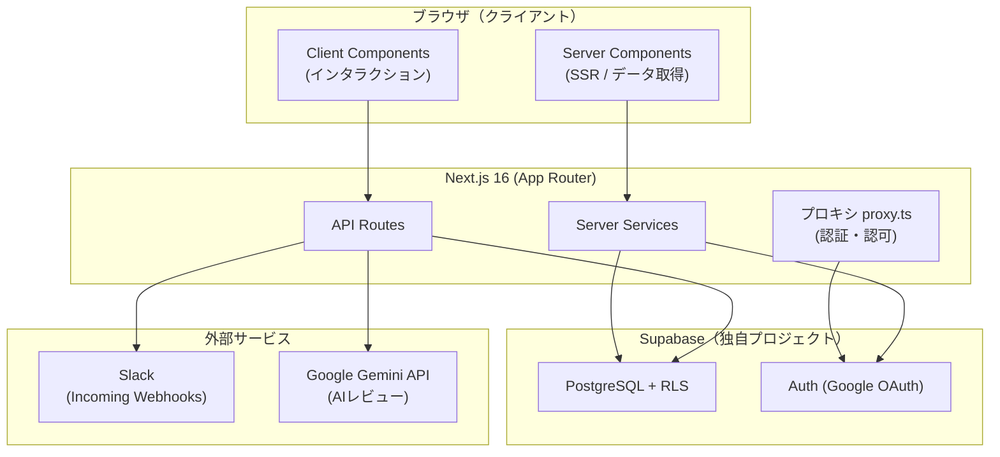
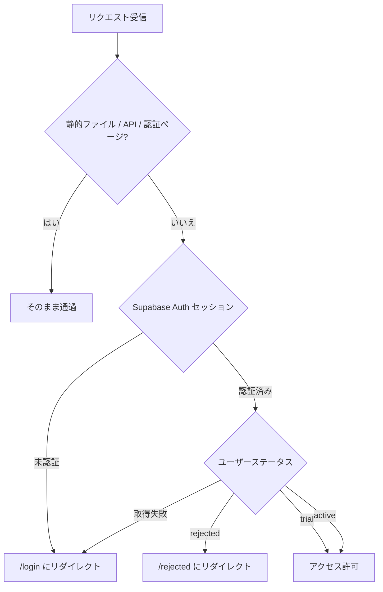
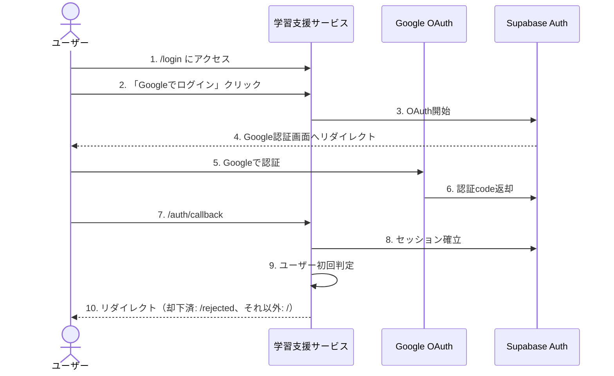
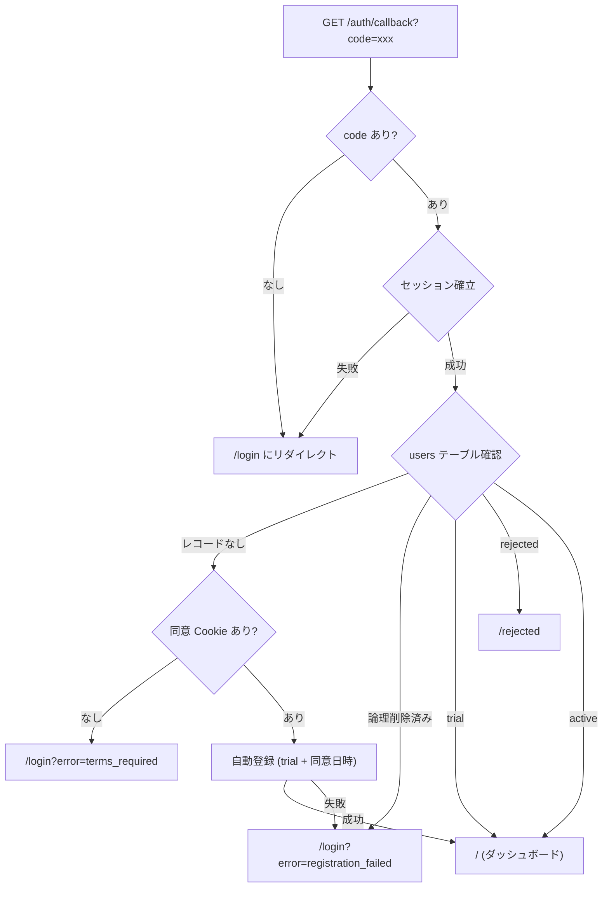
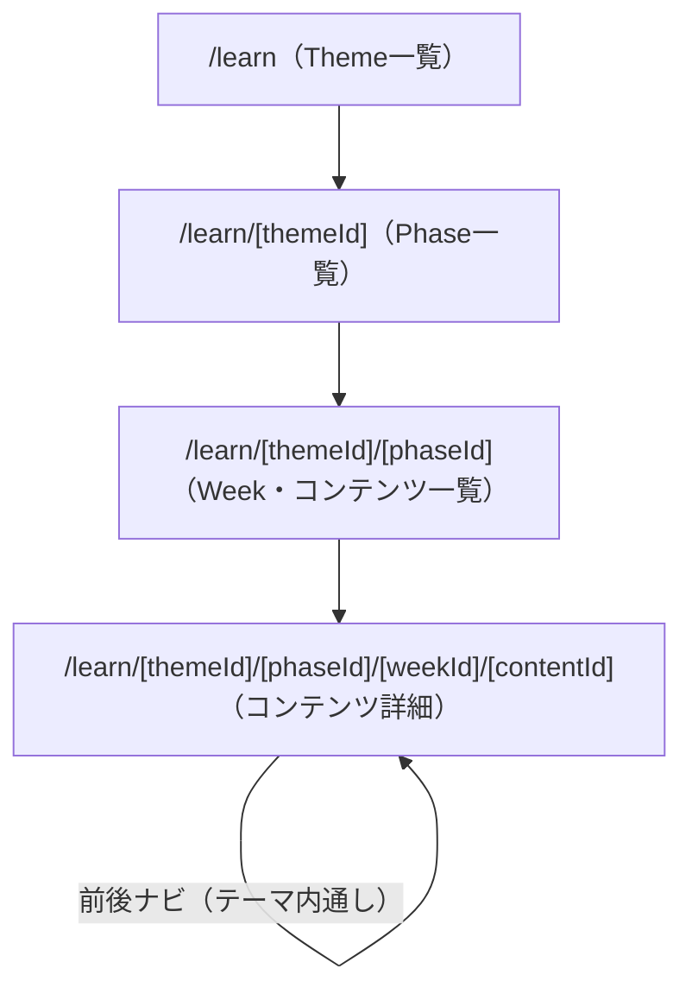

# 機能設計書

本書は、Web技術学習支援サービスの各機能の設計について記載する。

> 本書は現在の仕様のみを記載する。変更履歴は git / PR 履歴で管理し、改訂履歴節は設けない（#185）。調査ログ・一時的な運用手順は本書に残さない。

---

## 1. システムアーキテクチャ

### 1.1 全体構成


```mermaid
flowchart TB
    subgraph Browser["ブラウザ（クライアント）"]
        SC["Server Components<br/>(SSR / データ取得)"]
        CC["Client Components<br/>(インタラクション)"]
    end
    subgraph Next["Next.js 16 (App Router)"]
        SS["Server Services"]
        API["API Routes"]
        PX["プロキシ proxy.ts<br/>(認証・認可)"]
    end
    subgraph Supabase["Supabase（独自プロジェクト）"]
        PG["PostgreSQL + RLS"]
        AUTH["Auth (Google OAuth)"]
    end
    subgraph External["外部サービス"]
        SL["Slack<br/>(Incoming Webhooks)"]
        GM["Google Gemini API<br/>(AIレビュー)"]
    end

    SC --> SS
    CC --> API
    SS --> PG
    API --> PG
    PX --> AUTH
    SS --> AUTH
    API --> SL
    API --> GM
```

### 1.2 レイヤー構成

| レイヤー | 責務 |
|:--|:--|
| プロキシ（`proxy.ts`） | 認証・認可ゲート（静的ファイル・認証ページ以外の全リクエストをインターセプト） |
| Pages (Server Components) | ページレンダリング・Supabaseからのデータ取得 |
| Client Components | ユーザーインタラクション（フォーム、ボタン等） |
| API Routes | クライアントからのデータ更新（進捗記録、課題提出等） |
| Server Services | Supabase クエリ・ビジネスロジック |
| Auth Services | 認証・ロールベースの権限チェック |
| Notification Services | 外部通知サービスとの連携（Slack Incoming Webhooks） |

---

## 2. 認証・認可機能

### 2.1 プロキシ（proxy.ts）による認証フロー

> Next.js 16 では従来の Middleware が `proxy.ts` に改称された。本サービスの認証フローはこの `proxy.ts`（`proxy()` 関数）で実装している。


```mermaid
flowchart TD
    A[リクエスト受信] --> B{静的ファイル / API / 認証ページ?}
    B -->|はい| P[そのまま通過]
    B -->|いいえ| C{Supabase Auth セッション}
    C -->|未認証| L["/login にリダイレクト"]
    C -->|認証済み| D{ユーザーステータス}
    D -->|取得失敗| L
    D -->|rejected| RE["/rejected にリダイレクト"]
    D -->|trial| OK
    D -->|active| OK[アクセス許可]
```

ステータス取得失敗（null）時は `/login` へ送るフェイルクローズとする。お試しユーザー（`trial`）はページアクセス自体は許可し、コンテンツ単位の制限はアプリ層とRLSで担保する（2.6参照）。

### 2.2 認証の多層構造

| レイヤー | 保護対象 | 方式 |
|:--|:--|:--|
| プロキシ（`proxy.ts`） | 全ページ | Supabase Auth セッション + ユーザーステータス確認（第一の砦。`active` / `trial` のみ許可するフェイルクローズ方式。通過時に受信ヘッダー偽装を削除した上で `x-sinlab-*` リクエストヘッダーにユーザー情報を設定して下流へ引き渡す。スキップ対象パスでも偽装ヘッダーを削除） |
| Server Components（`(authenticated)/layout.tsx`） | 認証必須ページ全体 | `getServerAuth()` の `userStatus` を許可リスト検証（`active` / `trial` 以外はリダイレクト。プロキシのスキップ経路・設定不備に備えた第二の砦） |
| Server Components（layout / page） | ロール別の表示・ナビゲーション | `getServerAuth()`（`React.cache()` でリクエスト単位にメモ化。proxy からヘッダーが渡された場合は突合確認の上で `users` の再 SELECT を省略。`auth.getUser()` 検証は改ざん検知のため維持）によるロール取得・権限チェック |
| Server Components（コンテンツ表示） | お試しユーザーへのコンテンツ制限 | `userStatus` と `is_open_to_trial` によるロック判定（RLSと合わせた二層防御の第一層） |
| RLS | データベース | `auth.uid()` によるRow Level Security。お試しユーザーには `learning_contents` をお試し公開分のみに制限（二層防御の第二層） |
| API Routes | データ更新操作 | サーバー側での認証チェック + ステータスに基づく認可（`rejected` は403、お試しユーザーはお試し公開コンテンツのみ書き込み可） |

### 2.3 権限チェック

| 権限レベル | 対象ロール | 用途 |
|:--|:--|:--|
| 管理者権限 | `admin` のみ | 管理ダッシュボード、受講生管理、ユーザー管理 |
| コンテンツ管理権限 | `admin` または `maintainer` | コンテンツ CRUD 操作 |

**会員種別（`membership_type`）**: 承認済みユーザーは「コミュニティ会員（`community`）」と「一般有料会員（`general`）」に分類する。コミュニティ会員はコミュニティ会員プラン、一般有料会員は本サービスのみを利用するプランを指す。ロール（権限）とは独立した軸であり、**現時点では種別によるコンテンツ・機能のアクセス差はない**（将来の出し分けに備えた区別のみ）。承認前（`trial`）・却下（`rejected`）ユーザーは `NULL`。

一般有料会員への昇格には2通りの経路がある。

- **Stripe決済による自動昇格**（`general` のみ）: お試しユーザーが `/upgrade` からStripe Checkoutで決済を完了すると、管理者の承認なしに自動で `status=active` / `membership_type=general` となる（2.11節参照）
- **管理者による手動承認**（`community` / `general` いずれも可）: `/admin/users` の承認操作で管理者が種別を選択して設定する（2.7節）。**コミュニティ会員はStripe決済連携の対象外**であり、従来どおり手動承認のみで入会する

### 2.4 Googleログインフロー


```mermaid
sequenceDiagram
    actor U as ユーザー
    participant App as 学習支援サービス
    participant G as Google OAuth
    participant SB as Supabase Auth

    U->>App: 1. /login にアクセス
    U->>App: 2. 「Googleでログイン」クリック
    App->>SB: 3. OAuth開始
    SB-->>U: 4. Google認証画面へリダイレクト
    U->>G: 5. Googleで認証
    G->>SB: 6. 認証code返却
    U->>App: 7. /auth/callback
    App->>SB: 8. セッション確立
    App->>App: 9. ユーザー初回判定
    App-->>U: 10. リダイレクト（却下済: /rejected、それ以外: /）
```

**OAuthコールバック処理**:

```mermaid
flowchart TD
    A["GET /auth/callback?code=xxx"] --> B{code あり?}
    B -->|なし| L["/login にリダイレクト"]
    B -->|あり| C{セッション確立}
    C -->|失敗| L
    C -->|成功| D{users テーブル確認}
    D -->|レコードなし| T{同意 Cookie あり?}
    T -->|なし| TE["/login?error=terms_required"]
    T -->|あり| R["自動登録 (trial + 同意日時)"]
    R -->|成功| H
    R -->|失敗| F["/login?error=registration_failed"]
    D -->|論理削除済み| F
    D -->|trial| H
    D -->|rejected| RE["/rejected"]
    D -->|active| H["/ (ダッシュボード)"]
```

初回ログイン（自動登録）後もお試しユーザーとしてそのままダッシュボードへ遷移する。承認待ちであることはアプリ内バナーで通知する。同意 Cookie・登録失敗などのエラー導線は2.5・8.2を参照。

### 2.5 初回ログイン時のユーザー自動登録

OAuthコールバック処理中に初回ログインを検知し、`users` テーブルにレコードを自動作成する。`/login` には「利用規約およびプライバシーポリシーに同意する」チェックボックスを1つ置き、未チェックの間は Google ログインボタンを無効化する。チェックボックスのラベル内に利用規約・プライバシーポリシーの外部リンクを含める。同意は `GoogleLoginButton` が `signInWithOAuth` 直前にセットする短寿命の同意 Cookie（`SameSite=Lax`、有効期間30分。Google 側の2段階認証等で OAuth の往復が長引いても失効しない値）で callback へ持ち回り、`redirectTo` のクエリパラメータでは持ち回らない。規約改定時の再同意・管理画面での同意日時表示・規約本文のアプリ内ホスティングはスコープ外。

**自動登録データ**: `auth_id`・`email`（Supabase Auth のユーザー情報）、`display_name`・`avatar_url`（Google のユーザーメタデータ）、`role=member`、`status=trial`（いずれも既定値）、`terms_accepted_at`（サーバー現在時刻。同意 Cookie ありの場合のみ INSERT）。

INSERT 失敗・同意 Cookie なし・論理削除済み・存在確認失敗などのエラー導線と、Slack通知を送らない条件は8.2・9.5.1を参照。新規登録ユーザーのみが対象で、既存ユーザーの `terms_accepted_at` は `NULL` のまま利用継続でき、既存ユーザーの分岐では同意 Cookie を参照も更新もしない。`SUPABASE_SERVICE_ROLE_KEY` 未設定時は `createAdminSupabaseClient()` が throw し、通常クライアントへの暗黙フォールバックはしない（callback はこの例外を含む予期しない例外を `error` なしの `/login` へフェイルクローズし、500 にしない）。

### 2.6 お試し（trial）ユーザーへのコンテンツ制限

承認前ユーザー（`status = 'trial'`）を「**お試し（trial）ユーザー**」と呼ぶ。お試し体験を通じた入会動機の醸成のため、承認前でも通常どおりログインでき、お試し公開指定されたコンテンツのみ閲覧・課題提出できる。

**閲覧範囲**: `is_published = true` かつ `is_open_to_trial = true` のコンテンツのみ閲覧・進捗登録・提出が可能。

**ロック表示**:

| 対象 | 挙動 |
|:--|:--|
| コースツリー（テーマ / フェーズ / 週 / コンテンツ一覧） | 全件表示する（何が学べるかを見せるため） |
| お試し非公開のコンテンツ | 鍵アイコンでロックし、中身（本文・動画・スライド）は表示しない |
| ロック済みコンテンツへの直リンク | ロック画面を表示する（404にはしない） |
| ロック画面の構成（#288） | ①概要: 種別ごとの定型文（`getLockedContentFallbackOverview()`）。trial はお試し非公開コンテンツを RLS で読めず（0行）、service_role のカラム許可リストを増やすのは不変条件に反するため、`description` は取得しない。②規模: 「有料会員向けのコンテンツがN件（うち演習M件）」をツリー側の取得結果（`fetchThemeNavigationIndex()` の `paidOnlyCount` / `paidOnlyExerciseCount`）から算出し、service_role クエリは増やさない。③価値3点（`UPGRADE_BENEFITS`。お試し向けの導線専用で、契約画面 `/upgrade` の説明文には使わない）。④料金とCTA: `isStripeEnabled()` が true なら `fetchSubscriptionPrice()` の実額（主要画面を止めないよう2秒でタイムアウトし、取得失敗・タイムアウト時のみ `DISPLAY_MONTHLY_PRICE_JPY`）で「月額N円（税込）で全コンテンツが使えます」と `/upgrade` へのボタン、false なら「本登録は運営の承認で行います。承認後に閲覧できます」の案内のみ（`/upgrade` への導線を出さない）。`active` / admin にはロック画面自体が出ない |
| フェーズ一覧の鍵付き項目（#288） | タイトル横に「有料会員向け」バッジを付け、リスト末尾（お試しユーザーのみ・鍵付き項目があるとき）に1回だけCTAを置く（Stripe無効時は承認の案内） |
| 承認待ちの通知 | アプリ内バナーで通知（`/pending` 承認待ち専用画面は設けない） |

**承認待ちバナー**: `(authenticated)/layout.tsx` で `userStatus` が `trial` の場合に表示する（認証必須ページ全体で共通。ページごとの実装は不要）。

**`/pending` の廃止**: 旧URLのブックマークからの流入に備え、404にせずプロキシ（`proxy.ts`）で `/` へリダイレクトする。`shouldSkipMiddleware()` の対象から `/pending` を外し（残すとプロキシが判定せず素通りさせ、ページ削除後は404になる）、ステータス判定を通過した `active` / `trial` について `/pending` を `/` へ送る。`rejected` / ステータス取得不能は通常パスと同じく `/rejected` / `/login` へ送られる。

**service_role クライアントの使用範囲**:

RLS強化により、お試し非公開コンテンツはタイトルを含めて通常クライアント（`authenticated`）から取得できなくなる。ロック表示に必要な最小限の情報を得るため、**受講生向けのコンテンツ配信経路において RLS をバイパスしてよいのは以下の2箇所に限る**。

| 用途 | 理由 |
|:--|:--|
| ツリー表示の一覧サマリー取得 | ロック済みコンテンツのタイトル・並び順を表示するため |
| コンテンツ詳細ページの存在チェック | 直リンク時に「存在しない（404）」と「ロックされている」を区別するため。通常クライアントでは両者とも0行になり判別できない。同じ取得結果を前後ナビの通し列にも用いるため `weekIds` はテーマ内の全週に広がるが、WHERE条件・カラム許可リスト・呼び出し箇所は変わらない（3.3参照） |

> この制限は受講生向けのコンテンツ配信経路に限った話であり、管理者 / 講師向けの権限チェック済みクエリ（`admin-server.ts`・`/api/admin/users`・`/api/upload-pdf`・AIレビュー等）や、`user_id` フィルタで安全性を担保している既存の service_role 利用（`submissions-server.ts` 等）は従来どおりで、本設計の対象外。

**service_role クエリの必須条件**:

service_role は RLS を素通りするため、上記2箇所のクエリには以下を必ず課す。条件を省くと、`active` ユーザーにすら見えない未公開コンテンツのタイトルがお試しユーザーに露出する。

| 項目 | 内容 |
|:--|:--|
| WHERE 条件 | **`is_published = true AND is_deleted = false` で必ず絞る**（RLSが効かないため、通常の公開制御をアプリ側で再現する） |
| カラム許可リスト | `id, title, content_type, display_order, is_open_to_trial, week_id` のみ。`week_id` は週ごとのグルーピングおよびコンテンツ詳細ページの所属週判定に使用する。本文カラム（`text_content` / `video_url` / `pdf_url` / `exercise_instructions` / `reference_answer` / `hint`）は select しない |
| 0行だった場合 | 未公開・論理削除済み・存在しないコンテンツのいずれかであり、**404 として扱う**（ロック画面は表示しない） |

ロック済み（`is_open_to_trial = false`）と判定した場合はタイトルのみ表示するロック画面を返し、本文・動画・スライドは一切取得しない。

**親階層の公開判定はロック判定より先に行う**: 上記サマリーはコンテンツ行の `is_published` / `is_deleted` しか見ないため、コンテンツ詳細ページは member / お試しユーザーに対して、ロック判定の前に通常クライアントで取得した週（フェーズ・テーマの埋め込み付き）の3階層が公開済み・未削除であることを `isWeekHierarchyPublished()`（`learning-server.ts`）で確認し、満たさなければ 404 とする（コンテンツ行自体の公開・未削除はサマリーの WHERE 条件で担保される）。順序を逆にすると、未公開テーマ配下のロック対象コンテンツでタイトルとパンくずがロック画面に表示される（#242）。service_role の利用箇所・カラム許可リストはこのために増やさない。

**進捗率の分母**: ダッシュボードの進捗率は、お試しユーザーではお試し公開コンテンツのみを分母とする（体験範囲内の進捗を示す）。集計は通常クライアントのネスト select で行うため、RLSによる絞り込みがそのまま分母に反映される。ツリーは全件表示・進捗率はお試し公開分の分母、という差異は意図的なもの。

**提出物の引き継ぎ**: 承認前の提出・進捗は `user_id` ベースで記録されるため、承認後（`trial` → `active`）もそのまま引き継がれる。管理者 / メンテナーのレビュー一覧にもお試しユーザーの提出が表示される。

**既知のエッジケース（お試し公開フラグの取り下げ）**: 提出済みコンテンツの `is_open_to_trial` を後から `false` に戻すと、提出履歴画面（提出物とコンテンツを通常クライアントでネスト取得している）でお試しユーザーにはコンテンツのタイトルが取得できず、表示が欠ける。提出レコード自体は残り、承認後は再び表示される。運用上まれなケースのため、タイトル欠落時のフォールバック表示（「非公開のコンテンツ」等）に留める。

**スライドPDF**: ロック画面ではスライドPDFも取得しない。署名付きURLはロック判定の後にのみ発行する（3.2節）。

### 2.7 ユーザー管理（管理者向け）

**パス**: `/admin/users`

**アクセス権限**: `admin` ロールのみ

**機能**:
- 全ユーザー一覧の表示（ステータスでフィルタ可能）
- ユーザーの承認（`trial` → `active`）。承認時に会員種別を選択する
- ユーザーの却下（`trial` → `rejected`）
- ステータス変更のリカバリ（`rejected` → `active`）
- ユーザーのロール変更（`member` / `maintainer` / `admin` を画面上のセレクトボックスで切り替え）
- 案内メールの配信停止状態の表示（停止中なら停止日時）と、管理者による停止・再開（`opt_out_email` / `resume_email`。10.8節）。ステータスに関係なく操作でき、トランザクションメールには影響しない

**ロール変更の制約**:
- 管理者（`admin`）のロールは変更不可（セルフロック防止）
- ロール変更は `active` ユーザーのみ対象
- ロール変更後はページを即時リロードして反映

**会員種別の設定**:
- 承認ボタンの隣のセレクトボックスで「コミュニティ会員」「一般有料会員」を選択し、承認と同時に `membership_type` を設定する（既定は「コミュニティ会員」。ただし対象がStripe契約中の場合は下記のとおり「一般有料会員」が既定になる）
- 却下すると `membership_type` は `NULL` に戻る（承認前・却下ユーザーは会員種別を持たない）
- 却下ボタンは `active` ユーザーにも表示されるため、種別が設定済みのユーザーを却下する際は、確認ダイアログに現在の種別と「設定は解除されます」を明示する（誤操作で種別が失われることを防ぐ）
- `active` ユーザーは会員種別欄がセレクトボックスになり、選択変更と同時に `membership_type` が更新される（ロール変更セレクトと同じ操作感で、確認ダイアログなし）。`trial` / `rejected` ユーザーは種別を持たないため表示しない

**Stripe契約中ユーザーの会員種別制約**: `membership_type` と課金状態の不整合を防ぐため、Stripeサブスク契約中（現在契約中とみなせるステータスの `stripe_subscriptions` 行を持つ）ユーザーは、承認時・変更時のいずれも「一般有料会員」以外を選べない（コミュニティ会員の選択肢を無効化し、注記を表示する）。「一般有料会員」への設定自体は契約中でも常に許可する。これは、却下や `trial` からの再承認・種別誤選択などで「契約中なのに `community`」という不整合が生じた場合に、`change_membership` で「一般有料会員」へ是正する経路を塞がないため（承認だけにガードを掛けると是正できない詰みが生じる）。契約状況を取得できない場合の扱いはアクション・画面ごとに異なる:
- **会員種別変更（`active` ユーザー）**: 契約の有無を判定できないため、セレクトボックス自体を無効化する（「Stripe契約状況を取得できないため変更できません」。フェイルクローズ）
- **承認（`trial` / `rejected` ユーザー）**: 承認対象の大半はStripe非契約のお試しユーザーであり、承認フロー自体をStripeの一時的な取得失敗で止めないため、制約は掛けない（契約中と判定できた場合のみガードする）

**表示項目**: 表示名、メールアドレス、ロール（編集可能）、ステータス、会員種別（`active` はセレクトボックス、`trial`/`rejected` はバッジ。未設定は `-`）、Stripeサブスク契約中バッジ（現在契約中とみなせるステータスの `stripe_subscriptions` 行を持つユーザーのみ表示。2.11参照）、登録日時、操作ボタン

**Stripeサブスク契約中ユーザーの却下**: 却下してもStripe側のサブスクリプションは自動解約されない（自動連携はスコープ外）。却下確認ダイアログに「Stripeダッシュボードでの手動キャンセルが別途必要です」の警告を表示する。手動キャンセル手順は運用者向けドキュメントを参照。

**契約状況の取得に失敗した場合**: 契約中バッジを一律非表示にする（「契約なし」への誤ったフォールバック）と、実際には契約中のユーザーを却下した際に警告が出ずStripe課金が継続してしまう。取得エラー時はページ上部にエラーメッセージを表示し、却下確認ダイアログにも「契約状況を判定できないため、却下前にStripeダッシュボードで確認してください」という警告を全ユーザー分に表示する（フェイルクローズ）。

### 2.8 ログアウト

サイドナビゲーションからSupabase Authのセッションを破棄し、`/login` にリダイレクトする。

### 2.9 OAuthセキュリティ

| 項目 | 対策 |
|:--|:--|
| PKCE | Supabase Auth が自動的にPKCEフローを使用 |
| CSRF保護 | OAuth stateパラメータによるCSRF防止（Supabase管理） |
| セッション管理 | HTTP-only cookieでセッショントークンを管理 |
| トークン更新 | リフレッシュトークンによる自動更新 |
| ステータス改ざん | `users` テーブルの更新はRLSでadminロールのみに制限 |
| 自動登録の悪用 | Googleアカウントが必要。登録後は `trial`（お試し）となり、お試し公開コンテンツ以外の閲覧には管理者の承認が必須 |

### 2.10 Supabase Auth 設定

**Google OAuthプロバイダー設定**（Supabaseダッシュボード > Authentication > Providers）:
- Google Cloud ConsoleのOAuth 2.0クライアントID / クライアントシークレット
- リダイレクトURI: `https://<supabase-project-id>.supabase.co/auth/v1/callback`

**Google Cloud Console側の設定**:
- 承認済みリダイレクトURI: Supabaseが提供するコールバックURLを追加
- 承認済みJavaScript生成元: 本アプリのドメインを追加

**Supabase Auth URL設定**:

| 設定項目 | 値 |
|:--|:--|
| Site URL | 本アプリのURL（`http://localhost:3000` / 本番URL） |
| Redirect URLs | `http://localhost:3000/auth/callback`, `https://本番ドメイン/auth/callback` |

### 2.11 Stripeサブスク決済によるアップグレード

**機能フラグ（`STRIPE_ENABLED`）**: 本決済機能全体は環境変数 `STRIPE_ENABLED` で有効・無効を切り替える。判定は `isStripeEnabled()`（`app/constants/stripe.ts`）に集約し、未設定または `"true"` 以外の値は無効として扱う（フェイルクローズ）。`app/constants/stripe.ts` はStripe SDKに依存しないため、layout等の非決済系コードからも軽量に参照できる（決済系コードへは `app/services/api/stripe-server.ts` から再exportして提供する）。以降の節は有効時（`STRIPE_ENABLED=true`）の仕様を記述する。

無効時の挙動は以下のとおり。

| 対象 | 挙動 |
|:--|:--|
| `/upgrade` | Checkout導線（お試しユーザー向け）・お支払い管理導線（一般有料会員向け）をいずれも非表示にし、準備中である旨の案内を表示 |
| `/upgrade/success` | 決済確認・会員昇格処理を一切行わず同様の案内を表示。Stripeのホスト型Checkoutセッションは作成から最大24時間有効なため、無効化の直前に開始されたセッションから再訪しても昇格させない |
| トライアルバナー（`(authenticated)/layout.tsx`）／サイドナビ（`(authenticated)/components/SideNav.tsx`） | アップグレードボタン・「プラン・お支払い」項目を非表示 |
| `POST /api/stripe/{checkout,portal,webhook}` | 認証・署名検証より前段で503を返す（応答メッセージは `STRIPE_DISABLED_MESSAGE` に一元化） |

**対象フロー**: お試しユーザー（`status=trial`）が `/upgrade` からStripe Checkout（ホスト型）で月額サブスクリプションを契約すると、決済完了と同時に**管理者承認なし**で一般有料会員（`status=active` / `membership_type=general`）へ自動昇格する。**コミュニティ会員はスコープ外**で、従来どおり2.7節の手動承認のみを経由する。

**データモデル**: 専用テーブル `stripe_subscriptions`（ユーザーごとの課金状態のミラー、1ユーザー1行）と `stripe_events`（Webhook冪等性用）を用いる。アプリの認可判定は引き続き `users.status` / `users.membership_type` が唯一の真実であり、`users` テーブルにStripe関連カラムは追加しない（詳細は[データベース設計書](./database.md)の3.9/3.10・6.6/6.7を参照）。

**決済日の固定**: 決済日（請求サイクルのアンカー）は登録日ベースではなく、全ユーザー一律で**毎月27日 UTC 0:00（＝JST 9:00）**に固定する（`app/constants/stripe.ts` の `BILLING_ANCHOR_DAY_OF_MONTH` / `BILLING_ANCHOR_HOUR_UTC`）。27日を選んだのは全ての月に存在する日付で短い月の繰り上げ処理が不要なため、UTC 0:00（JST 9:00）を選んだのは決済失敗の検知・対応がしやすい日中帯のためである。`createCheckoutSession()` は `subscription_data.billing_cycle_anchor_config` を指定し、月の長さ・うるう年の考慮をStripe側に委ねる。この設定はCheckoutセッション作成時にのみ適用されるため、既存契約者への遡及適用（アンカー移行）は行わない（スコープ外）。

初回請求は日割り（`proration_behavior: "create_prorations"`）とする。無償（`"none"`）にすると「27日直前に登録して1ヶ月弱を無償で使い切って解約する」抜け道ができるため。ただし、アンカー直前の登録では日割り額がStripeの最低請求額（JPY ¥50）を下回りCheckout作成・決済が失敗しうるため、`isProrationBelowMinimum()` で判定し、下回る場合に限り `"none"` に切り替える。無償化されるウィンドウは月額に反比例して狭く（月額¥3000なら約12.4時間）、全面 `"none"` 採用時の1ヶ月弱とは規模が異なるため抜け道にはならない、という判断で採用している。判定にはPriceの `unit_amount`（`fetchSubscriptionPrice()` と共有するTTLキャッシュ）を用い、Priceが1ヶ月間隔でない（誤設定）場合や取得が一時的に失敗した場合は、Checkout作成全体を失敗させず `create_prorations`（安全側）にフォールバックする。

**Checkout Sessionの有効期限**: `expires_at` はStripe既定の24時間ではなく、常に作成から32分（Stripeが要求する最低30分＋安全マージン2分）に固定する。理由は2つある。

1. 二重Checkoutの排他（後述のclaim）は、セッションを特定できない場合にTTL経過で解除する設計のため。TTL経過時点で古いセッションがまだ決済可能だと、新旧2つのセッションが同時に成立しうる。TTLは「セッション有効期限 + 猶予10分」としてコードで導出し（`CHECKOUT_CLAIM_TTL_MS`）、この不等号を構造的に保証する
2. `proration_behavior: "none"`（アンカー直前の無償化）を選んだ根拠は「アンカーまでの残り時間が短いこと」だが、24時間有効なセッションを無償ウィンドウ内に開いたままアンカー通過後まで決済を遅らせて完了されると、Stripeがサブスク作成時点で次のアンカー（さらに1ヶ月先）を採用し、意図せず約1ヶ月分が無償になりうる（このガードが排除しようとした抜け道の再現）。有効期限が32分なら、アンカーまで32分以上ある間は必ずアンカー前に失効する

アンカーまで32分未満の場合はStripeの最低30分要件によりアンカーを跨ぐ余地が残るが、無償ウィンドウ自体が数時間〜半日程度の中のさらに一部でしかなく実害は小さい（完全に排除するには「アンカー直前は新規Checkout作成を一時停止する」設計が必要でスコープ外）。

**画面構成**:

| 画面 | パス | 内容 |
|:--|:--|:--|
| アップグレード | `/upgrade` | お試しユーザー: 月額料金（Stripe PriceからTTLキャッシュ付きで取得。JPY・1ヶ月間隔で取得できた場合は「月額N円（税込）」を表示。取得失敗時は `DISPLAY_MONTHLY_PRICE_JPY` のフォールバックで法定表示を残す。取得成功だが非月額・非JPYの場合は月額を断定せず見出しを出さない）+ 法定表示5項目（自動更新・料金・支払日/更新日・解約方法と解約後の扱い・未成年者注意文言）+ アップグレードボタン。実請求額を確認できない場合はボタンを無効化する。契約中の一般有料会員: 「ご契約中です」（次回のお支払い日、または解約予定日を表示。解約予約中の判定は `cancel_at_period_end` と `cancel_at` の両方で行い、解約予定日は `cancel_at`、無ければ `current_period_end` から表示する。flexible billing mode の Portal 解約は `cancel_at` にだけ現れるため。`docs/database.md` 3.9節）+ お支払い情報の管理・解約ボタン（Stripe Customer Portalへ遷移）+ 解約後の扱い（日割り返金なし・当該請求期間の末日まで利用可能）。それ以外の `active` ユーザー（コミュニティ会員・手動承認済みの一般有料会員）: 本登録済みの案内のみ。契約状況の取得自体に失敗した場合はエラーメッセージを表示し、契約なし・契約ありのいずれとも誤判定しない（フェイルクローズ）。取得失敗時もお支払い情報の管理・解約ボタンは表示し続けるが、契約の有無が不明なため解約ポリシー文言は出さない（契約が無ければAPI側が404を返すためボタン自体は安全） |
| アップグレード完了 | `/upgrade/success` | Checkoutから戻った直後のページ。`session_id` をStripe APIでretrieveし、決済完了・本人のセッションであることを確認した上で会員昇格を反映し、完了表示する。日割りで少額決済された直後であるため、`activateUserFromCheckoutSession()` が返す次回のお支払い予定日（＝満額請求日、DBの再読み込みなしで返す）も表示する（取得できなくても完了表示自体は行う） |

トライアルバナー（`(authenticated)/layout.tsx`、2.6参照）に `/upgrade` へのCTAボタンを表示する。

**会員化のタイミング（冪等性）**: Webhook（`checkout.session.completed`）を正とし、加えて `/upgrade/success` のサーバー側でも同一の冪等な有効化処理を呼ぶ。Webhookの配信遅延に関係なく、Checkoutから戻った瞬間に一般有料会員として利用開始できる。両者は同じ処理を呼ぶため、実行順序に依存しない。

会員昇格は、Stripeから取得し直した最新のサブスク状態が「現に有効」（`active` / `trialing`）なときのみ行う。Checkoutセッションの `payment_status==='paid'` だけを条件にすると、Checkout Sessionは決済後もStripe側の不変オブジェクトとして残り続けるため、解約後に `/upgrade/success?session_id=...` のURL（ブラウザ履歴等）を再訪しただけで無償のまま再昇格できてしまう。却下（`rejected`）済みユーザーも昇格対象から除外する。`activateUserFromCheckoutSession()` は実際に昇格したかを真偽値で返し、`/upgrade/success` はこれに応じて成功表示の可否を分岐する（昇格しなかった場合に誤って完了表示を出さないため）。

`/upgrade/success` の決済確認は `payment_status==='paid'` に加えて `no_payment_required` も許容する。Price側にトライアル期間が設定されている場合、Checkout時点では決済が発生せず `no_payment_required` になるため、`paid` のみを条件にするとWebhook側（`trialing` を昇格対象に含める）と非対称になり、実際には昇格済みなのにsuccessページで「決済情報を確認できませんでした」という誤ったエラー表示になってしまう。

Checkoutの決済手段はカードのみに限定する（コンビニ払い等の遅延通知系決済手段は使わない）。これらの決済手段では `checkout.session.completed` 発火時点でも未入金（`incomplete`）のままになり得るため、「Checkoutから戻った瞬間に必ず利用開始できる」という設計上の前提を成立させるための制約である。

`stripe_subscriptions` のミラー更新は、既に**別の**現行契約（終端状態でも手続き中でもない行）が記録済みの場合はスキップする。古い成功ページURLのリプレイで現行契約のミラー行が上書きされると、以後の解約Webhookが `stripe_subscription_id` で照合できなくなり、解約しても降格されなくなる事故につながるため。Checkout作成の処理権を確保しただけの行（`checkout_pending`）はまだ契約を表さないため、この判定の対象外とする（対象にすると、いま完了したCheckoutの昇格自体がスキップされてしまう）。ミラー更新時には `checkout_claimed_at` / `checkout_session_id` をNULLに戻し、処理権を正常に解除する。ただし解除するのは、claimが保持しているセッション自身の処理（またはセッションを特定できない場合）に限る。

Stripe APIからのライブ状態取得は、ミラー更新の直前（上記の既存行チェックの後）に1回だけ行い、その結果をミラー更新とusers更新の両方に使うことで、取得時点から書き込み時点までの間隔を最小化している。それでもミラー更新〜users更新の間に解約Webhookが並行実行される競合は理論上残る（完全な排他制御にはDBトランザクション/RPCが必要でスコープ外）。

**降格のタイミング**: サブスクリプションが終端状態（`canceled` / `unpaid` / `incomplete_expired` / `paused`）へ遷移した場合（解約完了・支払いリトライ全滅・未入金のまま期限切れ・トライアル終了後の支払い方法未登録による一時停止）に、お試しユーザーへ自動的に戻す（`status=trial`, `membership_type=NULL`）。降格は **`membership_type=general` のユーザーのみ**が対象で、コミュニティ会員・管理者が手動承認したユーザーを誤って巻き込まない。初回の支払い失敗（`past_due`）では降格せず、Stripe Smart Retriesに任せて運用者へSlack通知のみ行う（9章のSlack通知機能と同じ実装パターン）。進捗・提出データは `user_id` 基準で保持されるため、降格後に再課金しても引き継がれる。

**既知の限界**: この降格ガードは「`membership_type` が現在generalか」しか見ておらず、Stripe経由で契約したユーザーと管理者が手動でgeneral承認したユーザーを区別できない。却下 → 管理者が手動でgeneral再承認 → その間に旧契約の遅延Webhookが届く、という順序が発生すると手動承認分が誤って降格されうる（会員化の由来を永続化する設計変更が必要。2.7節の会員種別変更UIでも同じ限界がある既知の課題）。

**API**:

| エンドポイント | 内容 |
|:--|:--|
| `POST /api/stripe/checkout` | Checkoutセッションを作成しURLを返す。お試しユーザー以外は403。実額の確認（`fetchSubscriptionPrice()`）を処理権の確保より前に行い、取得失敗・非月額・非JPYのいずれでも503を返す（`/upgrade` の disabled だけでは古いタブや直接POSTを防げないため。Priceの取得はセッションを作らないため、claimの前でも二重作成の防止に影響しない）。その後、Checkoutセッションを作る前に処理権（claim）を原子的に確保し、確保できない場合（契約中・他の手続きが進行中）は409を返す（解約済みの行が残っているだけの場合は再契約を許可する）。claimが決済済みセッションを保持している場合・手続き中のセッションがまだ有効な場合・契約済みなのにお試しのままの場合の扱いは下記エッジケースのとおり。Stripe Customerはユーザーごとに一意に確保して再利用する。保存済みCustomerがStripe側に存在しない場合（ダッシュボードでの削除等）は、作り直して保存したうえで1度だけ再試行する（そうしないと当該ユーザーが恒久的にCheckoutへ進めなくなるため）。処理権を確保した後にCheckoutを作れなかった場合は、必ず解放してから応答する |
| `POST /api/stripe/webhook` | Stripeからのイベントを受信。生ボディで署名検証し、`event.id` のclaim（原子的な処理権確保）に成功した場合のみイベント種別ごとに処理する |
| `POST /api/stripe/portal` | Customer Portalセッションを作成しURLを返す。自身の `stripe_subscriptions` 行がない、またはCustomer未確保（Checkout手続き中に離脱した行のみ）のユーザーは404 |

portal は自分の行を読むSELECTのみだが、checkout は処理権のclaim/releaseで `stripe_subscriptions` を書き込む。DB書き込みを行う関数はいずれも `createAdminSupabaseClient()`（`SUPABASE_SERVICE_ROLE_KEY` 未設定時は throw。通常クライアントへの暗黙フォールバックなし）経由で service_role クライアントを取得する。二重の事前チェックは置かず、Customer作成前に admin client を確保することで孤児Customerを防ぐ。

**エッジケース**:
- 二重Checkout: 処理権のclaim（`stripe_subscriptions` の `checkout_pending` 行のINSERTと `user_id` のUNIQUE制約による排他）により、決済完了までミラー行が存在しない時間帯を突く並行リクエストも片方だけがセッションを作成できる。仕組みと解放条件は[データベース設計書](./database.md)3.9
- Stripe Customerの一意性: ユーザーごとに1つだけ確保・再利用する理由は[データベース設計書](./database.md)3.9。作成にはユーザー単位で固定したidempotency keyを用い、保存前にリトライが起きても同じCustomerが返るようにする
- 手続き中に離脱した場合: `checkout_pending` の行は残るが「契約中」とは扱わない（`/upgrade` の契約中表示・管理画面の契約中バッジ・Portalの404判定はいずれも `NON_CURRENT_SUBSCRIPTION_STATUSES` で除外する）。再度アップグレードを押した場合は、claimが保持するセッション（`checkout_session_id`）の状態で分岐する（`open` なら同じURLへ案内、`expired` なら処理権を奪って新規作成、`complete` なら次項。セッションを特定できない場合のみTTLを待つ。判断の詳細は[データベース設計書](./database.md)3.9）
- 決済済みのまま反映されなかった場合（Webhookとsuccessページの両方が失敗した場合。#250）: Checkout Sessionの `complete` は不変でTTLの救済も働かないため、放置すると409が永久に続く。そこで `POST /api/stripe/checkout` は、`claimCheckoutSlot()` が `blocked`（保持している決済済みセッションと、判定に使った処理権の確保時刻を伴う）を返した場合に、そのセッションを `activateUserFromCheckoutSession()` で反映する。反映はStripeから取り直したサブスクのライブ状態をミラー行に書き、処理権を解除する（既存のガード・CASはそのまま通る）。反映時は観測した処理権の確保時刻（`expectedClaimedAt`）を渡し、処理権がその値のままのときだけ書く。並行する別リクエストが先に反映・再claimした直後（セッションid記録前で既存のガードが効かない）に、その新しい処理権を解除させないためである。サブスクが有効（`active` / `trialing`）なら会員へ昇格し、新しいセッションは作らず `/upgrade/success?session_id=...` を200で返す（successページが同じ冪等な反映を行い、次回請求日つきの完了画面を出す）。それ以外は処理権の確保を1度だけやり直し、ミラー行の実状態に従って分岐する（終端状態なら新しいCheckoutを作成、`incomplete` / `past_due` など契約が残っていれば409）。反映がミラー行の書き込み前に失敗した場合（Stripe API・DBの一時的な障害）は処理権を残したまま500を返し、次のリクエストで再試行される。セッションidが未記録の照会経路で決済済みのセッションとまだ決済できる（`open`）セッションが並存する場合は、決済済みの側を優先し、`open` のセッションを失効させてから反映する（`open` へ案内すると二重払いになる。失効できなければ何もせず409）。照会経路は時計のずれの余裕（`CLAIM_LOOKUP_SKEW_SEC`）の分だけ処理権の確保より前に作られたセッションも拾うため、ミラー行に記録済みの契約（`stripe_subscription_id` が一致する）のセッションは反映済みとして決済済みに数えない。次の場合は再試行しても結果が変わらないため自動では反映せず、409を返してSlack（`sendSlackCheckoutRecoveryNotification()`）で運用者へ通知する: 決済済みのセッションが複数ある（1件目の反映で処理権が解けた後に2件目の反映が失敗すると、有効な契約を残したまま次のCheckoutを作れてしまうため）、セッションのユーザー（`client_reference_id` / `metadata.user_id`）が本人と一致しない、セッションに `customer` / `subscription` が無い、Stripeが恒久的なエラー（409・429を除く4xx。サブスクが存在しない等）を返した。同じユーザー・セッションの通知は60分に1回に抑止する（押すたびに同じ判定になるため。重複判定は `stripe_events` の一意制約によるclaimを流用し、判定に失敗した場合は通知する側に倒す）。これらの復旧処理は `app/services/api/stripe-checkout-recovery-server.ts` に置く（反映処理のある `stripe-webhook-server.ts` が `stripe-server.ts` を import しているため、両方を使う処理を独立したモジュールにして循環 import を作らない）
- 契約済みなのにお試しのままの不整合（#250）: 反映でミラー行の書き込み（処理権の解除を含む）までは成功し、会員昇格の更新だけが失敗すると、ミラー行は有効な契約を示すのにユーザーはお試しのまま残る。Webhookが届かない環境ではsuccessページのURLも手元に無いため、`POST /api/stripe/checkout` は処理権の確保が conflict になったとき、`reactivateUserFromMirror()` でこの不整合を解消する。ミラー行に契約が記録されていて（`stripe_subscription_id` があり、終端状態でも手続き中でもない）処理権を保持していない場合に、Stripeから取り直したライブ状態が有効なら昇格させ、`/upgrade` を200で返す（契約中の表示になる）。ミラーの status 自体は信用しない（未入金 `incomplete` で反映した後にStripe上で入金済みになり、Webhookが届かないまま残っている場合も救うため）。ミラーへの書き込みは、読んだ時点の契約・status・処理権なしを条件にした条件付きUPDATEで行う（取得後に並行する解約Webhookが書いた `canceled` を、古いスナップショットの `active` で上書きして昇格させないため）。管理画面には有料会員をお試しへ戻す操作が無く、お試しへの降格は終端状態への遷移時に限られるため、この組み合わせは不整合としてのみ生じる
- 進行中のCheckoutと古い成功ページURLのリプレイ: 有効なclaimが**別の**セッションを保持している場合、`activateUserFromCheckoutSession()` はミラー更新も処理権の解除も行わない（行うと、まだ決済可能なセッションを残したまま次のCheckoutを作れてしまう）。書き込みのCASは[データベース設計書](./database.md)3.9
- Checkout作成が失敗したか判別できない場合: Stripeが4xxで拒否したときなど「セッションは作られていない」と確定できるときのみ処理権を解放する。判別できない場合の扱いは[データベース設計書](./database.md)3.9
- Checkout手続き中に管理者が手動承認した場合: 決済完了時点で一般有料会員として上書きされる（許容）。降格側は `membership_type=general` ガードで巻き込みを防止する
- Checkout手続き中に管理者が却下した場合: 決済完了時点でユーザーが `rejected` であれば昇格しない（却下判断を決済完了で上書きしない）
- 受講生向けメール（10章）: 有料会員化・解約予約・有料会員終了のメールは、昇格・ミラー更新・降格が成功した後にのみ `after()` へ予約し、`email_logs` の UNIQUE で1通に抑える。送信の成否はWebhookの応答・claimの解放（再送判定）に影響しない
- Webhookイベントの順序逆転・再送・同一event.idの並行配信: `stripe_events` へのINSERTをclaimとして使う原子的な排他制御と、Stripe APIから再取得したライブ状態のみを書き込むハンドラ設計で吸収する（イベントに埋め込まれたスナップショットは信用しない）
- イベント本文の構造のAPIバージョン依存: Webhookのイベント本文（`event.data.object`）の構造はエンドポイントに設定したAPIバージョンで決まり、アプリがStripe APIを呼ぶ版（SDKが固定する `Stripe.API_VERSION`）とは独立している。このため本文から直接読んでよいのはID類（Checkout Sessionの `id` / `client_reference_id` / `metadata` / `customer` / `subscription`、Subscriptionの `id`）に限り、状態は常にStripe APIからのライブ取得を正とする。例外は `invoice.payment_failed` の運用者向けSlack通知で、本文の `customer_email` / `amount_due` / `hosted_invoice_url` を通知の表示にのみ使う（認可・会員状態の判定には使わない）。本文の他のフィールドを直接使う変更を入れる場合は、その時点でエンドポイントのAPIバージョンを `Stripe.API_VERSION` に合わせる（下記「Stripe Webhook 設定手順」）
- Stripe契約状況の取得エラー（`/upgrade`・`/admin/users`）: 「契約なし」に誤ってフォールバックせず、専用のエラーメッセージを表示する（フェイルクローズ）。特に管理画面での却下操作は、契約状況を判定できない場合も却下確認ダイアログに警告を表示する（却下操作自体は禁止せず、警告表示に留める意図的な判断）。会員種別変更（2.7節）は却下と異なり操作自体を無効化するフェイルクローズとする

**Stripe APIバージョン**: `getStripeClient()` は `apiVersion` を明示せず、SDKが固定する版（`Stripe.API_VERSION`）を使う。stripe-node はマイナー版ごと（ほぼ毎月）に同じリリース名（例: `.dahlia`）内の後方互換な版へ固定版を上げ、破壊的変更を含むリリース名の変更はメジャー版でのみ行う。明示すると型（`Stripe.LatestApiVersion`）により毎月のマイナー更新で型チェックが失敗し、Dependabot のグループ更新全体を止めるため明示しない。リリース名が変わるメジャー更新は Dependabot でもグループ外の個別PRになるため、そこで下記手順4に従いWebhookエンドポイント側も合わせる。

**スコープ外**: プランカタログ・複数通貨・クーポン・領収書カスタマイズ・却下時のサブスク自動キャンセル連携・年額プラン・プラン変更時のアンカー再設定・既存契約者へのアンカー移行（`billing_cycle_anchor_config` はサブスク作成時にのみ適用されるため、決済日固定の導入は本番での実課金開始前に行うことが前提）。

#### Stripe Webhook 設定手順（運用）

1. Stripe ダッシュボードの Webhook 設定でエンドポイントを作成（テスト環境・本番環境それぞれ）
2. エンドポイント URL に `<NEXT_PUBLIC_APP_URL>/api/stripe/webhook` を設定
   - パスの typo（例: `/api/stripe/webook`）は 404 となり、決済完了が一切反映されない
3. 購読イベントに次の4件を選択（`app/api/stripe/webhook/route.ts` の分岐と一致させる）
   - `checkout.session.completed`
   - `customer.subscription.updated`
   - `customer.subscription.deleted`
   - `invoice.payment_failed`
4. API バージョンを SDK が固定する版（`Stripe.API_VERSION`。stripe-node の CHANGELOG の「pinned API version」でも確認できる）に合わせる
   - 作り直しが必要なのは、SDK のメジャー更新でリリース名（例: `.dahlia`）が変わったときと、イベント本文から ID 類以外のフィールドを読む変更を入れるときに限る（同じリリース名内の差は後方互換で、本文は ID 類しか読まない）
   - API バージョンはエンドポイントの作成時に指定する（未指定はアカウント既定の版に従い、SDK の更新には追従しない）。既存エンドポイントの API バージョンは更新できないため、版を変えるときは新しい版でエンドポイントを作り直し、手順5の署名シークレットを再設定してから古いエンドポイントを削除する
5. エンドポイントごとに発行される署名シークレット（`whsec_…`）を `STRIPE_WEBHOOK_SECRET` 環境変数に設定
   - ローカル: `.env.local`
   - 本番: Vercel 環境変数
   - URL の編集ではシークレットは変わらないが、エンドポイントを作り直した場合（手順4の版の変更を含む）は再設定が必要

### 2.12 admin / maintainer による未公開コンテンツのプレビュー

`is_published = false`（下書き）のテーマ・フェーズ・週・コンテンツを、admin / maintainer ロールに限り通常の学習画面（`/learn/...`）でそのまま閲覧できる（issue #68）。公開前のコンテンツを確認するためだけに一度公開する、という運用を避けるための機能で、専用のプレビュー用ルートは設けない。

**権限判定**: `app/services/auth/permissions.ts` の `checkContentPermissions()` を用いる（admin / maintainer が true）。ページコンポーネント側ではロール分岐を行わず、`learning-server.ts` の各取得関数に `getServerAuth()` の `userRole` を渡すことで、取得関数の内部だけで判定する。

**RLS**: `learning_themes` / `learning_phases` / `learning_weeks` / `learning_contents` の SELECT ポリシーは admin / maintainer に未公開行を許可済み（[データベース設計書](./database.md)6.1）。変更が必要なのはアプリ層（`learning-server.ts` が独自に課す `is_published = true` の絞り込み）のみ。

**アプリ層**: `learning-server.ts` の取得関数（テーマ・フェーズ・週・コンテンツの取得と `fetchThemeNavigationIndex`）は `userRole` 引数（既定 `null`）を取り、`checkContentPermissions(userRole)` が true の場合のみ `is_published` の絞り込みを外す（`is_deleted = false` は常に維持）。`fetchThemeNavigationIndex` は週と埋め込みフェーズの双方に `is_published` 絞り込みを課す（`!inner` 結合のため未公開フェーズ配下の週はナビに現れない）。member / お試しユーザーの取得結果・RLSの適用範囲は変更しない。

**ロック表示用サマリー（2.6節）との関係**: 受講生向けのロック表示・存在チェックに使う service_role 経路（`fetchContentVisibilitySummariesByWeekIds()`）は変更しない（`is_published = true AND is_deleted = false` の絞り込みを維持）。admin / maintainer 向けには、通常クライアント（RLS適用）で未公開分も取得する別関数 `fetchContentSummariesByWeekIdsForManager()` を新設し、ロールに応じてどちらを呼ぶかを `fetchContentSummariesByWeekIds(weekIds, userRole)` が振り分ける。service_role を使ってよい箇所は2.6節の2箇所のまま増えない。

**未公開バッジ**: プレビュー中であることを明示するため、`is_published = false` の階層・コンテンツには「非公開」バッジ（`app/components/UnpublishedBadge.tsx`。`isPublished` propを受け取り自身で表示要否を判定する。`/manage` 配下の既存バッジと文言・見た目を統一）を一覧・詳細の両方に表示する。バッジの表示可否はデータ（各行の `is_published`）で判定し、ロール分岐はコンポーネント側に書かない。コンテンツ詳細ページのみ、コンテンツ行自体は公開済みでも所属する週・フェーズ・テーマのいずれかが未公開・論理削除済みならプレビュー扱いとする必要があるため、`isContentFullyPublished()`（`learning-server.ts`）で全階層の `is_published`/`is_deleted` を判定してからバッジ・完了ボタン・提出フォームの表示可否を決める（`fetchContentById()` の select は親階層に `is_deleted` フィルタを課していないため、これを省くと論理削除済みの親を持つコンテンツでUIとAPI（`isContentVisible()`）の可否表示が食い違う）。

**未公開コンテンツでの操作制限**: 進捗登録・課題提出・AIレビューはプレビュー中であっても許可しない。UI側は `isContentFullyPublished()` が false の間、完了ボタン・提出フォームを表示しない。API側は `isContentVisible()`（4.1節・5.1節参照）がコンテンツ自身に加えて週・フェーズ・テーマの全階層について `is_published = true AND is_deleted = false` を明示的に判定することで、admin / maintainer が直接APIを叩いた場合も含めて一律403にする（ロールに関わらないフェイルクローズ）。`learning_contents` の SELECT RLS は admin / maintainer に無条件で許可されるため、コンテンツ行の `is_published` だけを見ると、論理削除済みのコンテンツや未公開階層配下の（誤って公開フラグが立った）コンテンツへの操作が通ってしまう点に注意する。

**進捗率の分母**: コースツリー（フェーズページ）の進捗分母・分子は、ロック済み（お試し非公開）に加えて、コンテンツ・週・フェーズ・テーマのいずれかが未公開のものも除外する。admin / maintainer のプレビュー中は完了不能な下書きコンテンツ（公開済みでも未公開の週配下にあるコンテンツを含む）が含まれるため、分母に含めると進捗率がずれる。

---

## 3. 学習コンテンツ配信機能

### 3.1 コンテンツ取得

サーバーサイドで Supabase から公開コンテンツを取得する。

**共通フィルタ条件**: `is_published = true AND is_deleted = false`
**共通ソート順**: `display_order` 昇順

お試しユーザー（`status = 'trial'`）の場合、コンテンツ（`learning_contents`）はRLSにより `is_open_to_trial = true` の行のみが返る。ロック表示に必要なサマリー・存在チェックのみ service_role クライアントで別途取得する（2.6参照）。

admin / maintainer ロールの場合、上記の `is_published = true` 絞り込みをアプリ層で外し、未公開のテーマ・フェーズ・週・コンテンツもプレビューとして取得する（2.12参照）。

### 3.2 コンテンツ種別ごとの表示

| 種別 | 表示方法 |
|:--|:--|
| 動画（video） | YouTube facade（サムネイル + 再生ボタン）。クリックで `react-youtube` を遅延読み込みして autoplay 再生（URLから Video ID を自動抽出、レスポンシブ対応） |
| テキスト（text） | Markdown形式で記述・表示（GFM対応） |
| スライド（slide） | 非公開バケット `slides` のPDFを、閲覧権限チェック後にサーバー側で発行した署名付きURLで react-pdf によりブラウザ内表示（後述） |
| 演習（exercise） | Markdown形式の演習指示を表示。課題提出フォームと連携 |
| クイズ（quiz） | 導入文（`description`・任意）と設問（1〜3問）を表示し、回答後に正誤・解説を表示（後述） |

動画・スライドは、`learning_contents.description`（Markdown・任意入力）が設定されている場合のみ、プレイヤー／ビューア下部に概要欄カードを表示する（テキスト・演習と同じ `MarkdownRenderer`）。`MarkdownRenderer`（`app/components/MarkdownRenderer.tsx`）は `"use client"` を持たない共有コンポーネントで、Server Component からはサーバーで、Client Component（`AIReviewDisplay`）からはクライアントで同じ実装のまま描画される。コンテンツ本文の Markdown 描画経路（Server Component）は client 化しない。

**YouTube facade**: クリック前は `i.ytimg.com` の hqdefault を `` で直接参照する（最適化の恩恵がほぼ無いため `next/image` は使わず、クリック前に `youtube.com` へ通信しない）。クリック後に `YouTubePlayer` を動的読み込みして autoplay 再生する（クライアント読み込み方針は5.4.6）。iOS Safari では gesture 後に生成した cross-origin iframe の音声付き autoplay が拒否され、再生ボタンへの追加タップが必要になる場合がある（facade 化の既知の制約）。

**スライドPDFの配信（署名付きURL、#89）**

`slides` バケットは非公開（`public = false`）で、`learning_contents.pdf_url` にはオブジェクトキー（例: `gas/slide-01.pdf`）のみを保存する。配信の流れは次のとおり。

1. コンテンツ詳細ページ（`app/(authenticated)/learn/.../[contentId]/page.tsx`）は、`isContentLockedForUser()` によるロック判定と、RLS適用の `fetchContentById()` によるコンテンツ行の取得を通過した後に、`createSlideSignedUrl()`（`app/services/api/slides-server.ts`）で署名付きURLを発行し `PdfSlideViewer` へ渡す。ロック済み・未公開（admin / maintainer のプレビューを除く）・存在しないコンテンツではURL自体を発行しない
2. 署名は**通常クライアント（ログインユーザーの権限・RLS適用）**で行い、service_role は使わない。`storage.objects` の SELECT ポリシーは、member / お試しユーザーに対しては「`pdf_url` がそのオブジェクトキーと一致する `learning_contents` の行が、呼び出しユーザーの RLS 下で見え、かつ所属する週・フェーズ・テーマを含む4階層すべてが `is_published = true AND is_deleted = false`」の場合にのみ許可する（`isContentVisible()` と同じ4階層条件。#216。データベース設計書 6.8）。admin / maintainer はプレビューのためロールで無条件に許可される（2.12節。`isContentVisible()` 自体はロール非依存のフェイルクローズ）
3. 有効期限は `SLIDE_SIGNED_URL_EXPIRES_IN_SECONDS`（`app/constants/storage.ts`、1時間）。ページ描画時に発行し、期限切れ後はリロードで再発行される。pdf.js は表示直後に残りのチャンクを裏で取得し切るため、閲覧中に期限が切れてもページ送りは失敗しない
4. 発行に失敗した場合（Storage障害・キーとして解釈できない値・親階層未公開によるポリシー拒否）は `SlideContent`（`app/components/SlideContent.tsx`）が「現在表示できない」旨の中立なメッセージを表示し、ページ全体は落とさない（原因が一時障害か不正な保存値かを利用者側で区別できないため、再読み込みを促す文言にはしない）。学習画面のコンテンツ詳細では、member / お試しユーザーが親階層未公開のコンテンツに到達した場合は署名発行前に `notFound()` する（theme だけ未公開だと week/phase ガードをすり抜けうるため。#216）

未認証のデモ画面（`/demo`）のルート一覧（`app/demo/page.tsx`）は ISR（`revalidate = 3600`）でキャッシュする（ビルド時に service_role が無い環境では CI が placeholder キーを渡し、誤ったキーでは取得失敗して空表示になる）。ユーザー権限のクライアントが無いため、`createDemoSlideSignedUrl()`（`demo-learning-server.ts`）が他のデモ取得関数と同じく service_role で署名する。対象は**公開済み・未削除かつ `is_open_to_trial = true` のスライドのみ**（お試しユーザーと同じ範囲を未認証に見せる）で、この条件は呼び出し側ではなく同関数自身がコンテンツ行を受け取って判定する（満たさなければ Storage を呼ばず null）。それ以外のスライドはお試し公開の対象外である旨を表示する。

**クイズ（#306）**

設問は `quiz_questions` に持ち、受講者は `quiz_questions` を直接読めない（[データベース設計書](./database.md)3.19・6.16）。

1. コンテンツ詳細ページは `fetchQuizQuestions()`（`app/services/api/quiz-server.ts`）で RPC `get_quiz_questions` を**通常クライアント**で呼び、正解を含まない設問を `QuizForm` に渡す。service_role では読まない。取得に失敗したら「設問を読み込めませんでした」と表示する（設問ゼロの表示と区別する）。設問・選択肢・解説・模範解答の `{{SUPABASE_STORAGE_URL}}` は本文と同じく `resolveMarkdownStorageUrls()` で置換する
2. 回答は `POST /api/quiz/grade`（`{ contentId, answers: [{ questionId, choices? , text? }] }`）。認証・rejected の403のあと、member / お試しは提出 API と同じ `isContentVisible()` で403を判定する（admin / maintainer は未公開プレビューで試せるよう通さない。RPC 側も可視性を再確認する）。RPC `grade_quiz_answers` が全設問に回答したときだけ結果を返し、空なら400「すべての設問に回答してください。設問が更新された場合は、ページを再読み込みしてください」（画面は全問回答しないと送信できないため、画面から空になるのはページ表示後に設問が編集された場合）。正解・解説がレスポンスに含まれるのはこの採点後だけ
3. 画面は設問ごとに正解・不正解と解説を表示する。入力式は自動採点せず、模範解答と解説を表示する（AIレビューは流用しない。1コンテンツ1回の上限や Gemini の費用が設問単位の確認に見合わないため）。「もう一度解く」で回答をやり直せる
4. 採点に成功したら、未完了なら進捗 API（`POST /api/progress`）で完了にし、画面を再描画して完了ボタンに反映する。未公開プレビュー中は記録しない。回答内容は保存しない
5. 設問・選択肢・解説・模範解答の描画は本文と同じ `MarkdownRenderer`。ヒントは演習のヒントと同じくプレーンテキスト

`pdf_url` の旧形式（公開URL）は `20260908000000_secure_slides_bucket.sql` でキーへ正規化済み。アプリ側の `toSlideObjectKey()`（`app/lib/slide-object-key.ts`）も同じ規則で正規化するため、旧形式が管理画面やコンテンツ管理APIに流れてきてもキーとして保存され、外部URLなどキーとして解釈できない値は400で拒否する。空文字・空白のみは「未設定」として `null` に正規化して保存し、空文字の `pdf_url` を作らない（アプリは空文字を「スライド無し」として扱う一方、マイグレーションの `pdf_url` 検証は不正値として中断するため。#243）。親階層の公開判定は Storage ポリシー側にある（[データベース設計書](./database.md)6.8）。

### 3.3 画面遷移


```mermaid
flowchart TD
    A["/learn（Theme一覧）"] --> B["/learn/[themeId]（Phase一覧）"]
    B --> C["/learn/[themeId]/[phaseId]（Week・コンテンツ一覧）"]
    C --> D["/learn/[themeId]/[phaseId]/[weekId]/[contentId]（コンテンツ詳細）"]
    D -- 前後ナビ（テーマ内通し） --> D
```

各階層でパンくずリストを表示し、上位階層への導線を提供する。

#### 前後ナビゲーション

コンテンツ詳細ページ（`/learn/[themeId]/[phaseId]/[weekId]/[contentId]`）の「次へ」「前へ」は、**同じテーマ内を通し**で遷移する。週末尾の次は次の週の先頭、フェーズ末尾の次は次フェーズの先頭。**テーマはまたがない。** `/demo` は対象外。

| 項目 | 仕様 |
|:--|:--|
| 末尾 | 通し列上のテーマ末尾では「テーマに戻る」（`/learn/[themeId]`）。ナビ縮退時（通し列が空、または現在のコンテンツが通し列に無い。未公開フェーズ配下の公開週など）は従来どおり「フェーズに戻る」（`/learn/[themeId]/[phaseId]`）に倒し、現在の週のサマリーだけで前後を出す |
| 先頭 | テーマ先頭では「前へ」を出さない（「次へ」を右端に保つための空スペーサのみ） |
| 並び順 | フェーズ→週→コンテンツの `display_order` 昇順。同値は `id` でタイブレーク。空の週・空のフェーズは通し列に寄与せず自動スキップ |
| ロック済み | お試し非公開コンテンツも遷移先に含める（スキップしない）。ロック画面にも前後ナビを出す |
| 境界の併記 | 週・フェーズをまたぐときだけボタン内に「次の週: 〇〇」「次のフェーズ: 〇〇」を併記。同一週内はコンテンツ名のみ |
| データ取得 | `fetchThemeNavigationIndex()` が通常クライアントでテーマ配下の週＋フェーズを取得し、既存の `fetchContentSummariesByWeekIds()` を1回呼ぶ。**service_role の呼び出し箇所は増えない**（受講生向けは従来どおり同じ1経路。現行カタログでは1リクエスト）。コンテンツサマリーは PostgREST の1リクエスト上限（既定1000行）を range ページングで越え、テーマ全体の `display_order` 切り詰めで現在の週が欠落しないようにする |
| 404判定 | 従来どおり `fetchWeekById()` と現在の週のサマリーのみで行う。通し列は加算的な情報として扱い、通し列に現在のコンテンツが無くても404にはしない。サマリー側をページングしないと、1000行上限の切り詰めで現在の週が落ちて誤404になる |

リンクURLは現在URLの流用ではなく、遷移先コンテンツ自身の `phaseId` / `weekId` から組み立てる。

### 3.4 初回利用ガイド（オンボーディング）

初めて利用する受講生向けに、ウェルカムダイアログとはじめかたチェックリストを提供する。対象は `role = member` のみ（`trial` / `active` の両方）。判定は `app/services/auth/` の既存関数（`checkInstructorPermissions()` が false）を使い、ロールのリテラル比較はしない。

**ウェルカムダイアログ**（`app/(authenticated)/components/WelcomeDialog.tsx`、shadcn `Dialog`）
- 表示条件: `/` ダッシュボードで `role = member` かつ `users.onboarding_completed_at IS NULL` のとき、ページ表示時に開いた状態で1回表示する。他のページでは表示しない
- ステップ定義は `app/constants/onboarding.ts` に集約し、サーバー側で `status` に応じて絞り込んだものを props で渡す
  1. ようこそ: サービス概要とテーマ → フェーズ → 週 → コンテンツの4階層構成
  2. 学習の進め方: 「完了」ボタンによる進捗記録、演習の提出とAIレビュー（1コンテンツにつき1回）
  3. プランについて（`status = trial` のときのみ）: お試し公開コンテンツのみ閲覧・提出可、鍵アイコンは本登録後に閲覧可。本登録は管理者による承認、またはプランのアップグレード（`isStripeEnabled()` が true のときは `/upgrade` へのリンクも案内）
  4. 困ったときは: 不明点は管理者に問い合わせる旨
- 閉じたとき（「はじめる」・×・オーバーレイクリック・ダイアログ内リンク）は `POST /api/onboarding/complete` を呼び、成功可否に関わらず閉じる・遷移する（API失敗時は次回表示時に再度出るだけで、ユーザー操作をブロックしない）。送信は `keepalive: true` 付きで遷移中の打ち切りを防ぎ、失敗時は警告ログを残し、成功時はダッシュボードのサーバー表示を再取得する
- モバイル幅でも崩れないこと

**「次のステップ」カード**（#288。`app/(authenticated)/page.tsx`、「はじめかたチェックリスト」の直上に `Card` で表示）
- 表示条件（`shouldShowTrialNextStep()`）: `status = trial` かつ `role = member` かつ、`fetchThemeProgressSummaries()` の分母（trial ではお試し公開コンテンツ）が合計1件以上で、全テーマの完了率が100%
- 内容: 「お試しコンテンツをすべて完了しました。続きは有料会員で」＋価値3点（`UPGRADE_BENEFITS`）＋CTA（`isStripeEnabled()` が false のときは承認の案内のみ）。閉じる操作は設けず、全完了状態が続く限り表示する（永続化不要）。チェックリストと同時に出る場合はこちらを上に置く

**はじめかたチェックリスト**（`app/(authenticated)/components/GettingStartedChecklist.tsx`、`/` の「学習進捗」カード直下・「学習テーマ」一覧の上に `Card` で表示）
- 表示条件: `role = member` かつ未達成のステップがあるとき。全達成で非表示（永続化不要）
- 判定はすべてサーバー側で行う

| # | ステップ | 達成判定 | 導線リンク |
|:--|:--|:--|:--|
| 1 | 学習コンテンツを1つ完了する | `fetchThemeProgressSummaries()` の `completedContents` 合計 > 0 | 最初のテーマ（`/learn/{themes[0].id}`）。テーマが無ければ `/learn` |
| 2 | 演習課題を提出する | `submissions` に本人の行が1件以上（`limit(1)` で存在確認） | 同上 |
| 3 | AIレビューを受ける | 本人の `submissions` に紐づく `ai_reviews.status = 'completed'` が1件以上（`limit(1)` で存在確認） | `/submissions` |

- 各行にチェックアイコン（達成: `CheckCircle` + `text-success`、未達成: `Circle` + `text-muted-foreground`）、ラベル、短い説明、導線リンク。達成数（例: 1 / 3）を見出しに表示する
- お試し公開の演習が無い場合、ステップ2・3は達成不能になりうる。これは仕様として許容し、チェックリスト側で特別扱いはしない

**API**（`POST /api/onboarding/complete`、リクエストボディ無し）
- `getServerAuth()` で認証し、未認証は401、`userId` 無し / `rejected` は403（`app/api/progress/route.ts` と同じ分岐）。`role` が member 以外でも成功扱いにする
- 更新は service_role クライアント（`createAdminSupabaseClient()`）で `users` を `.eq("id", userId)` に絞り、`onboarding_completed_at` の1列のみ `now()` で UPDATE する（`user_id` フィルタで担保する service_role 利用の既存パターン）。冪等で2回目以降は上書きするだけ
- 本人 UPDATE の RLS ポリシー追加は採らない（`users` の UPDATE を本人に開くと `role` / `status` の自己書き換え対策が必要になり影響範囲が大きいため）
- 読み取りは `app/services/api/onboarding-server.ts` の `fetchOnboardingStatus()`（通常クライアントで自分の `onboarding_completed_at` を SELECT）と `fetchGettingStartedProgress()`（ステップ2・3の判定）に置く。`getServerAuth()` と `proxy.ts` のヘッダーには載せない（`/` でしか使わないため）
- `app/(authenticated)/page.tsx` は既存の `fetchThemeProgressSummaries()` と上記2関数を `Promise.all` で並列取得し、member のときのみダイアログ・チェックリストを描画する

---

## 4. 進捗管理機能

### 4.1 進捗記録 API

**エンドポイント**: `POST /api/progress`

**リクエストボディ**:
```json
{
  "contentId": 1,
  "isCompleted": true
}
```

ユーザーIDはボディで受け取らず、`getServerAuth()` が返す認証ユーザーのIDのみを使用する（クライアント由来の値で認可判定しない）。

**処理フロー**:
1. リクエストボディのバリデーション（`contentId` は正の整数、`isCompleted` は boolean で必須）
2. `getServerAuth()` による認証チェック（ステータス取得を含む）
3. ステータスに基づく認可: `rejected` は403
4. コンテンツ可視性チェック: **ステータスを問わず、対象 `contentId` が自分に可視でなければ403**（後述）
5. `user_progress` テーブルへの upsert
   - 完了時: `completed_at` に現在日時を設定し、`ever_completed` を true にする（一度 true にしたら解除でも戻さない。`first_content_completed` の初回判定に使う）
   - 未完了時: `completed_at` を null に設定する。`ever_completed` は変えない

**可視性チェックの実装方法**: 通常クライアント（`authenticated`）で対象 `contentId` を、コンテンツ自身と週・フェーズ・テーマの全階層について `is_published = true AND is_deleted = false` 付きで SELECT し、0行なら403とする。`learning_contents` のRLSがステータスを織り込むため（データベース設計書の6.1参照）、アプリ層でステータス別の分岐を書く必要はない。`is_published` / `is_deleted` の絞り込みのみアプリ層で明示する（RLSは admin / maintainer に無条件で SELECT を許可しているため、それだけでは論理削除済みや未公開階層配下のコンテンツへの進捗登録・提出・AIレビューまで通ってしまう。2.12節のプレビュー機能でも、これらの操作は許可しない）。この方式は「存在しない contentId」「未公開コンテンツ」「お試し非公開コンテンツ」「論理削除済みコンテンツ」のいずれも同時に弾ける。

upsert は既存行がある場合 UPDATE 経路を通るため、RLS側も INSERT / UPDATE の双方に可視コンテンツ限定の条件を課す（データベース設計書の6.2参照）。

**レスポンス**:

| ステータス | 条件 |
|:--|:--|
| 200 | 正常（完了状態を返却） |
| 400 | バリデーションエラー |
| 401 | 未認証 |
| 403 | `rejected` ユーザー / 対象コンテンツが自分に不可視（お試し非公開・未公開・存在しないID） |
| 500 | サーバーエラー |

### 4.2 進捗集計

ダッシュボードおよび一覧画面で表示する進捗率の計算:

```
進捗率 = (完了コンテンツ数 / 総コンテンツ数) × 100
```

**集計レベル**:
- **全体**: 全公開コンテンツ中の完了数
- **Phase単位**: Phase配下の全コンテンツ中の完了数
- **Week単位**: Week配下の全コンテンツ中の完了数

**お試しユーザーの分母**: 集計は通常クライアントのネスト select で行うため、RLSによる絞り込みがそのまま分母に反映される（2.6参照）。

---

## 5. 課題提出機能

### 5.1 課題提出 API

**エンドポイント**: `POST /api/submissions`

**リクエストボディ**:
```json
{
  "contentId": 1,
  "submissionType": "code",
  "codeFiles": [{ "filename": "main.js", "language": "javascript", "content": "function myFunction() { ... }" }],
  "url": null
}
```

`codeFiles` は複数ファイル提出用の配列。単一ファイルの後方互換として `codeContent`（文字列）も受け付けるが、`codeFiles` が優先される（データモデルの `code_content` / `code_files` の使い分けはデータベース設計書を参照）。

ユーザーIDはボディで受け取らず、`getServerAuth()` が返す認証ユーザーのIDのみを使用する（4.1と同じ）。

**処理フロー**:
1. リクエストボディのバリデーション
   - `contentId` は正の整数、`submissionType` は必須
   - `code` タイプ: `codeFiles`（複数ファイル・単一ファイルとも可）または後方互換の `codeContent` のいずれかが必須
   - `url` タイプ: `url` は必須
2. `getServerAuth()` による認証チェック（ステータス取得を含む）
3. ステータスに基づく認可: `rejected` は403
4. コンテンツ可視性チェック: ステータスを問わず、対象 `contentId` が自分に可視でなければ403（判定方法は4.1と同じ）
5. `submissions` テーブルへの INSERT

### 5.3 提出方法のコンテンツ別制御

演習コンテンツごとに許可する提出方法を `allowed_submission_types` で制御する。

| 値 | フォームの動作 |
|:--|:--|
| `'code'` | コード入力のみ表示（提出方法選択UI非表示） |
| `'url'` | URL入力のみ表示（提出方法選択UI非表示） |
| `'both'` | コード・URL両方から選択可 |

コンテンツ管理画面（`/manage/contents`）で演習コンテンツ作成・編集時に設定する。デフォルトは `'code'`。

### 5.4 コードエディタ

演習のコード提出フォームには、シンタックスハイライトと自動インデントを備えたコードエディタ（CodeMirror 6）を使用する。

**対応言語**: `code_language` カラムで演習ごとに設定する（`javascript`（既定）/ `typescript` / `gas` / `html` / `css` / `sql` / `bash` / `markdown` / `python` / `json`。#307）。許可値・既定ファイル名・表示名は `app/components/code-editor-utils.ts`（`CODE_LANGUAGES` / `DEFAULT_FILENAME_BY_LANGUAGE` / `CODE_LANGUAGE_LABELS`）に集約し、管理画面と提出フォームの言語セレクトも同じ一覧から作る。DB の CHECK 制約との一致はテストで検査する。SQL は PostgreSQL 方言、Bash は `@codemirror/legacy-modes` の shell モードで色分けする。React の `.jsx` / `.tsx` は `javascript` / `typescript` のまま提出する（エディタの言語モードは変えない）。Markdown のコードフェンスは `sql` / `bash` / `markdown` / `python` / `json` と `jsx` / `tsx` も色分けする（`MarkdownRenderer`）。

**エディタ機能**:
- シンタックスハイライト
- 自動インデント・ブラケット補完
- ライト / ダークモード対応（`<html>` の `dark` クラスに連動。未認証画面 `/login`・`/demo`（配下すべて）・`/rejected` は OS 設定にかかわらず常にライト。対象パスは `LIGHT_ONLY_PATH_PREFIXES`（`app/lib/color-scheme.ts`）が唯一の定義で、head スクリプトと `ColorSchemeSync`（遷移時の付け外し）が共有する。`useSyncExternalStore` で初期値を取得し、マウント直後のライト→ダークちらつきを防ぐ。表示中の OS テーマ切替は次の遷移か再読み込みで反映）

CodeMirror本体は数百KB規模のため遅延読み込みする（クライアント読み込み方針は5.4.6）。

#### 5.4.6 クライアント読み込み方針

重いクライアント依存はページ初期 JS から切り離す。

| 対象 | 方式 | 備考 |
|:--|:--|:--|
| CodeMirror | `CodeEditorNoSSR`（`ssr: false` + loading） | 演習フォームのみ |
| pdf.js / react-pdf | `PdfSlideViewerNoSSR`（`ssr: false` + loading） | スライドのみ |
| AIレビュー（Markdown + lowlight） | `AIReviewDisplayNoSSR`（`ssr: false`） | レビュー／ローディング時のみマウント。本文 Markdown の RSC 経路は維持 |
| react-youtube | facade + `YouTubePlayer` の dynamic | クリック前は youtube.com 非通信。サムネイルは `` で `i.ytimg.com` を直接参照 |
| radix-ui | `experimental.optimizePackageImports` | バレル import の tree-shake（`lucide-react` は Next.js 既定リストに含まれるため明示指定しない） |

**レスポンス**:

| ステータス | 条件 |
|:--|:--|
| 200 | 正常（提出データを返却） |
| 400 | バリデーションエラー |
| 401 | 未認証 |
| 403 | `rejected` ユーザー / 対象コンテンツが自分に不可視（お試し非公開・未公開・存在しないID） |
| 500 | サーバーエラー |

### 5.5 ヒント表示

演習コンテンツに `hint` カラムが設定されている場合、課題提出フォームの上部にアコーディオン形式でヒントを表示する。

- ヒントはデフォルト折りたたみ（`<details>` タグ）で表示し、クリックで展開
- `hint` が `NULL` の場合はヒントUIを表示しない
- ヒント本文はMarkdown形式で記述可能（Markdownレンダリングは行わずプレーンテキストで表示）

ヒントはコンテンツ管理画面（`/manage/contents`）で演習コンテンツ作成・編集時に設定する。`reference_answer` などと同様に演習（`exercise`）専用の項目で、未入力の場合は `NULL` として保存される。

### 5.6 提出履歴

- **受講生**: 自分の提出履歴を提出日時の降順でページネーション付き取得（`SUBMISSIONS_PAGE_SIZE`、content は id/title、ai_reviews は一覧表示用カラムのみ）
- **管理者**: 全受講生の提出一覧を提出日時の降順でページネーション付き取得（ユーザー・コンテンツ情報付き。件数定数は受講生側と共有）

---

## 6. 管理機能

### 6.1 コンテンツ管理

Theme / Phase / Week / コンテンツそれぞれに対してCRUD操作が可能。削除は論理削除（`is_deleted = true`）。行は物理削除せず、`user_progress` / `submissions` / `ai_reviews` の履歴を保持する。コンテンツ種別 `slide` では、PDF ファイルを Supabase Storage（`slides` バケット）にアップロードして `pdf_url` に保存する。テーマのサムネイル画像は Supabase Storage（`thumbnails` バケット）にアップロードして `image_url` に保存する。オブジェクトキーがテーマIDに依存するため、新規作成フォームではアップロードできず、テーマ作成後の編集画面から設定する。

**スライドPDFの削除方針**: コンテンツの単体・一括削除、週・フェーズ・テーマの削除（配下コンテンツの連鎖的な論理削除を含む）、および編集での `pdf_url` 差し替え（種別を `slide` 以外へ変更して `pdf_url` が `null` になる場合を含む。編集画面に警告を表示する）では、行の論理削除とあわせて、他から参照されていない `slides` オブジェクトのみ物理削除する。オブジェクトキーはコンテンツIDに依存せず複数コンテンツが同じ `pdf_url` を参照し得るため、削除前に生きた参照（`is_deleted = false`）が残っていないか必ず確認し、残る場合は Storage を削除しない（確認は対象キーを100件ごとのチャンクにまとめて行い、確認に失敗したチャンクは削除を試みない）。すべてのDB書き込みが成功した後に Storage 削除を行い、DB失敗時に「DBは失敗・PDFだけ消えた」状態を作らない。Storage の削除失敗・削除対象の `pdf_url` 取得失敗ではDBの論理削除全体を失敗させず、結果を `storageRemoved`（失敗時 false）で返す（サムネイル DELETE と同じ前例）。論理削除したコンテンツを復元してもPDFは戻らない（即時削除）。編集時は表示順判定と同じ現在値取得で旧 `pdf_url` も取得し、正規化後のキーが実際に変わった場合のみ削除処理へ進む（#246）。管理画面（削除確認画面・コンテンツ編集フォーム・一覧の一括削除）は `storageRemoved: false` を受け取ったら、DB 側の操作は成功扱いのまま「スライドPDFがストレージに残っている可能性がある」旨を警告表示する（`app/lib/slide-storage-warning.ts`。削除確認画面・編集フォームは一覧へ自動遷移せずに留まる。#241）。

**アクセス権限**: `admin` または `maintainer` ロール

**管理ルート**: `/manage` 配下（`/manage/themes`、`/manage/phases`、`/manage/weeks`、`/manage/contents`）

**お試し公開の設定**: コンテンツ作成・編集フォーム（`/manage/contents`）にチェックボックス「お試しユーザーにも公開する」を設け、`is_open_to_trial` を設定する。デフォルトは未チェック（`false`）で、種別を問わず全コンテンツで設定可能（2.6参照）。

**概要欄の設定**: コンテンツ種別が動画・スライド・クイズの場合のみ、コンテンツ作成・編集フォームに概要入力欄（Markdown・任意。クイズでは「導入文」）を表示し、`description` として保存する（`exercise_instructions` / `hint` と同じ、未入力なら `null` で保存するパターン）。テキスト・演習では表示せず、`description` は常に `null` として送信する。

**クイズの設問の登録（#306）**: 種別がクイズのとき、フォームに設問エディタ（`QuizQuestionsEditor`）を表示する。設問ごとに形式・設問・選択肢と正解（選択式）または模範解答（入力式）・解説・ヒントを入力し、1〜3問・選択肢2〜6個まで追加・削除できる。送信前に API と同じ zod スキーマ（`QuizQuestionsSchema`。`app/lib/quiz.ts`）で検証し、エラーは設問番号付きで表示する。`POST` / `PUT /api/manage/contents` は `quiz_questions` を受け取り、`content_type` が `quiz` のときは必須（PUT で `content_type` を送らない部分更新では不要）。保存は `replace_quiz_questions` RPC で全設問を置き換える。更新時は保存済みの設問と同じなら置き換えない（id が振り直されると、回答中の受講者の送信が旧 id で採点できなくなるため）。作成時に設問の保存が失敗したらコンテンツ行を論理削除して500。更新時は設問を先に保存し、失敗したら行を更新せず、その後の行の更新が失敗したら元の設問に戻す。編集画面は設問の取得に失敗したらフォームを出さない（空のまま保存すると設問が消えるため）。まとめて登録する場合は `POST /api/manage/contents/bulk`（`{ contents: [...] }`、1〜50件）を使う。各要素は作成 API と同じ項目（`insert_after_id` を除く）で、クイズは `quiz_questions` 必須。全件を先に検証し（1件でも不正なら400で何も作らない）、配列の順に各週の末尾へ作成する。途中で失敗したらそこで止め、500 とともに作成済みの `created`（`{ id, title }[]`）を返す（アトミックではない）。一括操作の種別変更（`PATCH` の `set_type`）ではクイズを指定できない（400。設問の無いクイズを公開しないため。許可する種別は `BULK_SETTABLE_CONTENT_TYPES`）。種別をクイズ以外へ変えても設問の行は残るが、受講者 RPC は `content_type = 'quiz'` のときだけ返し、再びクイズにするには編集画面で設問を送る（保存時に置き換わる）ため、古い設問が黙って復活することはない。

**所属週の選択（テーマ→フェーズ→週の連動セレクト）**: コンテンツ作成・編集フォームの所属週選択は、コンテンツ一覧（`/manage/contents`）の階層フィルタ（`ContentsFilterBar`）と同じ導出ロジックの3段セレクトにする。親を変更すると子の選択はリセットされ、必須は週セレクトのみ（テーマ・フェーズは絞り込み用）。編集画面では所属週から所属フェーズ・テーマを逆引きして初期選択する。送信するリクエストボディは `week_id` のみで、API・DBは変わらない。一覧のフィルタ指定は「新規作成」の初期選択に引き継ぐ。`/manage/weeks`・`/manage/phases` 一覧は階層順ソート（`sortWeeksByHierarchy` / `sortPhasesByHierarchy`）をフェーズ単位・テーマ単位にグルーピングして表示し、親階層未設定の行は末尾の「未分類」グループにまとめる（`/manage/contents` の週単位グルーピングと同形式）。

**新規作成・編集フォームの挿入位置指定（`SiblingOrderField`）**: テーマ・フェーズ・週・コンテンツの新規作成・編集フォームは、`display_order` の数値直接入力ではなく共通コンポーネント `SiblingOrderField` の挿入位置セレクトで指定する。親を選択すると、その配下の既存要素（非公開を含み、論理削除済みと編集対象自身は除く）を現在の並び順で表示する。テーマは親を持たないため常に全テーマを表示する。並び順は `content-grouping.ts` の階層順ソートと同じ比較関数（`compareGroupLevel`：`display_order` 昇順・同値は `id`）を用い、二重実装しない。

新規作成の既定の挿入位置は末尾（既存要素が無い場合は先頭のみ）で、親を選び直すと末尾へリセットする。編集フォームの既定値は、親を変更していない場合は**現在位置**（直前の兄弟要素の直後。先頭なら「先頭」）、親を変更した場合は新規作成と同じ**末尾**にリセットする（テーマは親を持たないため親変更の分岐は無い）。`ContentForm` の編集で、週セレクトの選択肢に無い週ID（未分類・削除済み等）が `week_id` に設定されている場合は、その週IDのまま兄弟候補を絞り込むため、同じ週に属する他の未削除コンテンツがあればそのまま兄弟一覧・現在位置に反映される（週を選び直せば選択肢にある週の兄弟一覧に切り替わる）。

API（`POST` / `PUT` の `/api/manage/{themes,phases,weeks,contents}[/[id]]`）は `display_order` の代わりに `insert_after_id: number | null`（`null` = 先頭、数値 = その兄弟要素IDの直後）を受け取る。`POST` は必須、`PUT` は任意項目で、**省略した場合は表示順を変更しない**（親を変更しない更新なら現状維持、親を変更する更新なら移動先の末尾に付ける）。サーバー側（`createTheme` / `createPhase` / `createWeek` / `createContent` および `updateTheme` / `updatePhase` / `updateWeek` / `updateContent`。`app/services/api/admin-server.ts`）は、`insert_after_id` が同じ親配下・未削除の兄弟要素として存在することを検証し（別の親・削除済み・存在しないID、編集時は自分自身も含めていずれも `InvalidInsertAfterIdError` を投げ、APIルートが400へ変換する）、対象範囲の兄弟を現在の並び順で取得して1からの連番に再採番してから新要素をINSERT、または対象行をUPDATEする（`display_order` が変わる行のみUPDATEし、既存の重複値も解消される）。編集で親（テーマ・フェーズ・週）を変更した場合は、移動先だけでなく移動元に残った兄弟の欠番も1からの連番に詰め直す（`resolveSiblingRenumber`）。再採番のロジック自体（`resolveSiblingResequence` / `resolveSiblingRenumber`）は `content-grouping.ts` の純粋関数で、新規作成・編集の両方から共用する。Supabase JSがトランザクションを持たないため再採番と本体のINSERT/UPDATEはアトミックではないが、途中失敗しても番号の欠番・重複が残るだけでデータは失われない。

### 6.1.1 PDFアップロード API

**エンドポイント**: `POST /api/upload-pdf`

**アクセス権限**: `admin` または `maintainer` ロール

**リクエスト**: `multipart/form-data`（最大50MB）

| フィールド | 必須 | 説明 |
|:--|:--|:--|
| `file` | ○ | アップロードする PDF ファイル |
| `folder` | - | 保存先フォルダ（コーススラッグ。例: `gas-advanced`）。英小文字・数字・ハイフンのみ |
| `slideNumber` | - | スライド番号。`folder` 指定時のみ有効。**文字列全体が半角数字のみ**で1以上 `SLIDE_NUMBER_MAX`（`app/constants/slides.ts`、999）以下である場合のみ受理し、それ以外（`1abc` / `1.5` / `+1` / `1e2` / 全角数字 / 前後に空白を含む値 / 空文字 / 上限超過 / 桁あふれ）は400（`folder` と異なり空白の除去は行わない）。**フィールド自体を送らなかった場合のみ**「指定なし」として自動採番へ回る。解釈は `parsePositiveInteger()`（`app/lib/positive-integer.ts`）に集約し、ドメイン上限の判定はスライド番号側で行う（`upload-thumbnail` の `themeId` 解釈には上限を適用しない）。管理画面のスライド番号入力は `type="number"` / `min={1}` / `step={1}` / `max={SLIDE_NUMBER_MAX}` とし、同じ定数から導出する |

**命名規約**: スライドは `slides` バケット（非公開）内にオブジェクトキー `<コーススラッグ>/slide-NN.pdf` で保存する（NN は最低2桁のゼロ埋め。1〜99は `01`〜`99`、100以上は `100` のように桁が増える）。例: `gas/slide-01.pdf`・`gas-advanced/slide-03.pdf`。`learning_contents.pdf_url` にはこのキーをそのまま保存し、配信URLは閲覧時に署名して発行する（3.2節）。

**処理フロー**:
1. 認証チェック
2. ロール確認（admin / maintainer のみ許可）
3. 保存先オブジェクトキーの決定
   - `folder` 指定あり: `<folder>/slide-NN.pdf`
     - `slideNumber` 指定あり → その番号で保存（同名ファイルは上書き）
     - `slideNumber` 指定なし → 同フォルダ内の既存 `slide-NN.pdf` を走査し、最大値+1 で自動採番（走査失敗時は500）。番号部分の解釈は指定時と同じ基準のため、ドメイン上限を超える値・安全な整数として読めないファイル名は採番の基準から除外する。採番結果自体が `SLIDE_NUMBER_MAX` を超える場合は、同じ番号を採番し続けて永久に409になるのを避けるため400を返す（`SlideNumberExhaustedError`。番号を明示指定すれば回避できる）
   - `folder` 指定なし: 後方互換のため `<timestamp>_<sanitizedName>` でバケット直下に保存
4. Supabase Storage の `slides` バケットにアップロード
5. アップロード結果の検証（`upload()` の戻り値が存在し、`fullPath` が `slides/<保存先キー>` と一致すること）。`data.path` は storage-js が引数のパスから組み立てて返すだけなので検証に使わず、サーバー応答由来の `fullPath` を用いる
6. 実体の存在確認（`exists(<保存先キー>)` による対象キーへのHEAD。完全一致で、件数上限による取りこぼしが無い）
   - 5・6 のいずれかを満たせない場合は500を返し、**保存用のキーを成功として返さない**（実体の無い `pdf_url` がコンテンツに保存されるのを防ぐ）
   - 確認に失敗してもアップロード済みオブジェクトは削除しない（一時的な通信エラーで正常なファイルを消さないため）。この場合、番号未指定で再アップロードすると残ったファイルの次の番号が採番されるため、409にはならず**どこからも参照されない孤児ファイルと欠番**が残る。どのキーを消費したかを利用者へ伝えるため、500のレスポンスには `path` を含める
7. 保存先のオブジェクトキーを返却する。配信URL（公開URL・署名付きURL）はアップロードAPIでは発行しない（閲覧時にサーバー側で署名する。3.2節）

**レスポンス**:

| ステータス | 条件 |
|:--|:--|
| 200 | 正常（`{ path: string }` を返却。`path` は `learning_contents.pdf_url` にそのまま保存するオブジェクトキー） |
| 400 | ファイルなし / サイズ超過 / PDF以外 / フォルダ名不正 / 番号不正 / 自動採番の上限到達 |
| 403 | 権限なし |
| 500 | アップロード失敗（自動採番中の重複含む） / アップロード後の存在確認に失敗 / サーバーエラー |

### 6.1.2 AIレビュー API

**エンドポイント**: `POST /api/ai-review`

**アクセス権限**: 認証済みユーザー（自分の提出のみ対象）

**APIキーの振り分け**: `getServerAuth()` が返す `userStatus` によって使用するGemini APIキーを切り替える。`active`（コミュニティ会員・一般有料会員とも）は有料ティアの `GEMINI_API_KEY`、お試しユーザー（`trial`）は無料ティアの `GEMINI_API_KEY_TRIAL`（未設定時は `GEMINI_API_KEY` にフォールバック）を用いる。選択ロジックは `resolveGeminiApiKey()`（`app/services/api/gemini.ts`）に集約し、モデル名・上限値・環境変数名は `app/constants/gemini.ts` に定義する。キーはサーバー側でのみ扱い、レスポンス・ログへ出力しない。

**リクエストボディ**:
```json
{ "submissionId": 1 }
```

**処理フロー**:
1. 認証チェック
2. 提出データと関連コンテンツを取得
3. 本人の提出であることを確認
4. Gemini API にコード・演習指示・模範回答を送信してレビュー生成（単一ファイルの提出は `code_content` に言語を持たないため、演習の `code_language` を言語として渡す）
5. `ai_reviews` テーブルに結果を upsert（`pending` → `processing` → `completed` / `failed`）

**レスポンス**:

| ステータス | 条件 |
|:--|:--|
| 200 | 正常（`{ review: AIReview }` を返却） |
| 400 | submissionId 未指定・不正（正の整数以外） |
| 403 | 他人の提出 |
| 404 | 提出データなし |
| 500 | Gemini API エラー / サーバーエラー |

### 6.1.3 ユーザー管理 API

**エンドポイント**: `PATCH /api/admin/users`

**アクセス権限**: `admin` ロールのみ

**リクエストボディ（ステータス変更）**:
```json
{ "userId": 1, "action": "approve", "membershipType": "community" }
{ "userId": 1, "action": "reject" }
```

`membershipType` に指定可能な値: `community`（コミュニティ会員） / `general`（一般有料会員）

**リクエストボディ（ロール変更）**:
```json
{ "userId": 1, "action": "change_role", "role": "maintainer" }
```

`role` に指定可能な値: `member` / `maintainer` / `admin`

**リクエストボディ（案内メールの配信停止・再開）**:
```json
{ "userId": 1, "action": "opt_out_email" }
{ "userId": 1, "action": "resume_email" }
```

`opt_out_email` は本人の依頼で管理者が停止する操作で、`users.email_opt_out_at` に `now()` を記録する（すでに停止中なら409。元の停止日時を上書きしない）。`resume_email` は `email_opt_out_at` を NULL に戻す（停止中でなければ409）。どちらも Stripe 契約の確認は行わない。

**リクエストボディ（会員種別変更）**:
```json
{ "userId": 1, "action": "change_membership", "membershipType": "general" }
```

`membershipType` に指定可能な値は `approve` と同じく `MEMBERSHIP_TYPES`（`community` / `general`）から導出する。対象は `status=active` のユーザーのみ（`status` 自体は変更しない）。

**制約**:
- `admin` ロールのユーザーへのロール変更は不可（403）
- `userId` と `action` は必須（省略時は 400）。`userId` は正の整数のみ許可する（文字列・0以下等は400。文字列を許すと後述のStripe契約中判定を型不一致ですり抜けうるため）
- `approve` では `membershipType` が必須（未指定・不正値は 400）。承認と同時に `status=active` と `membership_type` を更新する
- `reject` では `membership_type` を `NULL` に戻す
- `change_membership` では `membershipType` が必須（未指定・不正値は 400）。対象が `active` 以外・存在しない・削除済みのいずれかで0行更新の場合は 409
- **Stripe契約中ユーザーの制約（`approve` / `change_membership` 共通）**: 対象ユーザーが現在Stripeサブスク契約中の場合、`membershipType` に `general` 以外を指定すると409（`general` の指定は常に許可）。取得失敗時の扱いは非対称: `change_membership` はフェイルクローズで503を返すが、`approve` は主目的である承認フローを止めないため取得失敗時もブロックしない（2.7節参照）

**レスポンス**:

| ステータス | 条件 |
|:--|:--|
| 200 | 正常（`{ success: true, action }` を返却） |
| 400 | バリデーションエラー（`userId` 不正含む） |
| 403 | 管理者権限なし、または admin ユーザーへのロール変更 |
| 409 | `approve` の重複承認、`change_membership` の対象不正、Stripe契約中ユーザーへの `general` 以外の指定、`opt_out_email` / `resume_email` がすでに目的の状態（または対象が存在しない） |
| 500 | DB 更新失敗 / サーバーエラー |
| 503 | `change_membership` でStripe契約状況を取得できない |

### 6.1.4 サムネイルアップロード API

テーマのサムネイル画像を Supabase Storage へアップロード・削除する。アップロード成功時は同一リクエスト内で `learning_themes.image_url` も更新するため、フォームの「更新」操作を待たずに反映される。

**エンドポイント**: `POST /api/upload-thumbnail`（アップロード） / `DELETE /api/upload-thumbnail`（削除）

**アクセス権限**: `admin` または `maintainer` ロール

**リクエスト（POST）**: `multipart/form-data`（最大5MB）

| フィールド | 必須 | 説明 |
|:--|:--|:--|
| `file` | ○ | アップロードする画像ファイル（`image/png` / `image/jpeg` / `image/webp`） |
| `themeId` | ○ | 対象テーマID（正の整数） |

**リクエスト（DELETE）**: クエリパラメータ `themeId`（正の整数）

**命名規約**: サムネイルは `thumbnails` バケット内にオブジェクトキー `theme-{themeId}/thumbnail.{ext}` で保存する（`ext` は `png` / `jpg` / `webp`）。`image_url` には環境非依存の相対パス `/storage/v1/object/public/thumbnails/theme-{id}/thumbnail.{ext}?v=<timestamp>` を保存し、表示時に `resolveStorageUrl()` が Supabase URL を前置する。`?v=` は差し替え時に Supabase CDN と `next/image` のキャッシュを切り替えるためのバージョン。

**処理フロー（POST）**:
1. 認証チェック
2. ロール確認（admin / maintainer のみ許可）
3. ファイル形式・サイズ・`themeId` の検証
4. 対象テーマの存在確認（`is_deleted = false`）。存在しない場合は Storage へ書き込まずに404
5. `thumbnails` バケットへアップロード（同一拡張子の既存オブジェクトは上書き）
6. `learning_themes.image_url` を `?v=<timestamp>` 付きの相対パスへ更新。更新に失敗した場合、既存オブジェクトを上書きしていないときに限り、今回作成したオブジェクトを削除する
7. 拡張子が変わって旧オブジェクトが残る場合は、DB更新の成功後にそれを削除する
8. 相対パスと公開URLを返却

**処理フロー（DELETE）**:
1. 認証チェック、ロール確認、`themeId` の検証
2. 対象テーマの存在確認（`is_deleted = false`）
3. `learning_themes.image_url` を `NULL` に更新
4. 更新前の `image_url` が上記の命名規約に一致する場合のみ、対応する Storage オブジェクトを削除する（`/images/...` 等の旧形式の値が入っていた場合はDBのクリアのみ行う）

Storage オブジェクトの削除に失敗した場合も、DB参照は既に外れているため 500 とはせず 200 を返し、`storageRemoved: false` で部分失敗を呼び出し側へ伝える（`image_url` が `NULL` 済みで再試行しても対象を特定できないため）。管理画面はこの値を見て「ファイルが残っている可能性がある」旨を警告表示する。

**レスポンス**:

| ステータス | 条件 |
|:--|:--|
| 200 | 正常（POST: `{ path: string, url: string }` / DELETE: `{ success: true, storageRemoved: boolean }` を返却） |
| 400 | ファイルなし / サイズ超過 / 対応形式以外 / テーマID不正 |
| 401 | 未認証 |
| 403 | 権限なし、または `rejected` ユーザー |
| 404 | テーマが存在しない、または論理削除済み |
| 500 | アップロード失敗 / DB更新失敗 / サーバーエラー |

### 6.2 受講生管理

アクティブな受講生の一覧と進捗状況を表示する。

**表示項目**: 表示名、メール、進捗率（完了数/総数）、最終アクティビティ日時

**アクセス権限**: `admin` ロールのみ

### 6.3 管理ダッシュボード

**パス**: `/manage`（`/admin` はここへリダイレクト。7.3節）

**表示統計**: テーマ数、フェーズ数、週数、コンテンツ数、受講生数、提出数、最近の提出5件、週次ファネル

**アクセス権限**: `admin` / `maintainer`（`checkContentPermissions()`）

**週次ファネル**（グラフは出さない。目標値の 50% / 10% / 8% も出さない）:

RPC `get_weekly_funnel(weeks int)`（アプリは `WEEKLY_FUNNEL_WEEKS` = 8 を渡す。引数は 1〜104 に丸める）。1行は JST の月曜 0:00 から翌月曜 0:00 まで。境界は `timezone('Asia/Tokyo', timestamptz)` を `date_trunc('week', ...)` した日付（PostgreSQL の週は月曜始まり）。`fetchManageCounts()` と `Promise.all` で並列に取る。取得に失敗しても他の統計は出す。

| 列 | 算出 |
|:--|:--|
| 登録 `signups` | `users.created_at` がその週、`is_deleted = false` |
| 有効化 `activated` | その週の登録者のうち、`submissions.submitted_at` が登録時刻以上かつ登録から7日以内の提出が1件以上ある人数（コホート）。週末直前の登録は翌週末まで対象なので、今週と前週は画面に未確定と出す |
| 有料化 `upgraded` | 発生基準。`stripe_subscriptions.became_active_at`（`status` が初めて `active` になった時刻）がその週。Checkout の処理権（`checkout_pending` の INSERT）の `created_at` は使わない。後から `past_due` や終端になっても、再契約で同じ行を `checkout_pending` に戻しても週は動かない。`active` を一度も通っていない行と、手動承認の `general` は含めない。1ユーザー1行なので2回目の `active` は新しい発生にしない |
| 解約 `ended` | 発生基準。`became_active_at` がある行の `became_terminal_at`（`active` を経由したあと、`status` が初めて終端 `canceled` / `unpaid` / `incomplete_expired` / `paused` になった時刻）がその週。`trialing` → `paused` や `incomplete` → `incomplete_expired` など、一度も `active` になっていない行は含めない。後続のミラー更新で `updated_at` が動いても、再契約で `status` が戻っても週は動かない。2回目以降の終端は同じ行では数えない |
| 有料会員数 `paid_total` | 週末時点の `membership_type = general` かつ `status = active` の近似（途中の空白期間の履歴は無い）。現在その状態で未削除、かつ `became_active_at` が週末より前でいま終端でも `checkout_pending` でもない、または Stripe 行が無い / 終端 / `checkout_pending` で `updated_at` が週末より前（手動承認。解約後や Checkout 中断後の行も拾う。承認後の別更新で過去週から外れることがある）。いま終端でも、`became_active_at` が週末より前かつ `became_terminal_at` が週末以後ならその週末までは有料だったとみなす。再契約で現在有効な行は、最初の `became_active_at` 以降の空白週も有料に見える。論理削除に `deleted_at` が無いので削除済みは全週から除く |

呼び出しは `fetchWeeklyFunnel()`（`admin-server.ts`）だけ。`checkContentPermissions()` で admin / maintainer を確認してから service_role で RPC する。`stripe_subscriptions` の SELECT は本人か admin だけなので、maintainer の JWT のままでは有料化・解約が過少になる。SELECT ポリシーは広げない（集計以外の顧客 ID を maintainer に見せない）。関数自体は `SECURITY INVOKER` で、member が直接呼んでも RLS の見える行だけが対象。

---

## 7. 画面設計

### 7.1 認証系画面

| パス | 画面名 | 表示内容 |
|:--|:--|:--|
| `/login` | ログイン画面 | サービス名、利用規約・プライバシーポリシーへの同意チェックボックス（未チェックの間は「Googleでログイン」ボタンを無効化）、「Googleでログイン」ボタン、サービス説明。`error=registration_failed` のときは登録失敗メッセージ、`error=terms_required` のときは同意要求メッセージを表示（未知の `error` 値は何も出さない）。LP の内容を引用したサービス紹介ブロック（キャッチコピー、サブコピー、料金1行、「デモを試す」（`/demo` への内部リンク）・「無料体験会に申込む」・「サービス紹介を見る」（LP）の3リンク、4つの仕組みの順）と、「実際の学習画面」（動画・スライド・課題提出・AIレビューの画面のスクリーンショット4枚。`public/images/login/`、動画画面は講師のワイプを除去、AIレビュー画面は模範回答のコードをぼかし済み）を表示する。料金1行は、決済機能が有効（`isStripeEnabled()`）なときだけ月額（`DISPLAY_MONTHLY_PRICE_JPY` から `formatMonthlyJpyPrice()` で導出）を含め、無効時は「まずは無料で始められます。」のみとする（登録後に `/upgrade` で申し込めない料金をうたわないため）。未認証画面から Stripe Price は取得せず、実請求額の確認と法定表示は `/upgrade` が担う。料金改定時は Stripe Price・定数・LP をそろえて更新する。紹介ブロックのリンクは枠線・文字リンクに留め、ログインを主導線とする。PC幅（`lg` 以上）は左に紹介・右にログインカードの2カラムで、学習画面はその下に横4列、スマホ・タブレット幅（`lg` 未満）はログインカード → 紹介 → 学習画面（スマホは縦1列、タブレットは2列）の縦積みで、ログインカードは `max-w-md`、紹介は `max-w-xl` に幅を制限する。配色・書体は LP に合わせ、`.login-theme`（`app/globals.css`）でこの画面だけセマンティックトークンを上書きする（他の画面の配色は変えない）。常にライト表示（OS設定に連動しない）。 |
| `/rejected` | 却下画面 | 却下メッセージ、問い合わせ案内、ログアウトボタン。常にライト表示（OS設定に連動しない） |

承認待ち専用画面（`/pending`）は設けない。お試しユーザーはダッシュボードを含む通常画面にアクセスでき、承認待ちであることはアプリ内バナーで通知する（2.6参照）。`/pending` へのアクセスは `/` にリダイレクトする。

### 7.2 受講生向け画面

パス・画面名・概要は[要件定義書](./requirements.md)4.1を参照。設計上の補足:

- `/`: ウェルカムダイアログ・はじめかたチェックリストは member のみ（3.4）、未読のお知らせ最大3件（11章）
- `/learn/[themeId]/[phaseId]/[weekId]/[contentId]`: 前後ナビゲーションはテーマ内を通しで遷移（3.3）
- `/upgrade`: ステータス別の出し分け。サイドナビ「プラン・お支払い」から全認証ユーザーがアクセス可能（2.11）
- `/upgrade/success`: Checkoutから戻った直後の決済確認・完了表示（2.11）
- `/announcements` / `/announcements/[id]`: お知らせの一覧（未読表示。サイドナビ「お知らせ」に未読件数のバッジ）・詳細（開くと既読を記録）（11章）

### 7.3 管理・講師向け画面（`/manage`）

パス一覧は[要件定義書](./requirements.md)4.2を参照。admin と maintainer が共通でアクセス可能で、`/admin` および `/instructor` へのアクセスは `/manage` にリダイレクトされる。

### 7.4 管理者専用画面

- `/admin/users`（ユーザー管理。2.7・6.1.3）
- `/admin/emails`（メール通知。10.10節）: 今日の送信状況、種別ごとの設定（有効・無効のトグル、送る日、週次進捗の曜日、最終更新日時と更新者）、案内系メールの1日の上限、送信履歴（新しい順・ページング・種別と状態で絞り込み）。トランザクションメールを無効にするときは確認ダイアログで影響を示す。即時送信・手動実行のボタンは設けない
- `/admin/emails/templates`（メール文面の編集。10.11節）: サービス名（`service_name` / `service_subtitle`）の編集、テンプレート一覧（種別名・件名・編集済みか既定値か・最終更新日時と更新者）。各行から編集画面 `/admin/emails/templates/[templateKey]` へ進み、件名・本文（Markdown）の入力、使えるプレースホルダーの一覧（説明つき）、プレビュー（テキスト版・HTML版、条件の切り替えつき）、「既定に戻す」、自分宛のテスト送信ができる

### 7.5 共通UIコンポーネント

| コンポーネント | 責務 |
|:--|:--|
| サイドナビゲーション | アプリ全体のナビゲーション。デスクトップは固定サイドバー、モバイルはドロワー。管理者メニューの動的表示。ログアウト機能 |
| パンくずリスト | ページヘッダーと階層ナビゲーションの表示 |
| Markdownレンダラー | Markdownの安全なレンダリング（GFM対応Markdown変換 → Typographyスタイリング。react-markdownは生HTMLタグを描画しないためXSSは発生しない） |
| YouTube埋め込み | facade（サムネイル + 再生ボタン）。クリック後に react-youtube を遅延読み込みして再生 |
| 完了ボタン | コンテンツ完了状態のトグル。進捗記録APIを呼び出し |
| 提出フォーム | 課題提出フォーム。コンテンツの `allowed_submission_types` に応じてコード・URL・両方から選択して提出 |
| AIレビューボタン | 提出後にAIレビューをリクエストし、結果を提出履歴画面に表示 |
| PDF Viewer | Supabase Storage のPDFをブラウザ内で表示（react-pdf） |
| ウェルカムダイアログ | 初回1回だけ表示する3〜4ステップの案内（3.4参照）。閉じると `POST /api/onboarding/complete` で完了を記録する |
| はじめかたチェックリスト | ダッシュボード常設の3ステップ達成表示（3.4参照）。全達成で非表示 |

---

## 8. エラーハンドリング

### 8.1 API Routes

| エラー種別 | HTTPステータス | ハンドリング |
|:--|:--|:--|
| バリデーションエラー | 400 | リクエストボディのスキーマ検証（後述） |
| 認証エラー | 401 | Supabase Auth のセッション不在 |
| 認可エラー | 403 | `rejected` ユーザー / 対象データが自分に不可視・操作不可（ロール不足を含む） |
| Supabase エラー | 500 | DB操作失敗（サーバーログに出力） |
| 予期しないエラー | 500 | try-catch による一括ハンドリング |

#### 8.1.1 リクエストボディのスキーマ検証

JSONボディを受け取る API Route の入力検証は [zod](https://zod.dev/) に統一し、`app/services/api/schemas.ts` にRouteごとのスキーマを定義する。許可値（`content_type` / `membershipType` / `role` 等）はハードコードせず、`app/constants/` の既存定数（`CONTENT_TYPES` / `MEMBERSHIP_TYPES` / `USER_ROLES` 等）や、既存定数が無い項目のために追加した定数（`SUBMISSION_TYPES` / `ALLOWED_SUBMISSION_TYPES` / `USER_MANAGEMENT_ACTIONS` / `CODE_LANGUAGES`）から導出する。

各 Route は共通ヘルパー `validateRequest(request, schema)`（同ファイル）を呼び出すだけでよい。このヘルパーが以下をすべて吸収し、失敗時は統一形式のレスポンスをそのまま返す:

- リクエストボディのJSONパース（パース不能な場合も400。従来は一部のRouteのみが個別に400化しており、それ以外は例外として500になっていた）
- スキーマ検証（`schema.safeParse()`）
- 検証失敗時のレスポンス組み立て

**失敗時の統一レスポンス形式**: `{ "error": string }` を HTTP 400 で返す（成功時のレスポンス形状は Route ごとに異なる、既存の契約を維持）。`error` は該当した検証エラーメッセージを ` / ` 区切りで連結した日本語文字列で、以前から全 Route が返していた `{ error: string }` 形状と互換のため、既存のクライアント側エラーハンドリング（`.error` を読むだけの処理）に影響しない。

**スコープ外の Route**: `multipart/form-data` を受け取る `POST /api/upload-pdf` / `POST /api/upload-thumbnail` は、ファイル（`File`）を含む値をzodスキーマで表現する効果が薄く、既存のフィールドごとの手書き検証（ファイル形式・サイズ・`parsePositiveInteger()` 等）をそのまま維持する。`POST /api/stripe/checkout` / `POST /api/stripe/portal` はリクエストボディを持たず、`POST /api/stripe/webhook` は署名検証のため生のテキストボディを扱う関係でJSONスキーマ検証の対象外とする。

### 8.2 認証エラー

`/auth/callback` の失敗経路は共通して、セッション Cookie を付けず、応答で同意 Cookie を削除し、例外の内容・環境変数の値はレスポンスに出さずサーバーログにのみ出す。Slack通知は送らない。

| ケース | 対応 |
|:--|:--|
| Google認証キャンセル / OAuth コード交換失敗 | `/login` にリダイレクト（キャンセル時はエラーメッセージを表示） |
| セッション期限切れ | プロキシ（`proxy.ts`）が `/login` にリダイレクト |
| Supabase接続エラー・ユーザー存在確認の失敗 | サーバーログに出力し、INSERT せず `error` なしの `/login` へフェイルクローズ |
| ユーザー自動登録失敗 | `/login?error=registration_failed`。`/login` は許可リスト方式でメッセージ表示 |
| 同意 Cookie なしの初回登録 | INSERT を行わず `/login?error=terms_required`。同意 Cookie の失効（有効期間30分）もこの経路になるため、再度チェックしてやり直すよう案内する。既存ユーザーの分岐では参照しない |
| 論理削除済みユーザーの再ログイン | INSERT を試行せず、自動登録失敗と同じ導線（`registration_failed`） |
| service_role 未設定 | `createAdminSupabaseClient()` が throw し、callback が捕捉して `error` なしの `/login` へフェイルクローズ（500 にしない。通常クライアントへの暗黙フォールバック・個別事前チェックなし） |
| Supabase 接続用の環境変数未設定（`NEXT_PUBLIC_SUPABASE_URL` / `NEXT_PUBLIC_SUPABASE_PUBLISHABLE_KEY`） | セッション交換の前に検出し、`error` なしの `/login` へフェイルクローズ（500 にしない） |
| 重複登録の試行 | `auth_id` のUNIQUE制約で防止。既存レコードを使用 |
| 上記以外の予期しない例外 | callback はハンドラ全体を try/catch で包み、サーバーログ（`[auth/callback]` タグ）に出力の上、`error` なしの `/login` へフェイルクローズ（500 にしない）。監視上は 5xx として現れないため、ログのタグで検知する |

### 8.3 Server Services

- 全サービス関数は `{ data, error }` パターンで結果を返却
- エラー時はサーバーログに出力
- 呼び出し元でエラーに応じたUI表示を制御

---

## 9. Slack通知機能

### 9.1 概要

以下の3つの通知を、共通のSlack Incoming Webhook URL経由で管理者・運用者へ送る。通知先チャンネルはSlack Incoming Webhook URLの設定により決定する。

- **新規ユーザー承認依頼通知**: 初回ログイン時にユーザーが自動登録（`status=trial`）されると送信する
- **Stripe支払い失敗通知**（2.11節）: サブスクの請求が失敗（`invoice.payment_failed`）した際に送信する。初回失敗ではユーザーを降格せずStripe Smart Retriesに任せるため、運用者への通知のみを行う
- **Checkout自動復旧不可通知**（2.11節、#250）: 決済済みのまま反映されなかったCheckoutを、`POST /api/stripe/checkout` が自動では反映できなかった（決済済みセッションが複数・ユーザー不一致・customer/subscription欠落・Stripeの恒久的なエラー）際に送信する。該当ユーザーはアップグレードのたびに409を受け続けるため、手動対応につなげる

**通知失敗時もメインフローは継続**: いずれもSlack通知の失敗は本体のフロー（ユーザー登録・リダイレクト、Webhookの200応答）に影響しない。エラーはサーバーログにのみ出力する。ただし呼び出し方は異なり、新規ユーザー通知は `await` せず発火するだけの非同期・非ブロッキング呼び出しであるのに対し、支払い失敗通知・自動復旧不可通知は `await` して待ち合わせる（関数内部で例外・HTTPエラーを捕捉して握り潰すため、待ち合わせても本体のフローを失敗させることはない）。詳細は9.5参照。

### 9.2 実装構成

実装は `app/services/notifications/slack.ts`（`sendSlackNewUserNotification()` / `sendSlackPaymentFailedNotification()` / `sendSlackCheckoutRecoveryNotification()`）。呼び出し元は `app/auth/callback/route.ts`（新規ユーザー）、`app/api/stripe/webhook/route.ts`（支払い失敗）、`app/services/api/stripe-checkout-recovery-server.ts`（自動復旧不可。重複抑止つき）。

### 9.3 環境変数

`SLACK_NOTIFICATION_WEBHOOK_URL`（任意。通知先チャンネルは Webhook 設定で決まる）。未設定の場合は通知をスキップし、ログに警告を出力する。

### 9.4 Slack通知内容

各通知は Block Kit で送る。メッセージの体裁は `slack.ts` が正で、ここではフィールドの取得元・注意点のみ記す。

- **新規ユーザー承認依頼**: 表示名（`user.user_metadata.full_name`）、メール（`user.email`）、登録日時（サーバー現在時刻を JST（`Asia/Tokyo`）で表示）、`/admin/users` への絶対URL（`NEXT_PUBLIC_APP_URL` または `request.url` の origin）
- **Stripe支払い失敗**: メール（`invoice.customer_email`。無ければ「不明」）、請求額（`invoice.amount_due` をそのまま円表示。JPYはStripeのゼロdecimal通貨のため100で割らない。複数通貨対応はスコープ外）、請求書リンク（`invoice.hosted_invoice_url`。取得できた場合のみ）
- **Checkout自動復旧不可**: `users.id`・理由・Checkoutセッションidのみを載せる。メールアドレス等の個人情報は載せず、運用者はこのidから状況を確認する

### 9.5 処理フロー

#### 9.5.1 新規ユーザー承認依頼通知

INSERT 成功後はお試しユーザーとしてダッシュボードへ遷移する。承認依頼のSlack通知は従来どおり送信し、管理者は `/admin/users` で承認・却下を行う。`sendSlackNewUserNotification()` は `await` せずに発火する非同期・非ブロッキング呼び出しで、通知の完了を待たずにリダイレクトへ進む。

エラー導線（INSERT失敗・同意なし・論理削除済み・存在確認失敗・環境変数未設定）は8.2を参照。いずれも通知は送らない。存在確認は論理削除済み行も含めて `auth_id` で照合する（通常の SELECT RLS では本人の削除済み行が見えないため、確認のみ RLS をバイパスする。INSERT は通常クライアントのまま）。`/login` は `error` クエリ値を許可リスト方式（自前のキーのみ。プロトタイプ継承キーは含めない）で解釈し、`registration_failed`・`terms_required` のときのみメッセージを表示する。未知の値では何も表示しない。

#### 9.5.2 Stripe支払い失敗通知

`POST /api/stripe/webhook` が署名検証とイベントのclaim（[データベース設計書](./database.md)3.10）に成功した後、`invoice.payment_failed` のハンドラが `sendSlackPaymentFailedNotification()` を呼ぶ。他のイベント種別のハンドラと同じく `await` して待ち合わせるが、関数内部で例外・HTTPエラーを捕捉して握り潰すため、Slack通知が失敗してもWebhookの200応答自体は失敗しない（9.5.1の新規ユーザー通知のような「発火して待たない」呼び出しではない）。降格は行わず、通知のみでStripe Smart Retriesに任せる。

### 9.6 Slack Incoming Webhook 設定手順（運用）

Slack App の **Incoming Webhooks** を有効化し、通知先チャンネルを選んで発行した URL を `SLACK_NOTIFICATION_WEBHOOK_URL` に設定する（ローカルは `.env.local`、本番は Vercel 環境変数）。

### 9.7 エラーハンドリング

| ケース | 対応 |
|:--|:--|
| `SLACK_NOTIFICATION_WEBHOOK_URL` 未設定 | ログ警告を出力し通知をスキップ。フローは継続 |
| Webhook POST がネットワークエラー | エラーログを出力し握り潰す。ユーザー登録・リダイレクト / Stripe Webhookの200応答は正常完了 |
| Webhook POST が 4xx / 5xx | エラーログ（ステータスコード含む）を出力し握り潰す |
| ユーザー INSERT 失敗 | 新規ユーザー通知は送信しない（中途半端な状態を通知しない）。`/login?error=registration_failed` へリダイレクトする |
| 支払い失敗通知自体の送信エラー | Webhookのハンドラは正常完了し、`/api/stripe/webhook` は200を返す（通知の成否はStripeへのWebhook応答に影響しない） |

---

## 10. メール通知機能

### 10.1 概要

受講生の状態が変わったときに、本人へトランザクションメールを送る。加えて、毎朝のバッチ（Vercel Cron）で案内系の定期メールを送る（10.7節。要件は `docs/requirements.md` 3.8節）。運営向けの Slack 通知（9章）とは独立しており、Slack 通知はそのまま残す。送信プロバイダは Resend で、送信元は返信不可のアドレス（`EMAIL_FROM_ADDRESS`、`noreply@...`）とする。

送信基盤は次の方針で作る（Slack 通知の `postSlackWebhook()` と同じ考え方）。

- **未設定はスキップ**: `RESEND_API_KEY` / `EMAIL_FROM_ADDRESS` / `NEXT_PUBLIC_APP_URL` のいずれかが未設定なら、warn ログを出して送信しない（送信ログも作らない）
- **失敗は握りつぶす**: 送信失敗（非2xx）・タイムアウト（`EMAIL_SEND_TIMEOUT_MS`）・例外はログと `email_logs.error` に残し、呼び出し元の主処理（登録・承認・Stripe Webhook・`/upgrade/success`）のレスポンスや再送判定には一切影響させない
- **レスポンス後に送る**: 各フックは Next.js の `after()`（`next/server`）に送信処理を予約するだけで、レスポンスを遅らせない。`after()` はサーバーレス関数の終了まで処理を延長するため、送信が途中で打ち切られない。リクエストスコープ外で `after()` が使えない場合は、その場で発火だけ行う
- **二重送信の防止**: 送信前に `email_logs` の claim（`UNIQUE (user_id, kind, reference_key)` への INSERT。仕組みは `docs/database.md` 3.11節）を取り、取れなければ送信しない。claim が他のDBエラーで失敗した場合も、重複を防げないため送信しない
- **秘匿情報**: `RESEND_API_KEY` はサーバー側の送信リクエストのヘッダにのみ載せ、レスポンス・ログ・`email_logs` には出さない（`NEXT_PUBLIC_` を付けないためクライアントバンドルにも含まれない）
- **リンクは環境非依存**: 本文のリンクはすべて `NEXT_PUBLIC_APP_URL` を起点に生成する（リクエストの origin は使わない）

### 10.2 実装構成

実装は `app/services/notifications/`（送信 `email.ts`・テンプレート `email-templates.ts`・claim と予約 `user-emails.ts`・定期メール `email-digest-server.ts`・配信停止トークン `email-unsubscribe.ts`）、`app/services/api/cron-lock-server.ts`、`app/services/auth/cron-auth.ts`、`app/api/cron/email-digest/route.ts` と `vercel.json`、`app/api/email/unsubscribe/route.ts`。定数（種別 `EMAIL_KIND`・案内系の種別 `PROMOTIONAL_EMAIL_KINDS`・送信日・1日の上限・実行ロックの TTL）は `app/constants/notifications.ts`。共通レイアウトのフッターには送信元がサービスで返信不可である旨を入れ（サービス名・件名・本文は管理画面で編集でき、解決とエスケープの方針は10.11節）、`unsubscribeUrl` を渡したとき（案内系メール）だけ配信停止リンクと `List-Unsubscribe` / `List-Unsubscribe-Post` ヘッダーを付ける。

### 10.3 環境変数

`RESEND_API_KEY` / `EMAIL_FROM_ADDRESS`（返信不可の `noreply@...`。Resend で認証済みのドメイン。開発時は `onboarding@resend.dev`）/ `NEXT_PUBLIC_APP_URL`（本文のリンクの起点。Stripe と共通）のいずれかが未設定なら送信をスキップする。`CRON_SECRET`（Cron ルートの認証。Vercel Cron が `Authorization: Bearer` で送る）が未設定なら Cron ルートは常に 401。`EMAIL_UNSUBSCRIBE_SECRET`（配信停止トークンの HMAC 署名鍵。変更すると送信済みメールのリンクが無効になる）が未設定なら定期メールを送らず、配信停止ルートも 400。用途を含む一覧は `README.md` を参照。

### 10.4 メールの種別とトリガー

いずれも主処理が成功した後にのみ予約する。

| kind | トリガー（フック位置） | reference_key | 内容 |
|:--|:--|:--|:--|
| `signup` | 初回登録の INSERT 成功後（`GET /auth/callback`。Slack 承認依頼と同じ箇所）。INSERT は通常クライアントで行い id を返さないため、送信時に `auth_id` で `users.id` を引き直す | `users.id` | ようこそ、お試しで閲覧・提出できること、最初の学習コンテンツ（`/learn`）へのリンク、本登録の案内（Stripe 有効時のみアップグレード `/upgrade` も案内） |
| `approved` | `approveUser()` が更新したとき（`PATCH /api/admin/users` の `approve`） | 承認時刻（`approveUser()` が `updated_at` に書いた ISO 文字列） | 本登録の完了、全コンテンツが使えること、会員種別、ダッシュボードへのリンク |
| `upgraded` | `activateUserFromCheckoutSession()` または `reactivateUserFromMirror()`（2.11節の不整合の解消）が、まだ一般有料会員でなかったユーザーを実際に昇格させたとき（successページの再訪・Webhook の再送など、既に昇格済みの場合は予約しない）。Webhook・`/upgrade/success`・Checkout API の自己復旧が並行しても、UNIQUE で1通に抑える | `stripe_subscription_id` | 一般有料会員になったこと、月額料金（Stripe から取り直したサブスクの Price の単価×数量。JPY の1ヶ月間隔で確認できない場合と、サブスク・アイテムに割引が付いていて実請求額と食い違う場合は料金の行を載せず、`DISPLAY_MONTHLY_PRICE_JPY` では代用しない。例外として、Customer に直接付けた割引（`customer.discount`）はサブスクの `discounts` に含まれないため検知できず、定価が載る。Checkout のプロモーションコードはサブスク側に付くため通常の導線では起きず、Dashboard・API で Customer にクーポンを付けた場合に限られる）、次回請求日、`/upgrade` のお支払い管理への案内 |
| `cancel_scheduled` | `syncSubscriptionStatus()` で、Stripe から取り直したライブ状態が解約予約中（`cancel_at_period_end` が true、または `cancel_at` が設定済み）のとき（終端状態への遷移時を除く） | `stripe_subscription_id` | 解約を受け付けたこと、利用期限（`cancel_at`、無ければ `current_period_end`）まで全コンテンツを利用できること、期限までに Portal から取り消せること |
| `subscription_ended` | `syncSubscriptionStatus()` が終端状態への遷移で `revertUserToTrial()` を呼び、実際に行を更新したとき（`membership_type = general` ガードで更新されなかった場合は送らない） | `stripe_subscription_id` | 有料会員が終了しお試しユーザーに戻ったこと、お試し公開コンテンツは引き続き利用できること、再開は `/upgrade` からできること |

`cancel_scheduled` は、Stripe から取り直したライブ状態だけで判定する（2.11節の順序逆転対策と同じく、イベントのスナップショットは使わない）。

- **両方のフラグを見る理由**: flexible billing mode（API 2025-09-30.clover 以降の新規サブスクの既定）では、Customer Portal で解約すると `cancel_at` に終了日時が入り、`cancel_at_period_end` は false のままになる
- **ミラー行との比較（`false → true` の遷移）で判定しない理由**: ライブ状態をミラーへ書く経路は他にもある（successページ再訪・Checkout 自己復旧での反映、`reactivateUserFromMirror()`）。それらが Webhook より先に書くと遷移が消費され、メールが欠落する

このためサブスク更新のイベントが届くたび、解約予約中であれば予約し、Webhook の再送・並行イベントの重複は UNIQUE で1通に抑える。同じ契約で解約予約を取り消して再度予約した場合も、reference_key が同じため2通目は送らない。

対象外: 却下通知、支払い失敗のユーザー向け通知（Stripe の自動メールに任せる。運営向け Slack 通知は既存のまま）、AI レビュー完了通知。トランザクションメールは配信停止（10.8節）の対象外で、フッターに配信停止リンクを入れない。

### 10.5 送信ログ（`email_logs`）

テーブル定義・claim の意味は `docs/database.md` 3.11節（RLSは6.9節）。`sent_at` が入っていれば送信成功、`error` が入っていれば送信失敗、どちらも NULL なら claim 後に処理が中断したことを示す。

### 10.6 Resend 設定手順（運用）

Resend でアカウントを作成して送信ドメイン（`future-tech-association.org` のサブドメイン）を追加し、SPF / DKIM の DNS レコードでドメイン認証を完了する。API キー（Sending access）を `RESEND_API_KEY` に、認証済みドメインの `noreply@...` を `EMAIL_FROM_ADDRESS` に設定する（ローカルは `.env.local`。ドメイン認証前は `onboarding@resend.dev` を送信元にし、Resend アカウントのメールアドレス宛てで確認する。本番は Vercel 環境変数の Production / Preview）。

### 10.7 定期メール（Cron）

`vercel.json` の `crons` で毎日 UTC 23 時台（JST 8 時台）に `GET /api/cron/email-digest` を呼び、1本のジョブが「今日送るべき種別」をすべて判定して送る（`runEmailDigest()`）。

| kind | 送信日 | 対象 | reference_key | 内容 |
|:--|:--|:--|:--|:--|
| `weekly_digest` | 毎週月曜（月曜に送れなかった分だけ、同じ週の翌日以降） | 前週の月曜（JST）以前に登録し（先週をまるごと利用できたユーザー。先週の途中に登録したユーザーへ「先週は学習の記録がありませんでした」と送らないため）、先週に完了または提出が1件以上ある、または閲覧できる未完了コンテンツが残っているユーザー | 週の開始日（月曜。`YYYY-MM-DD`） | 先週の完了数・提出数、次に学ぶコンテンツ（閲覧できる未完了の先頭）へのリンク、今週の目標の提案（先週の完了数+1、最低2本、残り本数まで） |
| `inactivity_reminder` | 登録から7日目・14日目 | `user_progress` も `submissions` も0件のユーザー | `day7` / `day14` | まだ学習を始めていないこと、最初の1本（閲覧できる先頭のコンテンツ）へのリンク、困ったときの連絡先 |
| `announcement` | 公開後の毎日（対象者全員に送り終えるまで） | ステータス・会員種別がお知らせの対象に一致するユーザー（11.4節） | お知らせの ID | お知らせのタイトルと本文、詳細ページへのリンク |
| `trial_nurture` | 登録から2・5・7・14日目 | `status = trial` のユーザー | `day2` / `day5` / `day7` / `day14` | Day2: 演習の提出 / Day5: AI レビュー / Day7: 本登録で学べるテーマ + 本登録の案内（`isStripeEnabled()` が true のときだけ `/upgrade` へ誘導し、false のときは承認の案内のみ）/ Day14: 最後の案内 |

- **共通の対象**: `role = member` かつ `status IN (active, trial)`、`is_deleted = false`、`email_opt_out_at IS NULL`。admin / maintainer は学習者ではないため送らない
- **日付は JST の暦日で判定する**: 「登録から N 日目」は `users.created_at` を JST の暦日に丸め、登録日を0日目とする。週は月曜始まりで、「先週」は前週の月曜 0:00〜今週の月曜 0:00（JST）。日次実行が失敗した日の N 日目の分は翌日以降に拾わない（取りこぼしを許容する）
- **1人1日1通**: `trial_nurture` と `inactivity_reminder` が同じ日に重なるお試しユーザーには `trial_nurture` だけを送る。N 日目の案内を送る日はお知らせ・週次進捗を送らず、お知らせと週次進捗が重なる日は下の「1日の上限」の並び順で先の方だけを送り、もう一方は翌日以降の実行に回す。今日（JST 0:00 以降）すでに案内系メールの `email_logs` を持つユーザーは、同じ日の再実行（手動実行・Cron の再起動）で対象から外す（朝の実行後に承認されて `status` が変わっても、別種別の2通目を送らない）
- **お試しユーザーの範囲**: 次に学ぶコンテンツ・残り本数・最初の1本は、お試し公開（`is_open_to_trial = true`）のコンテンツだけで判定する（ダッシュボードの進捗の分母と同じ。4.2節）
- **集計**: 抽出はユーザーセッションの無いバッチのため service_role クライアントで行う（`user_id` 単位の集計であり、受講生へコンテンツを返す配信経路ではない）。コンテンツは `fetchThemeProgressSummaries()` と同じネスト select で全階層を `is_published = true AND is_deleted = false` に絞り、本文を含まないカラム（`id, title, display_order, is_open_to_trial, week_id` と各階層の名前・表示順）だけを読む。学習順はコンテンツ詳細の前後ナビと同じ `buildThemeContentOrder()` で並べる。新しい集計 SQL（RPC）は追加しない
- **並行実行の排除**: 実行の最初に実行ロック（`cron_locks`。[データベース設計書](./database.md)3.12）を取り、取れなければ何もせず `skipped` を返す。Cron の重複起動・手動実行が重なっても処理するのは1つだけになる。ロックの取得自体が DB エラーなら 500
- **二重送信の防止**: 1通ごとに `email_logs` の claim を通す（10.1節）。同じ日の再実行でも UNIQUE 違反で送らない。送信失敗は `error` を記録して再送しない（お知らせの一斉送信だけは、Resend が受け付けなかったことが確実な失敗を翌日以降に送り直す。11.4節）
- **1日の上限**: `email_settings.digest_daily_limit`（初期値80通。Resend 無料枠の日次100通に、同日のトランザクションメールの余裕を残す。10.10節）は同じ日（JST）の実行の合計に効かせる。ロックを取った後に、今日すでに作られた案内系の `email_logs` の行数を差し引いた数を今回の上限とし、送信を試みた通数（成功・失敗）がそれに達するか、経過時間が `EMAIL_DIGEST_TIME_BUDGET_MS`（45秒。ルートの `maxDuration` は60秒）を超えたら新しい送信を始めない。送れなかった通数は warn ログに残す。キューは N 日目の案内を先頭に並べ、その後は週次進捗の対象を決める日（月曜。取り戻しの火曜を含む）はお知らせ（公開の古い順）→ 週次進捗、それ以外の日は週次進捗（予約の繰り越し分）→ お知らせの順に並べる。週次進捗の予約は同じ週の間しか有効でないため、繰り越しの期限が無いお知らせが上限を使い切って週次進捗を週末まで押し出し、失わせることがないようにする。上限に掛かるのは通常はお知らせ・週次進捗で、翌日以降の実行で送られる。N 日目の案内だけで上限を超えた場合の残りと、週の最終日（日曜）に送れなかった週次進捗は繰り越さない（warn ログで区別する）
- **週次進捗の繰り越し**: 週次進捗の対象を決めるのは月曜の実行だけで、月曜の対象者を `email_logs` に繰り越し予約（`kind = weekly_digest_reserved`、reference_key = 週の開始日。メールは送らない）として記録する。予約は送信の前提とし、失敗したら1通も送らずに失敗（500）を返す（claim の前なので、再実行しても二重送信にはならず予約からやり直せる）。火〜日曜の実行は、予約を持ち、まだ今週の `weekly_digest` の行を持たないユーザー（月曜に上限・時間切れ・同日の N 日目の案内で送れなかった分）だけに送る。週の途中で新しく対象になったユーザー（新コンテンツの公開・配信再開・ステータス変更など）には、次の月曜まで送らない
- **月曜の実行が完了しなかった週**: 今週の予約が1件も無い（月曜の実行が失敗・スキップ・起動漏れで対象決定まで到達しなかった）ときは、`WEEKLY_DIGEST_CATCH_UP_DAYS`（1日 = 火曜）までの実行が月曜の代わりに対象を決めて予約し、送る。それより後（水〜日曜）は送らず、warn ログと応答の `weeklyReservationMissing: true` で知らせる（週の途中で初めて Cron を動かした場合に、その週の残りの日に一斉に送らないため）
- **ページング**: 抽出は `range` でページングし、返った件数だけ位置を進めて0件が返るまで取りに行く（PostgREST の `db-max-rows` が1000未満に設定されていても取りこぼさない）
- **レート制限**: Resend API（既定 2 リクエスト/秒）を超えないよう、送信の開始間隔を `EMAIL_DIGEST_SEND_INTERVAL_MS`（500ms）以上空ける
- **送信設定が無い環境**: `RESEND_API_KEY` / `EMAIL_FROM_ADDRESS` / `NEXT_PUBLIC_APP_URL` / `EMAIL_UNSUBSCRIBE_SECRET` のいずれかが無ければ DB に触れずに終了する（配信停止リンクを作れない案内メールは送らない）

**Cron ルートの認証**: `GET /api/cron/email-digest` はユーザーセッションの無い呼び出しのため `getServerAuth()` を使わず、`isAuthorizedCronRequest()` で `Authorization: Bearer <CRON_SECRET>` を検証する。`CRON_SECRET` が未設定・空、またはヘッダーが無い・不一致なら 401 を返し、何もしない（フェイルクローズ。比較は SHA-256 のダイジェスト同士の定数時間比較）。`/api` は proxy の対象外のため、この検証だけが防御になる。応答は送信件数の集計のみで、宛先・本文は含めない。抽出が DB エラーで失敗したら 500。

### 10.8 配信停止

- **対象**: 案内系メール（`PROMOTIONAL_EMAIL_KINDS` = 10.7節の定期メール3種とお知らせの一斉送信）だけ。トランザクションメール（10.4節）は `email_opt_out_at` を参照せず、配信停止後も届く
- **リンク**: 案内系メールは必ず、共通レイアウトのフッターに本人用の配信停止リンク（`<NEXT_PUBLIC_APP_URL>/api/email/unsubscribe?token=...`）を入れ、`List-Unsubscribe` / `List-Unsubscribe-Post: List-Unsubscribe=One-Click` ヘッダー（RFC 8058）を付ける
- **トークン**: `<users.id>.<署名>`（`EMAIL_UNSUBSCRIBE_SECRET` による HMAC-SHA256）。有効期限は持たない（古いメールのリンクからも停止できる）。検証は定数時間比較
- **`GET /api/email/unsubscribe?token=...`**（ログイン不要）: トークンを検証し、「配信を停止する」ボタン（同じ URL への `POST` フォーム）付きの確認画面を返す。**GET では停止を確定しない**。メールのセキュリティ製品（Outlook の Safe Links 等）はリンクを事前に GET するため、GET で確定すると本人が開く前に停止されてしまう
- **`POST /api/email/unsubscribe?token=...`**（確認画面のボタンと、`List-Unsubscribe-Post` に対応するメールクライアントのワンクリック配信停止）: 検証に成功したら `users.email_opt_out_at` を `now()` で記録し（既に停止済みなら更新せず）、完了画面を返す
- いずれも、形式不正・改ざん・シークレット未設定は理由を区別せず 400（フェイルクローズ）。DB エラーは 500。画面にユーザー情報は出さない
- **再開・停止（管理者）**: `/admin/users` で配信停止の状態を確認し、`resume_email`（`email_opt_out_at` を NULL に戻す）・`opt_out_email`（本人の依頼で停止。`now()` を記録）を実行する（2.7・6.1.3節）

### 10.9 定期メールの設定手順（運用）

本番の Cron を有効化する前に、利用規約の改定（案内メールの送信に関する条項）が完了していることを確認する。`CRON_SECRET` と `EMAIL_UNSUBSCRIBE_SECRET` にランダムな長い文字列（例: `openssl rand -base64 32`）を設定し（ローカルは `.env.local`、本番は Vercel 環境変数の Production）、`EMAIL_UNSUBSCRIBE_SECRET` は一度決めたら変えない。Production にデプロイし（Cron は Production デプロイでのみ動く）、Vercel ダッシュボードの Settings → Cron Jobs に `/api/cron/email-digest` が表示されることと、`curl -H "Authorization: Bearer $CRON_SECRET" <URL>/api/cron/email-digest` の応答（`sent` / `failed` / `deferred`）と Vercel ログの `[定期メール]` を確認する。

### 10.10 メール通知の管理（管理画面）

**設定の保存先**: `email_kind_settings`（種別ごとの `enabled`・`send_days`・`send_weekday`）と `email_settings`（案内系の1日の上限 `digest_daily_limit`。1行のみ）（`docs/database.md` 3.15・3.16節）。**これらのテーブルを唯一の真実とし、送る日・曜日・上限の定数をロジックにハードコードしない**。`INACTIVITY_REMINDER_DAYS` / `TRIAL_NURTURE_DAYS` / `WEEKLY_DIGEST_WEEKDAY` / `EMAIL_DIGEST_MAX_PER_DAY` は、マイグレーションの初期値と同じであることを確認するテスト用の定数として残し（送信の判定には使わない。読めないときの代替値にもしない）、入力検証の範囲は `EMAIL_SEND_DAY_MIN/MAX` などで別に定義する。対象の種別は `EMAIL_KIND` の全値（繰り越し予約 `weekly_digest_reserved` は送信種別ではないので含めない）。

**設定の反映と失敗時の方針**（実行のたびに読み、実行をまたいでキャッシュしない）:

| 種別 | 有効・無効 | 設定を読めないとき |
|:--|:--|:--|
| 案内系（`weekly_digest` / `inactivity_reminder` / `trial_nurture` / `announcement`） | 無効な種別は対象にしない。無効なお知らせは送信も完了記録もしない（有効に戻すと続きを送る。ただし送信失敗の再送期限 `ANNOUNCEMENT_EMAIL_RETRY_DAYS` は無効の間も進むため、期限を過ぎた失敗は再送されず、再有効化後は失敗のまま完了になる） | **フェイルクローズ**: DB エラー・行の欠落・値の不正（範囲外の `send_days` など）のとき、`runEmailDigest()` は1通も送らず `failed`（Cron は500）を返す |
| トランザクション（`signup` / `approved` / `upgraded` / `cancel_scheduled` / `subscription_ended`） | `deliverToUser()` が宛先を読む前に `enabled` を確認し、無効なら warn ログを出して送らない | **フェイルセーフ**: 既定値（有効）として送る。登録・決済の通知を欠落させないため。主処理（登録・承認・Stripe Webhook）の結果には、無効化・設定の読み取り失敗のどちらも影響させない |

- **送る日**: `send_days`（1〜60の整数、重複不可、最大10個、保存時は昇順）が、`inactivity_reminder` と `trial_nurture` の「登録から N 日目」の判定に使われる。`trial_nurture` の本文は、設定した日数以下で最も近い段階（2・5・7・14日目の案内）のものを使い、最後の設定日のときだけ「これが最後です」と伝える。経過日数の表記は7の倍数なら週、それ以外は日
- **週次進捗の曜日**: `send_weekday`（0 = 日曜〜6 = 土曜。初期値は月曜）。「先週」は送信曜日の前日までの7日間（JST）、`reference_key` は今回の送信曜日の日付、繰り越し予約（`weekly_digest_reserved`）も送信曜日の日付を基準にする。送信曜日を変えた週に2通送らないよう（送信日の予約が無いまま取り戻し期間を過ぎても、`weekly_digest` の設定の `updated_at` が今サイクルの開始日（JST）以降なら、曜日変更・再有効化の週とみなして障害の警告を出さず、その旨のログだけ残して次の送信日から再開する。過去のログ行の有無では判定しない）、送信済みの判定は同じ `reference_key` ではなく、今回の送信日を末尾とする7日間に `weekly_digest` の行があるかで行う（変更後の送信日がその7日以内に来る回は送らず、次の週から通常どおり送る）
- **1日の上限**: `digest_daily_limit`（1〜95。Resend 無料枠の日次100通未満）から、今日すでに作られた案内系の `email_logs` の行数を引いた数が各実行の上限になる。上限を下げても、その日に送った分を超えて送ることはない

**API**（admin のみ。`getServerAuth()` で判定し、未認証は401、admin 以外・却下ユーザーは403）:

| エンドポイント | 内容 |
|:--|:--|
| `GET /api/admin/email-settings` | 種別ごとの設定・1日の上限・更新者の表示名を返す |
| `PUT /api/admin/email-settings` | 種別の設定（`{ "kind", "enabled"?, "send_days"?, "send_weekday"? }`）または1日の上限（`{ "digest_daily_limit" }`）を更新する。両方の同時更新・更新項目なし・未知のフィールド・範囲外の値は400（zod。`EmailSettingsUpdateSchema`）。`send_days` は `inactivity_reminder` / `trial_nurture`、`send_weekday` は `weekly_digest` にのみ指定できる。更新者（`users.id`）と更新日時を記録し、対象が0行なら404 |
| `GET /api/admin/email-logs?kind=&status=&page=` | 送信履歴（新しい順。1ページ50件）。`status` は `sent` / `failed` / `pending`（`sent_at` があれば送信済み、`error` があれば失敗、どちらも無ければ未完了）。不正な絞り込みは400 |

- 設定の読み書きは管理者のセッション（通常クライアント）で行い、RLS（admin のみ）を二層目の防御にする。Cron とメール送信は service_role で読む
- 送信履歴は `email_logs` を service_role で読み（RLS のポリシーが無いため）、繰り越し予約（`weekly_digest_reserved`）の行は除く。選ぶのは表示する列と宛先ユーザーの表示名・メールアドレスだけで、本文（保存していない）・`provider_message_id` は出さない
- 送信は Cron のバッチに任せる。画面からの即時送信・手動実行は設けない。送信時刻（Cron の起動時刻）・送信予定件数の表示は対象外（文面の編集は10.11節）

### 10.11 メール文面の編集（管理画面）

**保存先**: `email_templates`（テンプレートキーごとの件名・本文の上書き。行が無いキーはコードの既定値）と、`email_settings` の `service_name` / `service_subtitle`（`docs/database.md` 3.16・3.17節）。管理画面は `/admin/emails/templates`（admin のみ。`maintainer` には開放しない）。

**編集できる範囲とできない範囲**

| 区分 | 対象 | 理由 |
|:--|:--|:--|
| 編集できる | サービス名（差出人名・件名の先頭 `【サービス名】`・見出し・フッターの名前）、補足（見出しの補足・フッター。空にできる）、各テンプレートの件名と本文（Markdown） | 運営が文面を調整したい部分 |
| コードで固定 | 宛名（「〇〇 様」）、ボタンのリンク先と表示条件、自動送信・返信不可の定型文、配信停止リンクと `List-Unsubscribe` ヘッダー、送信の条件・タイミング | 法令上の必須表示（特定電子メール法）や送信ロジックに関わる。**テンプレートの内容によらず、`renderEmailLayout()` が必ず付ける** |

**テンプレートキー**（`EMAIL_TEMPLATE_KEYS`。`app/lib/email-template.ts`）: `signup` / `approved` / `upgraded` / `cancel_scheduled` / `subscription_ended` / `weekly_digest` / `inactivity_reminder` / `trial_nurture.day2` / `trial_nurture.day5` / `trial_nurture.day7` / `trial_nurture.day14` / `announcement`。お試しユーザー向け案内は段階ごとにキーを分ける（どの段階を使うかは、送る日の設定に対し従来どおりコードが決める）。`announcement` は件名の形式（`お知らせ: {{title}}`）と、お知らせ本文の前後の定型文だけを持ち、本文に `{{announcement_body}}` を**ちょうど1つ**含める（お知らせごとの本文がそこに入る。件名には使えない）。

**プレースホルダー**: 本文・件名に `{{名前}}` で書く。テンプレートごとの許可リスト（`EMAIL_TEMPLATE_DEFINITIONS[key].placeholders`）にないもの（typo を含む）は保存時に400で拒否し、使えない名前を返す。全テンプレート共通で `{{display_name}}` と `{{service_name}}` が使える。

| テンプレート | 追加で使えるもの |
|:--|:--|
| `signup` | `registration_guide`（本登録の案内文。Stripe 有効・無効で文面が変わる） |
| `approved` | `membership_label` |
| `upgraded` | `monthly_price` / `next_billing_date`（取得できないときは空） |
| `cancel_scheduled` | `access_until`（「2026年10月31日 まで」または「現在のお支払い期間の終了まで」） |
| `subscription_ended` | なし |
| `weekly_digest` | `completed_last_week` / `submitted_last_week` / `weekly_cheer` / `next_content_title` / `suggested_goal` / `remaining_contents` / `all_completed_message` |
| `inactivity_reminder` | `first_content_title` / `no_content_guide` |
| `trial_nurture.day2` / `day5` | なし |
| `trial_nurture.day7` | `elapsed_label` / `locked_themes` / `registration_guide` |
| `trial_nurture.day14` | `elapsed_label` / `final_notice`（設定した最後の案内のときだけ「これが最後です」） / `registration_guide` |
| `announcement` | `title` / `announcement_body` |

経過日数の表記（`elapsed_label`）と「これが最後です」の判定は、送る日の設定（10.10節）に追従するためコードが行い、プレースホルダーで差し込む。

**値が無いときの規則（行単位）**: 本文を行ごとに見て、**プレースホルダーを含み、そのすべての値が空（空白のみを含む）の行は、行ごと出さない**。プレースホルダーの無い行は常に出す。1行に複数あるときは、1つでも値があれば行を出し、空の値は空文字になる。段落を分けたい行は空行で区切る（隣り合う行は1つの段落になる）。例: 料金を取得できないとき、`料金: {{monthly_price}}` の行は出ない。

**既定値とフェイルセーフ**

- **解決順**: `email_templates` の行 → コードの既定値（`EMAIL_TEMPLATE_DEFINITIONS`）。既定値は移行前の文面と同じ（サービス名の既定値だけ「Sinlab Study」。補足・フッターの講座名は「AIと学ぶ実践Web技術講座」）。「既定に戻す」は行の削除
- **読み出し**: `loadEmailTexts()`（service_role）が `email_templates` 全行と `email_settings` のサービス名を読む。**読み出しの DB エラー・例外・行の欠落・許可リスト外を含む行（DB の直接書き換え）は、その分だけ既定値にして送る**。登録・承認・決済の通知や定期メールを止めず、主処理（登録・承認・Stripe Webhook）の結果・レスポンスにも影響させない（10.1節の方針は変えない）
- **読む回数**: トランザクションメールは `deliverToUser()` が1送信につき1回、定期メール・お知らせは `runEmailDigest()` が**実行ごとに1回**（宛先ごとには読まない）。設定の読み出し（10.10節）が失敗したときのフェイルクローズは変えない
- **テンプレート関数**（`email-templates.ts`）は純粋関数のまま、文面（`EmailTexts`）を引数で受け取る（省略時は既定値）

**差し込みとエスケープ**（XSS・ヘッダーインジェクション対策）

- 本文は、プレースホルダーを不透明な目印に置き換えた状態で `markdown-email.ts` の変換（HTML 版は全文をエスケープしてから変換。リンクは `http(s)` のみ）にかけ、**変換の後に値を差し込む**。HTML 版ではエスケープして差し込み、テキスト版では値をそのまま入れる。値（表示名・コンテンツ名など、受講生や運営が入力した文字列を含む）は Markdown としても HTML としても解釈されない
- 値は1行の文字列にする（制御文字・改行・行区切りは空白にし、目印に使う私用領域の文字も除く）。件名は差し込み後も改行を含まず、サービス名（差出人名）からも改行・`<` `>` `"` を除く
- お知らせ本文は従来どおり `renderEmailMarkdown()` で1回だけ変換したものを、`{{announcement_body}}` の位置に入れる

**API**（admin のみ。`requireAdminApi()` = `getServerAuth()` で判定し、未認証は401、admin 以外・却下ユーザーは403。JSON ボディは zod で検証する）

| エンドポイント | 内容 |
|:--|:--|
| `GET /api/admin/email-templates` | テンプレート一覧（編集済みの内容・更新日時・更新者）とサービス名 |
| `PUT /api/admin/email-templates` | `{ template_key, subject, body }` を保存（upsert）。`template_key` は既定値の定義にあるキーのみ、`subject` は1〜100文字・改行不可、`body` は1〜5,000文字、プレースホルダーは許可リストのみ（`EmailTemplatePreviewSchema` / `EmailTemplateUpdateSchema`）。未知のフィールドは400 |
| `DELETE /api/admin/email-templates?template_key=` | 「既定に戻す」（行を削除） |
| `PUT /api/admin/email-templates/branding` | `{ service_name, service_subtitle }`（1〜50文字・0〜100文字、いずれも改行不可。補足が空なら NULL） |
| `POST /api/admin/email-templates/preview` | 保存前の入力内容（`variant` でサンプルの条件を選ぶ）で、件名・テキスト版・HTML版を返す。何も送らず保存しない |
| `POST /api/admin/email-templates/test-send` | 同じ入力で、**ログイン中の admin 本人のメールアドレス**にだけ送る（宛先はリクエストから受け取らない）。件名に「【テスト】」を付け、`email_logs` には記録しない |

- 書き込みは管理者のセッション（通常クライアント）で行い、RLS（admin のみ）を二層目の防御にする。読み出しはメール送信側が service_role で行う
- **プレビュー**は実際のテンプレート関数にサンプルの値を渡して作るので、送られるメールと一致する。条件の切り替え（料金の有無、Stripe の有効・無効、最初のコンテンツの有無、最後の案内かどうかなど）を `variant` で選べる。配信停止リンクは署名の無いサンプルの URL で、誰の配信も停止できない
- **テスト送信の上限**: 1日（JST）`EMAIL_TEST_SEND_DAILY_LIMIT` 通（全 admin の合計。既定10）。DB 関数 `claim_email_test_send()`（service_role のみ実行可）が、ロックの中で今日の `email_test_sends` を数え、上限未満なら1行 INSERT して id を返す（上限なら NULL で429）。同時リクエストでも上限を超えず、空いている枠を取りこぼさない。数えられないとき（DB エラー）は送らない。送信に失敗したときは記録を消す。`email_logs` を使わないため、案内系メールの1日の上限（10.10節）の数え方には影響しない

---

## 11. お知らせ機能

運営（admin / maintainer）から受講生へのお知らせ（要件は `docs/requirements.md` 3.9節）。アプリ内に表示し、選んだものはメールでも一斉送信する。テーブル定義は `docs/database.md` 3.13・3.14節、RLS は 6.11・6.12節。

### 11.1 実装構成

実装は `app/services/api/announcements-server.ts`（受講生向けの取得・既読の記録・未読件数と、管理向けの作成・更新・論理削除。すべて通常クライアント（RLS 適用））、`app/lib/announcement-target.ts`（対象判定 `isAnnouncementTarget()`。RLS の SELECT と同じ条件で、受講生向けの取得とメールの一斉送信の宛先抽出で共有する）、`app/lib/markdown-email.ts`（本文の Markdown をメール用に変換）、`app/(authenticated)/announcements/`（受講生向け画面）、`app/(authenticated)/manage/announcements/` と `app/api/manage/announcements/`（管理画面・API）、`app/api/announcements/[id]/read/route.ts`（既読の記録）。

### 11.2 対象の指定と表示条件

- **対象ステータス** `target_statuses`: `active` / `trial` の1つ以上（却下ユーザーは対象にできない）
- **対象会員種別** `target_membership_types`: NULL は全種別。指定すると、その会員種別のユーザーだけが対象（ステータスと会員種別の両方が一致したユーザーだけが対象）。お試しユーザーは会員種別を持たないため、会員種別を指定したお知らせはお試しユーザーには見えない。この組み合わせ（会員種別の指定 + お試しユーザー）は入力検証で拒否する
- **受講生に見えるお知らせ**: 公開済み（`published_at IS NOT NULL`）・未削除で、自分のステータス・会員種別が対象に含まれるもの。タイトルを含め、それ以外は一覧・詳細・ダッシュボード・未読件数のいずれにも出さない（詳細は 404）

**二層防御**: RLS の SELECT ポリシーで上の条件を課し、アプリ層（`announcements-server.ts`）でも同じ条件で絞る（PostgREST の絞り込みと `isAnnouncementTarget()` の両方）。admin / maintainer は管理画面のため RLS で全件を読めるので、アプリ層の絞り込みが無いと受講生向け画面に下書きや非対象のお知らせが出てしまう。受講生向けの取得に service_role は使わない（AGENTS.md の service_role 制限の2箇所は増やさない）。

### 11.3 画面と API

- **ダッシュボード**: 未読のお知らせを新しい順に最大3件（`DASHBOARD_UNREAD_ANNOUNCEMENT_LIMIT`）。未読が無ければ枠を出さない
- **サイドナビ**: 「お知らせ」に未読件数のバッジ。件数は `getServerAuth()` のヘッダーには載せず、レイアウトで取得する（`React.cache()` でダッシュボードと同じリクエストの取得を共有。新しい順に最大100件（`UNREAD_ANNOUNCEMENT_SCAN_LIMIT`）を見て数える。取得に失敗したら0件表示）。既読は `announcements` に本人の `announcement_reads` を埋め込んで同じクエリで読む（会員種別の取得と合わせて2往復）
- **一覧・詳細**: 一覧は `ANNOUNCEMENTS_PAGE_SIZE`（20件）ずつページングする（提出一覧と同じページャー。範囲外のページは最終ページへリダイレクト）。本文は既存の `MarkdownRenderer`（react-markdown。生 HTML を描画しない）で表示する
- **既読**: 詳細を開いたときに、クライアントから `POST /api/announcements/[id]/read` を呼んで記録し、サイドナビのバッジを更新する（ページの描画中に記録しないのは、リンクの先読みで既読にならないようにするため）。API は通常クライアントで対象のお知らせが見えることを確かめてから INSERT する（見えなければ 404。既に既読なら成功扱い）。既読が読めないときは未読扱いにしない
- **管理画面・管理 API**: `getServerAuth()` で認証し、`checkContentPermissions()`（admin / maintainer）で認可する（未認証 401、それ以外 403）。入力は `AnnouncementSchema`（zod）で検証し、全項目を送る。公開済みのまま更新するときは最初の公開日時を保ち、非公開にすると `published_at` を消す（アプリ内表示とメールの一斉送信が止まる。送信済みの分は `email_logs` に残るため、再公開しても同じ人には送らない）。対象ステータス・会員種別を変更したら（集合として比較）`email_sent_at` を消して一斉送信を未完了に戻し、まだ送っていない対象者にだけ次のバッチから送る。削除は論理削除

### 11.4 メールの一斉送信

「メールでも送る」（`send_email`）を選んだお知らせは、画面から同期送信せず、10.7節の Cron の日次バッチが送る（Resend の日次上限とサーバーレス関数のタイムアウトを避けるため）。

- **送信待ち**: 公開済み・未削除・`send_email = true`・`email_sent_at IS NULL` のお知らせ（公開の古い順）
- **宛先**: 定期メールと同じ候補（`role = member`、`status IN (active, trial)`、未削除、`email_opt_out_at IS NULL`）のうち、`isAnnouncementTarget()` でお知らせの対象に一致するユーザー。配信停止しているユーザーには送らない
- **二重送信の防止**: kind = `announcement`、reference_key = お知らせの ID で `email_logs` を claim する。途中の再実行・分割送信でも同じ人に2通送らない
- **分割送信**: 1日の上限・実行時間・1人1日1通（同じ日に別の案内を受け取るユーザーは翌日に回す）で送り切れない分は、`email_logs` に行が無いユーザーを翌日以降の実行で送る。週次進捗の対象を決める日（月曜）以外は、週次進捗の繰り越し分をお知らせより先に送る（10.7節「1日の上限」）ため、週の途中に公開したお知らせは週次進捗の繰り越しが残っている間は少し遅れることがある
- **送信失敗の送り直し**: お知らせは翌週の同種メールで取り返せないため、Resend が受け付けなかったことが確実な失敗（`email_logs.error` が `status=429` / `5xx`。`RETRYABLE_EMAIL_ERROR`）に限り、公開日（JST）から `ANNOUNCEMENT_EMAIL_RETRY_DAYS`（3日）以内は送り直す。失敗した日の翌日以降の実行で失敗の行を削除してから claim し直す（同じ日には送り直さない。行を消すと今日の案内系メールの数＝1日の上限・1人1日1通の判定から外れるため）。タイムアウト等の送れたかどうか分からない失敗と、結果が記録されなかった行（送信中）は二重送信を避けるため送り直さない
- **完了**: 送信ループの後に `email_logs` を引き直し、実行の開始時点で送信を終えていなかった対象者全員が送信を終えた（送信済み、または送り直さない失敗・送信中の行を持つ）ときに `email_sent_at` を記録する（claim 自体が DB エラーで失敗した宛先など行の無い対象者や、翌日以降に送り直す失敗が残っていれば完了にしない）。実行の途中で管理画面から編集された（`updated_at` が実行の開始時点と異なる）お知らせは完了にせず、翌日の実行が新しい対象で判定し直す（対象を広げた分を送らずに完了にしないため）。対象者がいないお知らせも完了にする。応答の `announcementsCompleted` に件数を返す
- **本文**: タイトルと Markdown 本文を、テキスト版（見出し・リスト記号を読みやすく落とす）と簡易 HTML 版（全文をエスケープしてから段落・見出し・リスト・コード・太字・`http(s)` のリンクだけを変換する。`javascript:` 等はリンクにしない）で載せ、詳細ページ（`/announcements/<id>`）へのリンクと配信停止リンクを付ける。変換はお知らせ1件につき1回だけ行い、どんな入力でも行の長さにほぼ比例する時間で終わるようにする（正規表現の過剰なバックトラックで Cron を止めないため。見出しの閉じ `#` の除去は正規表現を使わず、インラインの装飾は1回の照合で読む文字数に上限を付ける）

---

## 12. 計測

アクセス解析は Vercel Web Analytics（`@vercel/analytics`）。Cookie も端末識別子も保存しない。GA4 は使わない。Preview / 開発環境ではパッケージが既定で送信しない（`debug` は設定しない）。本番で記録するには Vercel のプロジェクト設定で Analytics を ON にする（環境変数は増やさない）。ルートレイアウトの `<Analytics />` は `/demo` と `/login` を含む全ページに置く。

登録・有効化・有料化・解約の実数はアクセス解析ではなく DB の週次ファネル（6.3節）で見る。

### 12.1 イベント

名前と `source` は `app/constants/analytics.ts` に集約する。クライアントは `track()`（`@vercel/analytics`）、サーバーは `track()`（`@vercel/analytics/server`）を `trackServerEvent()` 経由で呼ぶ。失敗は握りつぶし、登録・進捗・提出・Checkout・Webhook のレスポンスを変えない（Slack / メールと同じ。`void track(...).catch(...)`）。

| イベント | 発火 | プロパティ |
|:--|:--|:--|
| `signup` | 初回登録の INSERT 成功後（`app/auth/callback/route.ts`） | なし |
| `first_content_completed` | `POST /api/progress` で、そのユーザーの `user_progress.ever_completed` が初めて true になるとき（書き込み前の件数で判定。完了解除で `is_completed` が戻っても再送しない） | `status` |
| `first_submission` | 提出 API で、そのユーザーの提出が初めてできたとき（書き込み前の件数で判定） | `status` |
| `locked_content_viewed` | ロック画面を描画したとき（Server Component） | `content_type` |
| `upgrade_cta_clicked` | `/upgrade` への CTA クリック | `source`: `lock_screen` / `phase_list` / `dashboard_card` / `banner` |
| `checkout_started` | `POST /api/stripe/checkout` が Stripe の Checkout URL を返したとき（再利用の URL を含む。`/upgrade` や `/upgrade/success` への遷移は含まない） | なし |
| `checkout_completed` | `activateUserFromCheckoutSession()` がユーザーを実際に昇格したとき（`activated` は再訪でも true のままなので、行を更新した初回だけ。有料化メールと同じゲート） | なし |
| `subscription_ended` | `revertUserToTrial()` が行を更新したとき | なし |

`upgrade_cta_clicked` の配置は、ロック画面・フェーズ一覧の鍵付き案内・ダッシュボードの「次のステップ」・認証レイアウトのトライアルバナー。サイドナビの「プラン・お支払い」やウェルカムダイアログは対象にしない。

### 12.2 個人情報を入れない

プロパティに載せてよいキーは `status` / `content_type` / `source` だけ。メールアドレス・表示名・ユーザー ID は送らない。送信直前に `sanitizeAnalyticsProperties()` が許可リスト外のキーと `@` を含む値を捨てる。

クライアントに足すのは `@vercel/analytics` の `<Analytics />` と、CTA リンクが呼ぶ `track()` だけ。週次ファネルの表は Server Component で、グラフ用の依存は入れない。

